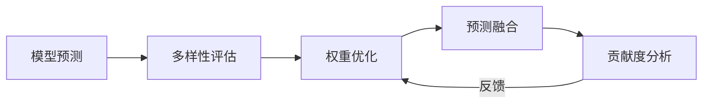
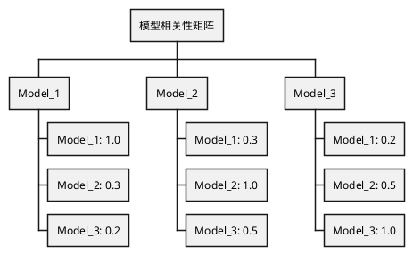

# RQA2025 模型集成系统设计文档

## 1. 概述

模型集成系统实现多模型预测结果的融合优化，主要功能包括：
- 多模型集成框架
- 动态权重调整
- 模型多样性评估
- 预测结果融合
- 模型贡献度分析

## 2. 系统架构

### 2.1 核心组件
```text
EnsembleEngine - 集成执行引擎
WeightOptimizer - 权重优化器
DiversityAnalyzer - 多样性分析
PredictionFuser - 预测融合器
ContributionTracker - 贡献度追踪
```

### 2.2 工作流程


## 3. 集成方法

### 3.1 方法比较
| 方法 | 原理 | 适用场景 |
|------|------|----------|
| 加权平均 | 线性组合预测结果 | 同质化模型 |
| 堆叠 | 元模型学习组合 | 异质化模型 |
| 投票 | 多数表决机制 | 分类任务 |
| 装袋 | 自助采样聚合 | 高方差模型 |

### 3.2 权重优化
```python
class WeightOptimizer:
    def __init__(self, 
                lookback: int = 30,
                decay: float = 0.9):
        """
        Args:
            lookback: 回看窗口(天)
            decay: 权重衰减系数
        """
        
    def calculate(self,
                model_perf: Dict[str, float]) -> Dict[str, float]:
        """计算最优权重"""
        # 使用softmax转换表现到权重
        exp_perf = {k: np.exp(v) for k, v in model_perf.items()}
        total = sum(exp_perf.values())
        return {k: v/total for k, v in exp_perf.items()}
```

## 4. 模型多样性

### 4.1 评估指标
| 指标 | 公式 | 解释 |
|------|------|------|
| 预测相关性 | corr(p_i, p_j) | 模型间相似度 |
| 误差相关性 | corr(e_i, e_j) | 错误模式差异 |
| 多样性得分 | 1 - avg(corr) | 整体多样性 |

### 4.2 相关性矩阵


## 5. 贡献度分析

### 5.1 分析方法
```math
Contribution_i = w_i \times \frac{Cov(p_i, P)}{Var(P)}
```
其中：
- $w_i$: 模型权重
- $p_i$: 模型预测
- $P$: 集成预测

### 5.2 分析报告
| 模型 | 权重 | 相关性 | 贡献度 |
|------|------|--------|--------|
| LSTM | 0.4 | 0.8 | 32% |
| 随机森林 | 0.3 | 0.7 | 21% |
| 神经网络 | 0.3 | 0.6 | 18% |

## 6. 系统集成

### 6.1 数据接口
```python
class ModelInterface:
    def get_predictions(self) -> Dict[str, np.ndarray]:
        """获取各模型预测"""
        
    def get_performance(self) -> Dict[str, float]:
        """获取模型近期表现"""
```

### 6.2 生产部署
```text
                   +---------------+
                   | 集成管理系统  |
                   +-------+-------+
                           | API
+------------------+       |       +-----------------+
| 模型训练系统     | <-----+-----> | 交易执行系统    |
+------------------+               +-----------------+
```

## 7. 版本历史

- v1.0 (2025-07-01): 基础集成框架
- v1.1 (2025-07-15): 动态权重优化
- v1.2 (2025-08-01): 多样性评估
- v1.3 (2025-08-15): 贡献度分析
