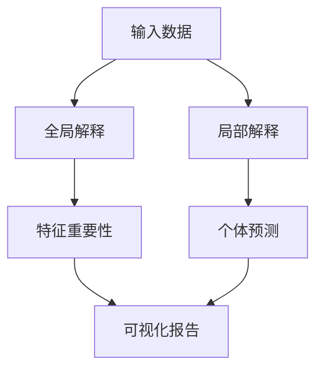

# RQA2025 模型解释性设计文档

## 1. 概述

模型解释性模块提供多种技术帮助理解量化模型决策逻辑，主要功能包括：
- 特征重要性分析
- 个体预测解释
- 决策路径可视化
- 模型性能监控
- 偏差检测

## 2. 系统架构

### 2.1 核心组件
```text
FeatureAnalyzer      - 特征重要性分析器
InstanceExplainer    - 个体预测解释器
DecisionVisualizer   - 决策路径可视化
ModelMonitor         - 模型性能监控
BiasDetector         - 偏差检测器
```

### 2.2 解释流程


## 3. 全局解释技术

### 3.1 特征重要性
| 方法 | 适用模型 | 优点 | 缺点 |
|------|---------|------|------|
| 排列重要性 | 所有模型 | 模型无关 | 计算成本高 |
| SHAP值 | 树模型/神经网络 | 统一尺度 | 需要专门实现 |
| 权重分析 | 线性模型 | 直接解释 | 仅限线性模型 |

### 3.2 决策面分析
```python
def plot_decision_surface(model, X, features):
    """绘制二特征决策面"""
    # 生成网格点
    x_min, x_max = X[:, 0].min() - 1, X[:, 0].max() + 1
    y_min, y_max = X[:, 1].min() - 1, X[:, 1].max() + 1
    xx, yy = np.meshgrid(np.arange(x_min, x_max, 0.1),
                         np.arange(y_min, y_max, 0.1))
    
    # 预测并绘制
    Z = model.predict(np.c_[xx.ravel(), yy.ravel()])
    Z = Z.reshape(xx.shape)
    plt.contourf(xx, yy, Z, alpha=0.4)
    plt.scatter(X[:, 0], X[:, 1], c=y, s=20, edgecolor='k')
```

## 4. 局部解释技术

### 4.1 LIME解释
```yaml
lime_config:
  kernel_width: 0.75
  n_samples: 1000  
  feature_selection: auto
  discretize_continuous: True
```

### 4.2 SHAP解释
| 解释器类型 | 适用场景 | 计算复杂度 |
|-----------|---------|-----------|
| TreeExplainer | 树模型 | O(TL) |
| KernelExplainer | 任何模型 | O(NS) |
| DeepExplainer | 深度学习 | O(BD) |

## 5. 可视化方案

### 5.1 特征重要性图
```javascript
// 示例：交互式重要性图
function renderImportanceChart(scores) {
  const chart = new ImportanceChart({
    container: '#importance-container',
    width: 800,
    height: 400,
    showStd: true
  });
  chart.render(scores);
}
```

### 5.2 决策路径图
```text
决策路径可视化包含：
- 节点分裂条件
- 样本流动方向
- 最终预测分布
- 特征贡献热图
```

## 6. 模型监控

### 6.1 漂移检测
| 检测类型 | 方法 | 告警阈值 |
|---------|------|---------|
| 数据漂移 | KS检验 | p<0.01 |
| 概念漂移 | 模型性能下降 | -5% |
| 特征漂移 | 均值/方差变化 | 2σ |

### 6.2 监控指标
```python
metrics:
  - name: feature_drift
    method: ks_test
    threshold: 0.01
  - name: performance_drop
    method: rolling_accuracy  
    window: 30
    threshold: 0.05
```

## 7. 部署方案

### 7.1 解释服务API
```text
GET /explanations/global
POST /explanations/local
GET /monitoring/alerts
```

### 7.2 解释缓存
```yaml
caching:
  enabled: true
  ttl: 3600  # 1小时
  max_size: 10000
```

## 8. 版本历史

- v1.0 (2024-03-01): 基础特征重要性分析
- v1.1 (2024-03-15): LIME/SHAP解释
- v1.2 (2024-04-01): 漂移检测系统
- v1.3 (2024-04-15): 交互式可视化
