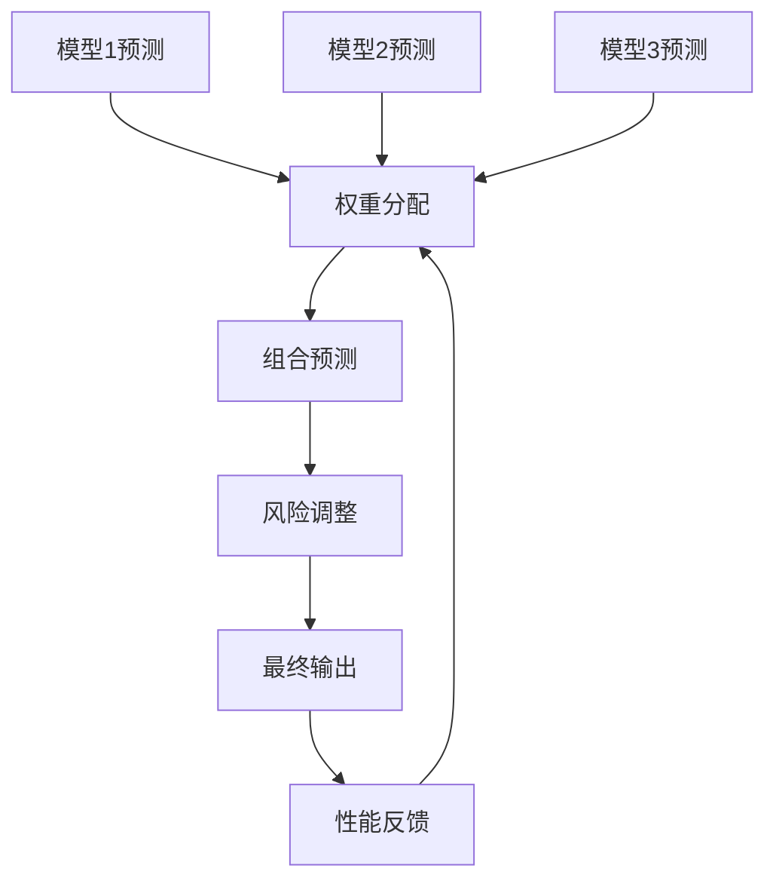
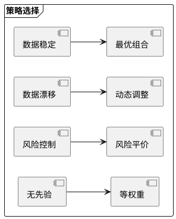

# RQA2025 模型系统设计文档

## 1. 模型集成概述

模型集成系统实现多模型预测的智能融合，主要功能包括：
- 多模型并行预测
- 动态权重分配
- 组合风险控制
- 在线学习调整
- 性能监控

## 2. 集成架构

### 2.1 核心组件
```text
WeightOptimizer   - 权重优化器
MetaLearner       - 元学习器
RiskController    - 风险控制器
OnlineUpdater     - 在线更新器
PerformanceMonitor - 性能监控
```

### 2.2 集成流程


## 3. 权重策略

### 3.1 分配方法
| 方法 | 原理 | 适用场景 |
|------|------|----------|
| 等权重 | 平均分配权重 | 模型性能相近 |
| 最优组合 | 最小化组合误差 | 有监督场景 |
| 动态调整 | 基于近期表现 | 非平稳环境 |
| 风险平价 | 均衡风险贡献 | 风险敏感场景 |

### 3.2 策略比较


## 4. 风险控制

### 4.1 控制机制
| 机制 | 实现方式 | 参数设置 |
|------|----------|----------|
| 波动率目标 | 预测标准差控制 | risk_target=0.1 |
| 最大杠杆 | 限制放大倍数 | max_leverage=2.0 |
| 风险预算 | 风险贡献均衡 | budget=[0.3,0.3,0.4] |
| 止损控制 | 回撤阈值触发 | drawdown_limit=0.2 |

### 4.2 风险矩阵
```text
| 风险等级 | 波动率范围 | 权重调整 | 监控频率 |
|----------|------------|----------|----------|
| 低       | <5%        | +10%     | 每日      |
| 中       | 5%-10%     | ±0%      | 每小时    |
| 高       | >10%       | -20%     | 实时      |
```

## 5. 在线学习

### 5.1 更新机制


### 5.2 参数配置
| 参数 | 说明 | 推荐值 |
|------|------|--------|
| 学习率 | 权重更新速度 | 0.01-0.1 |
| 衰减率 | 历史影响程度 | 0.9-0.99 |
| 窗口大小 | 参考数据量 | 30-100 |
| 最小权重 | 模型保留阈值 | 0.01 |

## 6. 性能指标

### 6.1 评估指标
| 指标 | 计算公式 | 目标值 |
|------|----------|--------|
| 组合误差 | ∑(预测-实际)² | 最小化 |
| 风险调整收益 | 收益/风险 | >2.0 |
| 权重波动率 | σ(权重变化) | <0.1 |
| 模型利用率 | 活跃模型/总模型 | >80% |

### 6.2 监控面板
```text
[实时看板]
1. 组合预测曲线 vs 实际值
2. 权重分布雷达图
3. 风险指标仪表盘
4. 模型贡献度排行
5. 异常预警提示
```

## 7. 版本历史

- v1.0 (2025-11-01): 基础集成框架
- v1.1 (2025-11-15): 风险控制模块
- v1.2 (2025-12-01): 在线学习系统
- v1.3 (2025-12-15): 生产级优化
