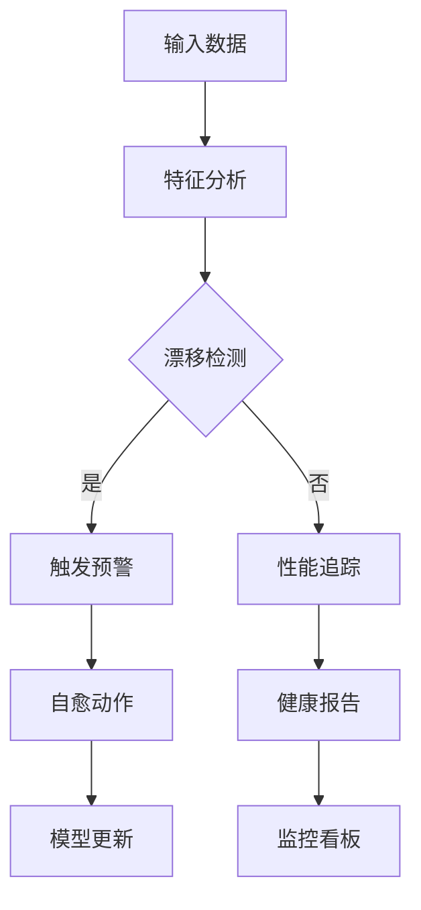
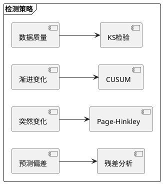

# RQA2025 运维系统设计文档

## 1. 模型监控概述

模型监控系统实现生产环境模型的实时健康管理，主要功能包括：
- 数据分布监控
- 性能指标跟踪
- 漂移自动检测
- 多级预警通知
- 自适应修复

## 2. 监控架构

### 2.1 核心组件
```text
DataProfiler      - 数据特征分析
DriftDetector     - 漂移检测引擎
PerformanceTracker - 性能追踪器
AlertManager      - 预警管理器
AutoHealing       - 自愈控制器
```

### 2.2 监控流程


## 3. 漂移检测

### 3.1 检测算法
| 算法 | 原理 | 适用场景 |
|------|------|----------|
| KS检验 | 比较分布差异 | 数据漂移 |
| CUSUM | 累积和检测 | 渐进漂移 |
| Page-Hinkley | 变化点检测 | 突变漂移 |
| 残差分析 | 预测误差分布 | 概念漂移 |

### 3.2 检测策略


## 4. 预警机制

### 4.1 预警级别
| 级别 | 触发条件 | 响应时间 |
|------|----------|----------|
| INFO | 轻微异常 | <24h |
| WARNING | 持续异常 | <4h |
| ERROR | 功能影响 | <1h |
| CRITICAL | 系统风险 | 立即 |

### 4.2 通知渠道
```text
| 级别       | 渠道                  | 频率限制 |
|------------|-----------------------|----------|
| INFO       | 系统日志/仪表盘        | 无       |
| WARNING    | 邮件                  | 1条/小时 |
| ERROR      | 短信+邮件             | 3条/小时 |
| CRITICAL   | 电话+短信+邮件        | 无限制   |
```

## 5. 自愈策略

### 5.1 恢复方案
| 问题类型 | 自动动作 | 人工干预 |
|----------|----------|----------|
| 数据漂移 | 特征重缩放 | 数据源检查 |
| 概念漂移 | 增量学习 | 模型重构 |
| 性能退化 | 权重调整 | 参数优化 |
| 系统故障 | 回滚版本 | 故障排查 |

### 5.2 策略矩阵
```text
| 漂移程度 | 自动响应               | 人工审核 |
|----------|------------------------|----------|
| <5%      | 记录日志               | 不需要   |
| 5%-15%   | 调整权重               | 事后     |
| 15%-30%  | 增量更新               | 实时     |
| >30%     | 停止服务+回滚          | 立即     |
```

## 6. 运维指标

### 6.1 关键指标
| 指标 | 计算公式 | 健康阈值 |
|------|----------|----------|
| 漂移率 | 漂移样本/总样本 | <5% |
| 恢复时间 | 故障结束-开始 | <10min |
| 预警准确率 | 真阳性/(真阳性+假阳性) | >90% |
| 模型健康度 | 1 - (异常时长/总时长) | >99% |

### 6.2 监控面板
```text
[实时运维看板]
1. 系统健康状态概览
2. 漂移热力图
3. 预警历史曲线
4. 自愈动作记录
5. 资源使用监控
```

## 7. 版本历史

- v1.0 (2025-11-01): 基础监控框架
- v1.1 (2025-11-15): 多级预警系统
- v1.2 (2025-12-01): 自适应恢复
- v1.3 (2025-12-15): 生产级优化
