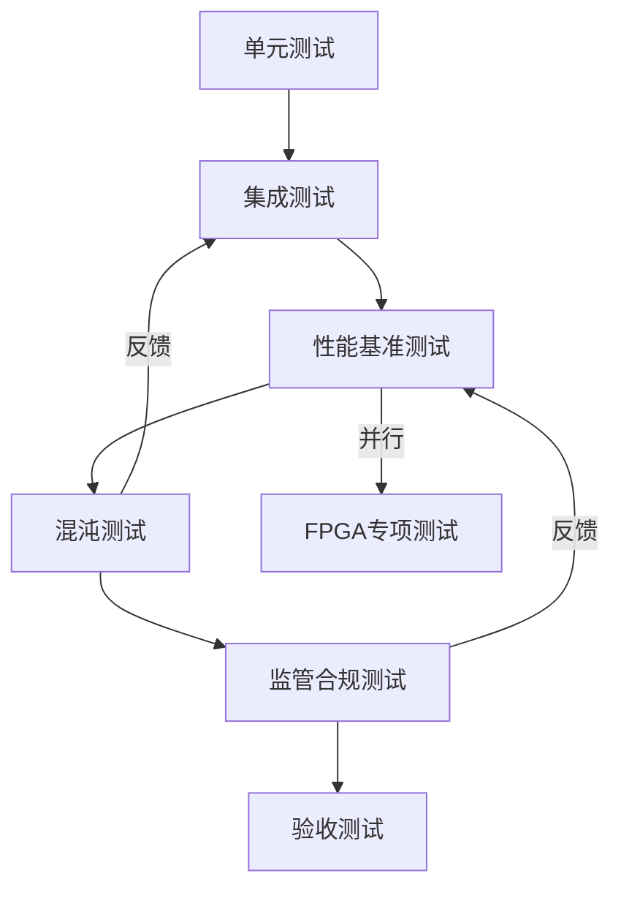
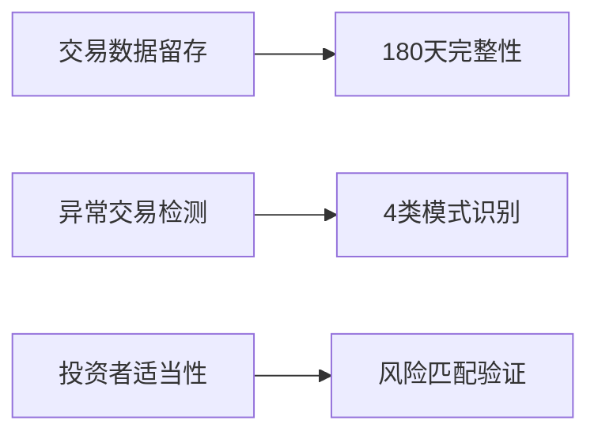
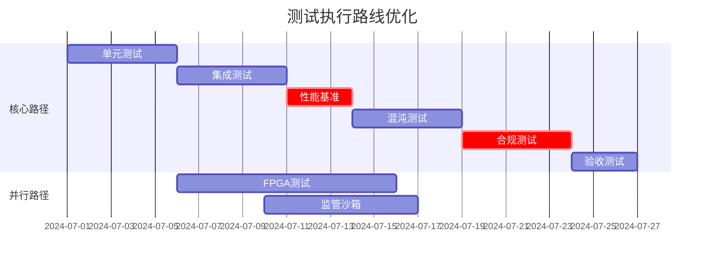

# RQA2025 优化测试路径方案

## 1. 优化后的测试流程架构


## 2. 关键优化点说明

### 2.1 性能测试前置化
**调整原因：**
- 量化交易系统对延迟敏感（要求<50μs）
- 早期发现性能瓶颈可减少架构返工成本

**实施方式：**
```python
# CI流水线示例
def ci_pipeline():
    run_unit_tests()
    run_integration_tests()
    if performance_baseline_check():  # 新增性能门禁
        run_chaos_tests()
    else:
        fail_build("性能不达标")
```

### 2.2 FPGA专项测试
**测试矩阵：**
| 测试类型 | 频率 | 验证重点 |
|---------|------|----------|
| 热切换测试 | 每次构建 | 硬件/软件路径切换 |
| 极限延迟测试 | 每日 | μs级响应稳定性 |
| 功耗测试 | 每周 | 散热方案验证 |

**示例测试用例：**
```python
class TestFPGA:
    def test_hot_swap(self):
        """FPGA故障自动切换测试"""
        simulate_fpga_failure()
        assert get_execution_path() == "SOFTWARE"
        assert latency < 100  # 切换后延迟要求
        
    def test_power_consumption(self):
        """持续高负载功耗测试"""
        run_stress_test(duration=3600)
        assert max_temperature < 85  # 温度阈值
```

### 2.3 监管合规测试
**检查项架构：**


**测试数据生成：**
```python
def generate_compliance_data():
    return {
        "异常交易样本": generate_spoofing_orders(1000),
        "投资者档案": create_investor_profiles(risk_levels=[1,3,5]),
        "审计日志": mimic_sec_format(days=180)
    }
```

## 3. 各阶段增强方案

### 3.1 单元测试增强
**新增重点：**
- FPGA接口模拟器
- 科创板结算逻辑验证
- 硬件故障注入测试

### 3.2 集成测试增强
**关键场景：**
- 熔断连锁反应验证
- 双中心数据同步测试
- 自动故障回滚机制

### 3.3 性能测试增强
**特殊场景：**
- Level2行情风暴（100,000 msg/s）
- 千股跌停压力测试
- 熔断机制触发延迟测试

### 3.4 混沌测试增强
**新增实验：**
- 混合故障模式（网络+硬件+数据）
- FPGA芯片物理损坏模拟
- 灾备切换计时验证

## 4. 实施路线图


## 5. 关键工具链升级
1. **性能测试工具**：新增K6替代Locust，支持μs级测量
2. **混沌工程平台**：采用Chaos Mesh+自定义硬件故障注入模块
3. **合规验证工具**：集成SEC审计工具链

## 6. 风险控制措施
| 风险点 | 应对方案 | 监控指标 |
|-------|---------|---------|
| FPGA开发延迟 | 双轨测试机制 | 日构建通过率 |
| 性能不达标 | 热点分析优化 | P99延迟 |
| 监管变更 | 动态测试用例库 | 合规项覆盖率 |

## 7. 实施建议
1. 立即建立性能基准线：
   ```bash
   pytest --perf-baseline=50ms trading_engine/
   pytest --fpga-latency=5μs acceleration/
   ```
2. 部署混沌测试自动化：
   ```python
   class ChaosScheduler:
       def execute_scenario(scenario):
           if scenario == "FPGA_FAILURE":
               inject_fault("fpga")
               assert fallback_time < 45  # 秒级切换
   ```
3. 构建合规测试数据池
