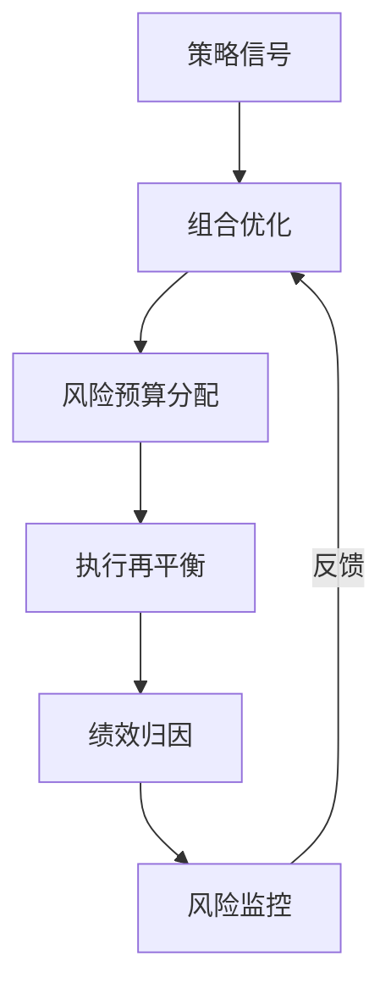
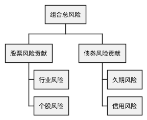

# RQA2025 组合管理系统设计文档

## 1. 概述

组合管理系统实现多策略资产配置与优化，主要功能包括：
- 多资产组合优化
- 动态风险预算分配
- 智能再平衡机制
- 绩效归因分析
- 组合风险监控

## 2. 系统架构

### 2.1 核心组件
```text
OptimizationEngine - 组合优化引擎
RiskAllocator     - 风险预算分配器
Rebalancer        - 自动再平衡器
AttributionAnalyzer - 绩效归因分析
PortfolioMonitor  - 组合风险监控
```

### 2.2 工作流程


## 3. 组合优化

### 3.1 优化方法比较
| 方法 | 目标函数 | 适用场景 |
|------|----------|----------|
| 最小方差 | min w'Σw | 低风险组合 |
| 风险平价 | min ∑(RC_i - b_i)² | 平衡风险贡献 |
| 最大夏普 | max (w'μ)/√(w'Σw) | 最优风险调整收益 |
| 均值方差 | max w'μ - λw'Σw | 风险收益权衡 |

### 3.2 约束条件
```python
constraints = [
    ("max_weight", 0.3),   # 单资产上限30%
    ("min_weight", 0.05),  # 单资产下限5% 
    ("sector_limit", {     # 行业限制
        "Technology": 0.4,
        "Healthcare": 0.3
    })
]
```

## 4. 风险预算

### 4.1 预算分配策略
| 策略 | 分配逻辑 | 特点 |
|------|----------|------|
| 等风险 | 1/N风险预算 | 传统风险平价 |
| 波动率倒数 | 1/σ_i | 波动率调整 |
| 策略夏普 | SR_i/∑SR | 绩效加权 |
| 动态调整 | 市场状态依赖 | 自适应分配 |

### 4.2 风险贡献监控


## 5. 再平衡机制

### 5.1 触发条件
```python
class RebalanceTrigger:
    def __init__(self):
        self.triggers = [
            {"type": "calendar", "freq": "M"},  # 月度定期
            {"type": "threshold", "value": 0.05},  # 权重偏离5%
            {"type": "risk_change", "value": 0.1}  # 风险贡献变化10%
        ]
```

### 5.2 交易成本控制
| 方法 | 实现方式 | 效果 |
|------|----------|------|
| 分批执行 | TWAP/VWAP算法 | 减少市场冲击 |
| 阈值过滤 | 忽略小微调仓 | 降低换手率 |
| 交易税优化 | 利用税收规则 | 减少税负 |

## 6. 绩效归因

### 6.1 归因模型
```math
R_p = ∑_{i=1}^n w_i R_i + ∑_{i=1}^n w_i (R_i - R_b) + ∑_{i=1}^n (w_i - w_{b,i}) R_b
```
其中：
- 第一项：资产配置收益
- 第二项：选股能力
- 第三项：基准差异

### 6.2 归因报告
| 维度 | 指标 | 分析重点 |
|------|------|----------|
| 资产类别 | 配置贡献 | 大类资产选择 |
| 行业 | 超额收益 | 行业轮动能力 |
| 策略 | 风险调整收益 | 策略有效性 |

## 7. 系统集成

### 7.1 数据接口
```python
class DataInterface:
    def get_returns(self) -> pd.DataFrame:
        """获取各资产历史收益率"""
        
    def get_risk_factors(self) -> pd.DataFrame:
        """获取风险因子暴露"""
        
    def get_constraints(self) -> Dict:
        """获取当前约束条件"""
```

### 7.2 生产部署
```text
                   +---------------+
                   | 组合管理系统  |
                   +-------+-------+
                           | API
+------------------+       |       +-----------------+
| 交易执行系统     | <-----+-----> | 风险监控系统    |
+------------------+               +-----------------+
```

## 8. 版本历史

- v1.0 (2025-05-01): 基础组合优化
- v1.1 (2025-05-15): 动态风险预算
- v1.2 (2025-06-01): 智能再平衡
- v1.3 (2025-06-15): 绩效归因分析
