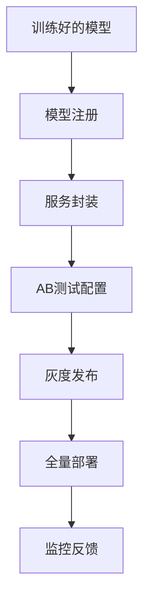

# RQA2025 生产部署设计文档

## 1. 概述

生产部署模块实现量化模型从研发到生产的全流程管理，主要功能包括：
- 模型服务化封装
- AB测试框架
- 性能监控告警
- 自动化部署流水线
- 灰度发布策略

## 2. 系统架构

### 2.1 核心组件
```text
ModelService      - 模型服务化核心
ABTestManager     - AB测试框架
ModelRegistry     - 模型版本管理
MonitoringAgent   - 性能监控代理
DeploymentEngine  - 自动化部署引擎
```

### 2.2 部署流程


## 3. 模型服务化

### 3.1 服务接口设计
| 端点 | 方法 | 描述 |
|------|------|------|
| /predict | POST | 执行模型预测 |
| /models | GET | 获取模型列表 |
| /model/{id} | GET | 获取模型详情 |
| /model/{id} | DELETE | 卸载模型 |
| /abtests | POST | 创建AB测试 |

### 3.2 请求/响应示例
```json
// 预测请求
{
  "model_id": "lstm_v1",
  "features": {
    "feature1": 0.5,
    "feature2": 0.3
  }
}

// 预测响应
{
  "request_id": "req_123",
  "prediction": 0.87,
  "model_version": "1.0.0",
  "timestamp": "2024-01-01T00:00:00Z"
}
```

## 4. AB测试框架

### 4.1 实验配置
```yaml
experiment:
  id: momentum_strategy_v2
  models:
    - id: lstm_v1
      weight: 0.3
    - id: xgboost_v2 
      weight: 0.7
  metrics:
    - sharpe_ratio
    - max_drawdown
```

### 4.2 流量分配算法
```python
def allocate_traffic(experiment):
    total = sum(m.weight for m in experiment.models)
    rand = random.random() * total
    cumulative = 0
    for model in experiment.models:
        cumulative += model.weight
        if rand <= cumulative:
            return model.id
```

## 5. 监控告警

### 5.1 核心指标
| 指标 | 类型 | 说明 |
|------|------|------|
| 预测延迟 | 性能 | P99 < 100ms |
| 模型准确率 | 质量 | 日环比变化 <5% |
| 请求成功率 | 可用性 | >99.9% |
| 内存占用 | 资源 | <80%阈值 |

### 5.2 告警规则
```python
# 准确率下降告警
if current_accuracy < baseline_accuracy * 0.95:
    trigger_alert(
        "AccuracyDrop", 
        f"Accuracy dropped by {1-current_accuracy/baseline_accuracy:.1%}"
    )
```

## 6. 性能优化

### 6.1 优化策略
| 场景 | 方案 | 预期收益 |
|------|------|----------|
| CPU瓶颈 | 模型量化 | 30-50%加速 |
| IO瓶颈 | 批处理预测 | 吞吐量3x |
| 内存瓶颈 | 模型共享 | 内存减少40% |
| 网络延迟 | 边缘部署 | 延迟降低80% |

### 6.2 性能目标
| 指标 | 目标值 |
|------|--------|
| 单实例QPS | 1000+ |
| 预测延迟 | <50ms |
| 启动时间 | <10s |
| 故障恢复 | <30s |

## 7. 部署策略

### 7.1 发布模式
| 模式 | 适用场景 | 回滚难度 |
|------|----------|----------|
| 蓝绿部署 | 大版本更新 | 容易 |
| 金丝雀发布 | 关键模型 | 中等 |
| 影子测试 | 高风险变更 | 困难 |

### 7.2 部署检查清单
1. 模型版本标签
2. 依赖项兼容性
3. 性能基准测试
4. 回滚方案验证
5. 监控配置检查

## 8. 版本历史

- v1.0 (2024-09-01): 基础服务化框架
- v1.1 (2024-09-15): AB测试支持
- v1.2 (2024-10-01): 自动化监控
- v1.3 (2024-10-15): 优化部署流水线
