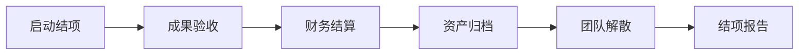
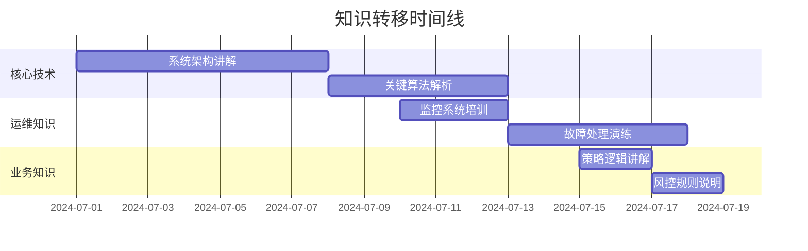

# RQA2025 量化系统设计文档

## 1. 项目结项流程

### 1.1 结项阶段划分


### 1.2 结项检查清单
| 类别 | 检查项 | 完成标准 | 负责人 |
|------|--------|----------|--------|
| 技术 | 代码冻结 | 所有变更合并到release分支 | 技术主管 |
| 文档 | 归档完整 | 所有文档索引可检索 | 技术文档工程师 |
| 财务 | 费用结算 | 所有发票已报销 | 财务专员 |
| 资产 | 资源释放 | 云资源已释放或转移 | 运维工程师 |
| 合同 | 履约确认 | 所有合同条款已履行 | 法务专员 |

## 2. 维护团队职责

### 2.1 维护团队组成
| 角色 | 人数 | 主要职责 | 技能要求 |
|------|------|----------|----------|
| 系统运维 | 2 | 监控告警、故障处理 | Linux/Python/监控工具 |
| 数据工程师 | 1 | 数据管道维护 | SQL/大数据技术 |
| 量化分析师 | 1 | 策略监控调整 | 量化分析/Python |
| 开发支持 | 1 | 紧急修复、小功能开发 | 全栈开发 |

### 2.2 维护SLA标准
| 服务类型 | 响应时间 | 解决时限 | 可用性承诺 |
|----------|----------|----------|------------|
| 紧急故障 | 30分钟 | 4小时 | 99.95% |
| 重要问题 | 4小时 | 1工作日 | 99.9% |
| 一般请求 | 8小时 | 3工作日 | 99% |
| 功能增强 | 48小时 | 按排期 | N/A |

## 3. 知识转移计划

### 3.1 知识转移路线图


### 3.2 知识库结构
```text
knowledge_base/
├── 系统架构/
│   ├── 架构设计文档.md
│   ├── 技术决策记录/
│   └── 部署拓扑图.png
├── 运维手册/
│   ├── 日常运维指南.md
│   ├── 故障处理手册.md
│   └── 性能调优技巧.md
├── 开发规范/
│   ├── 代码规范.md
│   ├── API文档/
│   └── 测试规范.md
└── 业务知识/
    ├── 策略白皮书.md
    ├── 风控规则库.md
    └── 数据字典.md
```

## 4. 后续支持方案

### 4.1 支持阶段划分
| 阶段 | 时间范围 | 支持方式 | 响应团队 |
|------|----------|----------|----------|
| 全面支持 | 0-3个月 | 原团队全程支持 | 原项目组 |
| 混合支持 | 4-6个月 | 原团队+新团队 | 联合团队 |
| 有限支持 | 7-12个月 | 仅关键问题支持 | 维护团队 |
| 文档支持 | 12+个月 | 仅知识库支持 | 无 |

### 4.2 支持渠道矩阵
| 问题类型 | 首选渠道 | 备用渠道 | 升级路径 |
|----------|----------|----------|----------|
| 系统故障 | 告警系统 | 紧急电话 | CTO |
| 数据问题 | 数据看板 | 企业微信 | 数据总监 |
| 策略疑问 | 知识库 | 邮件支持 | 量化总监 |
| 功能需求 | JIRA系统 | 产品经理 | 产品总监 |

## 5. 经验教训总结

### 5.1 关键成功因素
```text
1. 架构设计前瞻性
   - 模块化设计便于扩展
   - 清晰的接口定义
   - 完善的文档支持

2. 开发流程规范化
   - 严格的代码审查
   - 自动化测试覆盖
   - 持续集成实践

3. 风险管理机制
   - 早期风险识别
   - 定期风险评估
   - 应急方案准备
```

### 5.2 改进方向建议
```text
1. 需求管理
   - 加强需求评审流程
   - 建立变更控制机制
   - 优化优先级评估

2. 技术债务
   - 定期债务评估会议
   - 设立专门偿还周期
   - 预防新增债务规范

3. 团队协作
   - 改进知识共享机制
   - 加强跨职能沟通
   - 优化会议效率
```

### 5.3 经验教训记录
| 问题类型 | 发生阶段 | 根本原因 | 改进措施 |
|----------|----------|----------|----------|
| 数据延迟 | 开发阶段 | 数据源API不稳定 | 增加缓存层+重试机制 |
| 模型漂移 | 测试阶段 | 特征工程缺陷 | 增加PSI监控+定期重训练 |
| 交易失败 | 上线阶段 | 券商接口超时 | 优化超时设置+多通道切换 |
