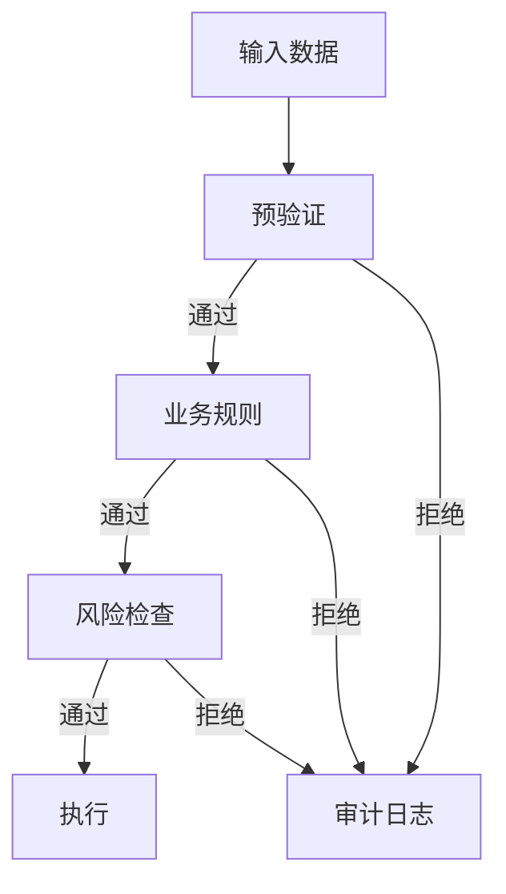

# 风险控制体系指南

## 架构概述



## 快速开始

### 初始化引擎

```python
from src.risk.risk_engine import RiskEngine, MarketRuleValidator

engine = RiskEngine()

# 配置基础验证
pre_check = engine.validators['pre_check']
pre_check.required_fields = ['trade_id', 'symbol', 'amount']
pre_check.type_checks = {'amount': (int, float)}
pre_check.range_checks = {'amount': (0, 10_000_000)}

# 添加业务规则
engine.add_business_rule('market', MarketRuleValidator())

# 添加风险检查
def custom_risk_check(data):
    # 自定义风险检查逻辑
    pass
engine.add_risk_check(custom_risk_check)
```

### 执行验证

```python
data = {
    'trade_id': 'TRADE001',
    'symbol': '600000',
    'amount': 5000
}

result = engine.validate(data)
if result['is_valid']:
    print("验证通过")
else:
    print(f"验证失败: {result['errors']}")
```

## 验证规则配置

### 预验证规则

| 规则类型 | 示例 | 风险等级 |
|---------|------|---------|
| 必填字段 | `required_fields=['trade_id']` | BLOCKED |
| 类型检查 | `type_checks={'amount': float}` | BLOCKED |
| 范围检查 | `range_checks={'amount': (0, 1M)}` | WARNING |

### 业务规则示例

```python
class ComplianceValidator(RuleValidator):
    """合规性验证器"""
    
    def validate(self, data):
        result = super().validate(data)
        
        # 检查受限股票
        if data.get('symbol') in RESTRICTED_STOCKS:
            result.add_error(
                'compliance',
                "该股票交易受限",
                RiskLevel.BLOCKED
            )
        
        return result
```

## 风险等级说明

| 等级 | 说明 | 处理建议 |
|------|------|---------|
| SAFE | 无风险 | 自动放行 |
| WARNING | 低风险 | 记录但放行 |
| DANGER | 高风险 | 人工审核 |
| BLOCKED | 禁止 | 自动拒绝 |

## 审计日志

### 日志格式示例

```json
{
    "timestamp": "2023-11-15T14:30:00",
    "input_data": {"trade_id": "TRADE001", "amount": 5000},
    "validation_result": {
        "is_valid": false,
        "errors": [{
            "rule": "range_check",
            "message": "金额超出限制",
            "risk_level": "BLOCKED"
        }]
    },
    "decision": "REJECTED"
}
```

### 查询日志

```python
# 获取最近100条日志
logs = engine.get_audit_log(limit=100)
```

## 最佳实践

1. **分层验证**：
   - 预验证：基础数据完整性
   - 业务规则：领域特定规则
   - 风险检查：实时风险指标

2. **性能优化**：
   ```python
   # 高频检查放预验证层
   pre_check.range_checks = {
       'amount': (0, 1_000_000),  # 先检查大范围
       'price': (0, 1000)
   }
   
   # 低频检查放风险层
   def low_freq_check(data):
       if data['amount'] > 500_000:
           # 复杂计算...
           pass
   ```

3. **监控指标**：
   - 验证通过率
   - 各风险等级分布
   - 平均验证耗时
```
