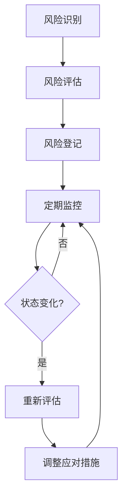

# RQA2025 Phase 4A风险管理计划

## 📋 风险管理概述

### 风险管理目标
- **识别**：全面识别Phase 4A可能的风险点
- **评估**：准确评估风险概率和影响程度
- **应对**：制定有效的风险应对策略
- **监控**：建立持续的风险监控机制
- **响应**：确保风险事件得到及时处理

### 风险管理原则
1. **主动识别**：在问题发生前识别潜在风险
2. **分级管理**：根据风险等级采取相应措施
3. **责任到人**：每个风险都有明确的负责人
4. **持续监控**：定期评估风险状态变化
5. **经验学习**：从风险事件中总结经验教训

### 风险管理流程
```
风险识别 → 风险评估 → 风险应对 → 实施监控 → 响应处理 → 经验总结
    ↑                                                    ↓
    └──────────────── 持续改进 ────────────────────────┘
```

---

## 🔍 风险识别与评估

### 高风险项目 (P0)

#### 1. 业务流程测试覆盖提升 (🔴 高风险)
**风险描述**：
业务流程测试覆盖率从46%提升至90%是Phase 4A的核心目标，但当前覆盖率严重不足，涉及复杂的业务逻辑和数据依赖关系。

**风险因素**：
- 测试数据准备时间长
- 业务逻辑复杂，测试用例设计难度大
- 外部系统依赖导致测试不稳定
- 团队对业务流程理解不够深入

**概率评估**：高 (80%)
**影响评估**：高 (系统核心功能无法有效验证)
**风险等级**：🔴 高风险
**RPN评分**：640 (高)

**负责人**：孙十一 (质量提升专项组)
**监控人**：张三 (项目管理办公室)

#### 2. 性能优化实施 (🔴 高风险)
**风险描述**：
CPU使用率从90%降低至80%，内存使用率从超标恢复至70%目标，需要复杂的系统优化，但可能影响系统稳定性。

**风险因素**：
- 算法优化可能引入新的性能问题
- GPU加速设备采购和配置风险
- 缓存优化可能影响数据一致性
- 并行处理可能引入并发问题

**概率评估**：中高 (70%)
**影响评估**：高 (影响系统整体性能)
**风险等级**：🔴 高风险
**RPN评分**：490 (高)

**负责人**：陈七 (性能优化专项组)
**监控人**：李四 (技术团队)

### 中风险项目 (P1)

#### 3. 端到端测试执行效率优化 (🟡 中风险)
**风险描述**：
E2E测试执行时间从>5分钟优化至<2分钟，但测试环境复杂，外部依赖多。

**风险因素**：
- Windows编码兼容性问题解决难度大
- 外部服务依赖稳定性差
- 测试数据准备和清理耗时长
- 并发测试场景设计复杂

**概率评估**：中 (60%)
**影响评估**：中 (影响测试效率和CI/CD)
**风险等级**：🟡 中风险
**RPN评分**：360 (中)

**负责人**：郑十三 (质量提升专项组)
**监控人**：王五 (项目管理办公室)

#### 4. 安全加固实施 (🟡 中风险)
**风险描述**：
容器安全、MFA机制等安全功能实施可能影响现有功能正常使用。

**风险因素**：
- 安全配置可能影响系统性能
- 多因素认证影响用户体验
- 容器安全限制可能影响部署
- 安全测试可能发现新问题

**概率评估**：中 (50%)
**影响评估**：中 (影响安全性和可用性)
**风险等级**：🟡 中风险
**RPN评分**：250 (中)

**负责人**：李四 (安全加固专项组)
**监控人**：赵六 (技术团队)

### 低风险项目 (P2)

#### 5. 工作组协作协调 (🟢 低风险)
**风险描述**：
3个专项工作组和支撑团队之间的协作可能存在沟通不畅、资源冲突等问题。

**风险因素**：
- 跨团队沟通效率低
- 资源分配不均衡
- 技术方案分歧
- 进度协调困难

**概率评估**：中低 (40%)
**影响评估**：低 (影响协作效率)
**风险等级**：🟢 低风险
**RPN评分**：120 (低)

**负责人**：张三 (项目管理办公室)
**监控人**：王五 (项目管理办公室)

#### 6. 外部依赖服务稳定性 (🟢 低风险)
**风险描述**：
依赖的外部数据源、云服务等可能存在稳定性问题。

**风险因素**：
- 网络连接不稳定
- 外部服务API变更
- 数据源服务中断
- 第三方服务限流

**概率评估**：低 (30%)
**影响评估**：中低 (影响部分功能)
**风险等级**：🟢 低风险
**RPN评分**：90 (低)

**负责人**：杨十五 (DevOps团队)
**监控人**：马十六 (DevOps团队)

---

## 🛡️ 风险应对策略

### 高风险应对策略

#### 1. 业务流程测试覆盖提升
**预防措施**：
- [ ] 提前准备测试数据和环境
- [ ] 组织业务专家培训测试团队
- [ ] 分阶段实施，先易后难
- [ ] 建立测试数据自动生成机制

**应急措施**：
- [ ] 准备备选测试方案
- [ ] 增加测试团队人力投入
- [ ] 协调业务团队提供支持
- [ ] 调整测试范围优先级

**资源配置**：
- 测试数据工程师：2人 (额外投入)
- 业务专家支持：每周2天
- 自动化测试工具：预算增加20万元

**监控指标**：
- 周度测试覆盖率增长：≥3%
- 测试用例通过率：≥90%
- 测试执行稳定性：≥95%

#### 2. 性能优化实施
**预防措施**：
- [ ] 建立性能基线和监控体系
- [ ] 分批次实施优化措施
- [ ] 准备回滚方案
- [ ] 充分的测试验证

**应急措施**：
- [ ] 性能优化效果不达预期时及时调整策略
- [ ] 准备备选优化方案
- [ ] 增加性能专家支持
- [ ] 实施分级降级策略

**资源配置**：
- GPU加速设备：2套 (预算50万元)
- 性能测试环境：独立服务器
- 性能专家：1人 (外部顾问)

**监控指标**：
- CPU使用率变化：每周监控
- 内存使用率变化：实时监控
- 响应时间变化：自动化监控
- 系统稳定性：7×24监控

### 中风险应对策略

#### 3. 端到端测试执行效率优化
**预防措施**：
- [ ] 建立Linux测试环境
- [ ] 优化测试框架配置
- [ ] 减少外部依赖
- [ ] 实现测试并行执行

**应急措施**：
- [ ] 准备手动测试备选方案
- [ ] 优化CI/CD流水线
- [ ] 增加测试资源投入

**资源配置**：
- Linux测试服务器：2台
- 测试优化工具：预算10万元
- 测试工程师：1人 (额外投入)

**监控指标**：
- 测试执行时间：每日监控
- 测试成功率：每小时监控
- 环境稳定性：实时监控

#### 4. 安全加固实施
**预防措施**：
- [ ] 安全加固前充分测试
- [ ] 分阶段实施安全措施
- [ ] 建立安全监控机制
- [ ] 准备安全配置回滚方案

**应急措施**：
- [ ] 安全措施影响业务时及时调整
- [ ] 增加安全专家支持
- [ ] 实施分级安全策略

**资源配置**：
- 安全测试工具：预算15万元
- 安全专家：1人 (外部顾问)
- 安全监控系统：云安全服务

**监控指标**：
- 安全漏洞数量：每日监控
- 安全事件发生率：实时监控
- 系统可用性影响：实时监控

### 低风险应对策略

#### 5. 工作组协作协调
**预防措施**：
- [ ] 建立定期沟通机制
- [ ] 明确职责分工和接口
- [ ] 建立协作平台和工具
- [ ] 开展团队建设活动

**应急措施**：
- [ ] 发现协作问题及时协调
- [ ] 调整资源分配
- [ ] 加强跨团队培训

**资源配置**：
- 协作工具：Microsoft Teams + Jira
- 团队建设预算：5万元
- 沟通协调时间：每周4小时

#### 6. 外部依赖服务稳定性
**预防措施**：
- [ ] 建立服务监控和告警
- [ ] 准备服务降级方案
- [ ] 多数据源备份
- [ ] 服务调用超时和重试机制

**应急措施**：
- [ ] 服务异常时自动切换
- [ ] 实施降级策略
- [ ] 联系供应商支持

**资源配置**：
- 监控工具：Prometheus + Grafana
- 备用数据源：2套
- 应急响应预算：10万元

---

## 📊 风险监控机制

### 风险监控体系

#### 1. 风险状态监控


#### 2. 监控指标体系

| 风险项目 | 监控指标 | 监控频率 | 阈值 | 责任人 |
|---------|---------|---------|------|-------|
| 业务流程测试 | 测试覆盖率增长 | 每周 | <3% | 孙十一 |
| 性能优化 | CPU/内存使用率 | 每日 | 变化>5% | 陈七 |
| E2E测试 | 执行时间、成功率 | 每小时 | 时间>3分钟 | 郑十三 |
| 安全加固 | 漏洞数量、可用性 | 每日 | 影响>1% | 李四 |
| 协作协调 | 问题解决时间 | 每周 | >2天 | 张三 |
| 外部依赖 | 服务可用性 | 实时 | <99.5% | 杨十五 |

### 风险报告机制

#### 1. 定期报告
- **日报**：各专项组报告当日风险状态
- **周报**：项目管理办公室汇总周风险报告
- **月报**：全面风险评估和趋势分析

#### 2. 紧急报告
- **橙色预警**：风险升级或新高风险
- **红色预警**：风险事件发生
- **立即响应**：影响生产系统的事件

### 风险阈值定义

| 风险等级 | 概率阈值 | 影响阈值 | RPN阈值 | 响应级别 |
|---------|---------|---------|--------|---------|
| 低风险 | <40% | 轻微 | <200 | 关注监控 |
| 中风险 | 40-70% | 中等 | 200-400 | 制定应对 |
| 高风险 | >70% | 重大 | >400 | 重点应对 |

---

## 🚨 应急响应机制

### 应急响应流程
```
事件发生 → 立即响应 → 评估影响 → 启动预案 → 执行恢复 → 总结改进
     ↓            ↓           ↓          ↓          ↓           ↓
  5分钟内      30分钟内     1小时内    2小时内    4小时内     24小时内
```

### 应急响应团队
- **应急指挥**：张三 (项目总指挥)
- **技术响应**：李四 (技术负责人)
- **业务响应**：王五 (业务负责人)
- **用户沟通**：赵六 (用户体验负责人)

### 应急预案库

#### 1. 系统性能异常预案
- **触发条件**：CPU>95% 或 内存>90%
- **响应措施**：
  - 立即启动性能监控
  - 执行自动扩容
  - 通知相关团队
  - 准备回滚方案
- **恢复目标**：30分钟内恢复正常

#### 2. 测试环境故障预案
- **触发条件**：测试环境不可用>30分钟
- **响应措施**：
  - 切换到备用环境
  - 启动环境重建
  - 通知测试团队
  - 评估影响范围
- **恢复目标**：2小时内恢复

#### 3. 安全事件应急预案
- **触发条件**：安全漏洞被利用
- **响应措施**：
  - 隔离受影响系统
  - 启动安全响应
  - 通知安全团队
  - 执行修复措施
- **恢复目标**：4小时内完成修复

### 资源储备

#### 1. 人力储备
- 性能优化专家：2人 (外部顾问)
- 安全专家：1人 (外部顾问)
- 测试工程师：3人 (内部储备)

#### 2. 技术储备
- 备用测试环境：1套
- GPU加速设备：1套
- 应急响应工具包：完整配置

#### 3. 预算储备
- 应急响应预算：50万元
- 外部专家费用：30万元
- 设备采购储备：20万元

---

## 📈 风险评估矩阵

### 当前风险分布

| 风险等级 | 数量 | 占比 | 主要风险点 |
|---------|------|------|-----------|
| 高风险 | 2 | 33% | 业务流程测试、性能优化 |
| 中风险 | 2 | 33% | E2E测试效率、安全加固 |
| 低风险 | 2 | 34% | 协作协调、外部依赖 |

### 风险趋势预测

#### 第一阶段 (4月1日-4月14日)
- 高风险：可能略有下降，重点关注业务流程测试进度
- 中风险：保持稳定，E2E测试优化取得进展
- 低风险：可能有小幅上升，协作磨合期

#### 第二阶段 (4月15日-4月30日)
- 高风险：可能显著下降，性能优化见成效
- 中风险：保持稳定，安全加固完成大部分
- 低风险：趋于稳定，协作机制成熟

### 风险控制目标

| 时间点 | 高风险 | 中风险 | 低风险 | 总体目标 |
|-------|-------|-------|-------|---------|
| 4月7日 | ≤2个 | ≤3个 | ≤3个 | 风险可控 |
| 4月14日 | ≤1个 | ≤2个 | ≤3个 | 风险降低 |
| 4月21日 | 0个 | ≤2个 | ≤2个 | 风险优化 |
| 4月30日 | 0个 | ≤1个 | ≤2个 | 风险最小 |

---

## 🎯 成功标准

### 风险管理成效指标
- **高风险项目**：Phase 4A结束时为0
- **中风险项目**：Phase 4A结束时≤1个
- **风险响应时间**：<2小时 (橙色预警), <30分钟 (红色预警)
- **风险事件数量**：控制在计划范围内
- **风险应对成功率**：≥90%

### 持续改进机制
- **月度回顾**：总结当月风险管理经验
- **最佳实践**：建立风险管理最佳实践库
- **培训机制**：定期开展风险管理培训
- **工具完善**：持续改进风险管理工具

---

**制定日期**: 2025年4月1日
**制定人**: 王五 (项目管理办公室)
**审批人**: 张三 (项目总指挥)
**生效日期**: 2025年4月1日
**评审周期**: 每两周评审一次
**下次评审**: 2025年4月15日
