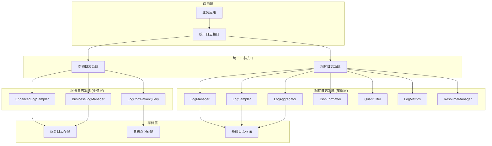

# 日志系统文档

## 📋 概述

RQA2025日志系统采用分层设计，包含现有日志系统（基础层）和增强日志系统（业务层），通过统一日志接口协调两个系统，确保职责明确、功能互补。

## 🏗️ 系统架构

### 整体架构图


## 📊 系统分工

### 现有日志系统 (基础层)

#### 职责范围
- **基础日志管理**: 日志记录器的创建和管理
- **基础采样**: 基于级别的采样和负载调整
- **日志聚合**: 批量日志收集和处理
- **格式化输出**: JSON格式日志输出
- **专业过滤**: 量化交易相关的日志过滤
- **指标收集**: 日志数量统计和性能指标
- **资源管理**: 日志文件管理和磁盘空间控制

#### 核心组件
| 组件 | 职责 | 适用场景 |
|------|------|----------|
| **LogManager** | 基础日志管理、格式化、输出 | 系统启动、配置、错误日志 |
| **LogSampler** | 基础采样、负载调整 | 高频率日志的采样控制 |
| **LogAggregator** | 日志聚合、批量处理 | 大量日志的批量处理 |
| **JsonFormatter** | JSON格式输出 | 结构化日志输出 |
| **QuantFilter** | 量化日志过滤 | 专业领域的日志过滤 |
| **LogMetrics** | 日志指标收集 | 监控统计 |
| **ResourceManager** | 资源管理 | 系统资源控制 |

#### 使用场景
- 系统启动、关闭、配置加载日志
- 通用调试、性能分析日志
- 错误异常、系统监控日志
- 高频率日志的采样控制
- 结构化日志输出

### 增强日志系统 (业务层)

#### 职责范围
- **业务采样**: 关键业务日志的强制采样
- **业务分类**: 业务日志的分类管理
- **关联追溯**: 业务操作的完整追溯
- **关联查询**: 采样日志与全量日志的关联查询
- **业务统计**: 业务操作的统计分析

#### 核心组件
| 组件 | 职责 | 适用场景 |
|------|------|----------|
| **EnhancedLogSampler** | 业务采样、强制采样 | 关键业务日志的强制采样 |
| **BusinessLogManager** | 业务日志分类管理 | 业务操作的完整记录 |
| **LogCorrelationQuery** | 关联查询、追溯 | 问题排查和审计 |

#### 使用场景
- 订单、交易、风控、账户等关键业务操作
- 业务操作的完整追溯
- 关联查询和问题排查
- 合规审计支持

## 🔧 使用指南

### 1. 基础日志记录 (现有系统)

```python
from src.infrastructure.m_logging import log_basic

# 系统级日志
log_basic("system.startup", "INFO", "系统启动完成")
log_basic("system.config", "INFO", "配置文件加载成功")
log_basic("system.database", "INFO", "数据库连接建立")

# 性能监控日志
log_basic("performance.memory", "INFO", "内存使用: 512MB")
log_basic("performance.cpu", "INFO", "CPU使用率: 15%")

# 错误日志
log_basic("system.error", "ERROR", "数据库连接失败", error_code="DB001")
```

### 2. 业务日志记录 (增强系统)

```python
from src.infrastructure.m_logging import log_business, log_debug, BusinessLogType

# 开始业务操作
trace_id = "trace_123456"
correlation_id = "corr_789012"

# 订单处理日志
correlation_id = log_business(
    operation="order_processing",
    business_type=BusinessLogType.ORDER,
    message="订单处理开始",
    level="INFO",
    order_id="ORDER_001",
    symbol="000001.SZ",
    price=10.50,
    qty=1000,
    trace_id=trace_id,
    correlation_id=correlation_id
)

# 风控检查日志
log_business(
    operation="risk_check",
    business_type=BusinessLogType.RISK,
    message="风控检查通过",
    level="INFO",
    order_id="ORDER_001",
    risk_score=0.85,
    trace_id=trace_id,
    correlation_id=correlation_id
)

# 交易执行日志
log_business(
    operation="trade_execution",
    business_type=BusinessLogType.TRADE,
    message="交易执行成功",
    level="INFO",
    order_id="ORDER_001",
    filled_qty=800,
    avg_price=10.52,
    trace_id=trace_id,
    correlation_id=correlation_id
)

# 调试信息
debug_trace_id = log_debug(
    operation="market_analysis",
    message="市场分析完成",
    symbol="000001.SZ",
    bid=10.51,
    ask=10.53,
    trace_id=trace_id
)
```

### 3. 关联查询 (增强系统)

```python
from src.infrastructure.m_logging import query_correlation, CorrelationQuery
from datetime import datetime, timedelta

# 按跟踪ID查询
result = query_correlation(
    CorrelationQuery(
        trace_id=trace_id,
        time_range=(datetime.now() - timedelta(minutes=10), datetime.now())
    )
)

print(f"关联日志数量: {len(result.related_logs)}")
print(f"采样日志数量: {len(result.sampled_logs)}")

# 按业务类型查询
result = query_correlation(
    CorrelationQuery(
        business_type=BusinessLogType.ORDER,
        time_range=(datetime.now() - timedelta(hours=1), datetime.now())
    )
)

print(f"订单相关日志: {len(result.sampled_logs)}")
```

### 4. 统一日志接口使用

```python
from src.infrastructure.m_logging import (
    UnifiedLoggingInterface, 
    LoggingContext,
    BusinessLogType
)

# 创建统一日志接口
interface = UnifiedLoggingInterface()

# 配置日志系统
config = {
    'basic': {
        'level': 'INFO',
        'sampling': {'default_rate': 0.5}
    },
    'enhanced': {
        'sampling': {
            'default_rate': 0.3,
            'critical_business_types': ['order', 'trade', 'risk']
        },
        'business_logging': {
            'business_log_rate': 1.0,
            'debug_log_rate': 0.1
        }
    }
}
interface.configure(config)

# 使用上下文管理
with interface.start_trace() as trace_id:
    with interface.start_correlation() as correlation_id:
        # 设置业务上下文
        interface.set_business_context(BusinessLogType.ORDER, "order_processing")
        
        # 记录业务日志
        interface.log_business(
            operation="order_receive",
            business_type=BusinessLogType.ORDER,
            message="收到订单",
            level="INFO"
        )
        
        # 记录基础日志
        interface.log_basic("system.order", "INFO", "订单系统处理中")
```

## 📊 配置说明

### 基础系统配置
```json
{
  "basic": {
    "level": "INFO",
    "handlers": [
      {"type": "file", "filename": "logs/basic.log"},
      {"type": "console"}
    ],
    "sampling": {
      "default_rate": 0.5,
      "level_rates": {
        "DEBUG": 0.1,
        "INFO": 0.8,
        "ERROR": 1.0
      }
    }
  }
}
```

### 增强系统配置
```json
{
  "enhanced": {
    "sampling": {
      "default_rate": 0.3,
      "critical_business_types": [
        "order", "trade", "risk", "account"
      ],
      "level_rates": {
        "DEBUG": 0.1,
        "INFO": 0.5,
        "WARNING": 1.0,
        "ERROR": 1.0
      }
    },
    "business_logging": {
      "business_log_rate": 1.0,
      "debug_log_rate": 0.1,
      "enable_correlation": true,
      "enable_trace": true
    },
    "correlation_query": {
      "max_query_history": 1000,
      "query_timeout": 300
    }
  }
}
```

## 📈 性能指标

### 基础系统指标
- **日志写入延迟**: < 10ms
- **采样率调整响应时间**: < 100ms
- **聚合处理延迟**: < 50ms
- **格式化输出延迟**: < 5ms

### 增强系统指标
- **业务日志强制采样**: 100% (关键业务类型)
- **关联查询响应时间**: < 500ms
- **追溯查询响应时间**: < 200ms
- **上下文切换延迟**: < 10ms

### 存储指标
- **日志压缩率**: > 70%
- **查询索引效率**: < 100ms
- **存储空间利用率**: > 80%

## 🧪 测试指南

### 单元测试
```bash
# 运行日志系统测试
python -m pytest tests/unit/infrastructure/m_logging/ -v

# 运行特定组件测试
python -m pytest tests/unit/infrastructure/m_logging/test_enhanced_log_sampler.py -v
```

### 集成测试
```bash
# 运行日志系统集成测试
python -m pytest tests/integration/infrastructure/test_logging_integration.py -v
```

### 性能测试
```bash
# 运行日志性能测试
python -m pytest tests/performance/infrastructure/test_logging_performance.py -v
```

## 🔍 故障排查

### 常见问题

#### 1. 日志丢失问题
**症状**: 关键业务日志未记录
**排查步骤**:
1. 检查采样配置是否正确
2. 确认业务类型是否在强制采样列表中
3. 检查日志级别设置
4. 验证存储空间是否充足

#### 2. 关联查询失败
**症状**: 无法查询到关联日志
**排查步骤**:
1. 检查trace_id和correlation_id是否正确
2. 确认时间范围设置
3. 验证索引是否正常
4. 检查查询权限

#### 3. 性能问题
**症状**: 日志写入延迟过高
**排查步骤**:
1. 检查磁盘I/O性能
2. 确认日志聚合配置
3. 验证采样率设置
4. 检查系统资源使用

### 调试工具

#### 1. 日志统计
```python
from src.infrastructure.m_logging import get_logging_interface

interface = get_logging_interface()
stats = interface.get_statistics()
print(f"基础日志数量: {stats['basic_logs']}")
print(f"业务日志数量: {stats['business_logs']}")
print(f"调试日志数量: {stats['debug_logs']}")
```

#### 2. 采样率检查
```python
# 检查基础采样器
basic_sampler = interface.get_basic_sampler()
print(f"基础采样率: {basic_sampler.current_rate}")

# 检查增强采样器
enhanced_sampler = interface.get_enhanced_sampler()
print(f"增强采样率: {enhanced_sampler.current_rate}")
```

#### 3. 关联查询调试
```python
# 查询特定跟踪ID的日志
related_logs = interface.get_related_logs(trace_id="trace_123")
print(f"关联日志数量: {len(related_logs)}")

# 获取关键业务日志
critical_logs = interface.get_critical_business_logs()
print(f"关键业务日志数量: {len(critical_logs)}")
```

## 🔗 相关文档

- [增强日志系统架构](../enhanced_logging_architecture.md)
- [日志系统分工架构](../logging_system_architecture.md)
- [统一日志接口使用示例](../../../examples/unified_logging_example.py)
- [日志系统测试用例](../../../../tests/unit/infrastructure/m_logging/)

---

**最后更新**: 2025-07-19  
**文档版本**: v1.0  
**维护状态**: ✅ 活跃维护中 