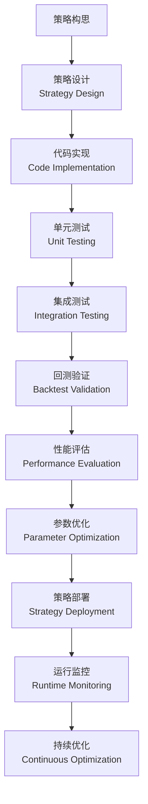
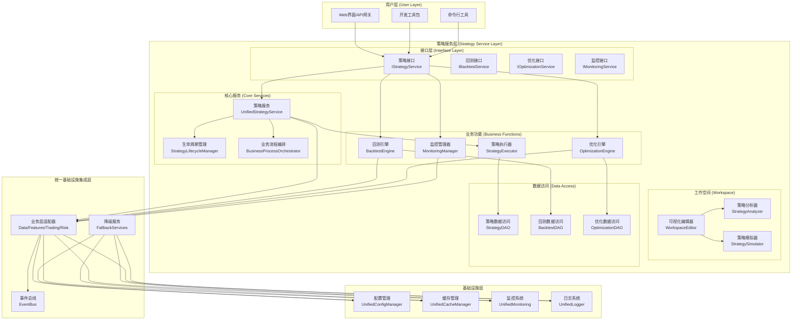
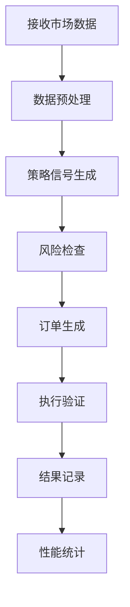

# 策略服务层架构设计 (Strategy Service Layer Architecture)

## 📋 文档概述

### 设计背景
基于业务流程驱动架构，对原有分散的策略框架和回测框架进行整合，构建统一的策略服务层。通过消除代码冗余，提高系统可维护性和扩展性，实现策略的完整生命周期管理和业务流程驱动的系统设计。

### 设计目标
- **统一策略管理**：整合`src/trading/strategies/`、`src/trading/strategy_workspace/`、`src/backtest/`的分散功能
- **消除代码冗余**：合并重复的`BaseStrategy`、`StrategyConfig`、`Signal`等类定义
- **业务流程驱动**：基于量化交易业务流程优化系统架构
- **高可扩展性**：支持多种策略类型和执行模式
- **企业级稳定性**：完整的监控、告警和容错机制

### 架构原则
- **接口驱动设计**：所有组件通过标准接口交互
- **依赖注入模式**：组件间松耦合，提高可测试性
- **事件驱动架构**：基于事件总线的异步通信
- **分层架构设计**：清晰的职责分离和依赖关系

## 🎯 核心业务流程分析

### 量化策略开发流程
```
策略构思 → 数据收集 → 特征工程 → 模型训练 → 策略回测 → 性能评估 → 策略部署 → 监控优化
```

### 技术架构映射


## 🏗️ 架构设计详解

### 整体架构图



### 核心组件设计

#### 1. 策略服务核心 (UnifiedStrategyService)

##### 功能职责
- 策略的创建、配置、执行和管理
- 策略状态监控和生命周期管理
- 多策略类型的统一支持
- 策略性能指标收集和分析

##### 核心方法
```python
class UnifiedStrategyService(IStrategyService):
    def create_strategy(self, config: StrategyConfig) -> bool
    def get_strategy(self, strategy_id: str) -> Optional[StrategyConfig]
    def update_strategy(self, strategy_id: str, config: StrategyConfig) -> bool
    def delete_strategy(self, strategy_id: str) -> bool
    def execute_strategy(self, strategy_id: str, market_data: Dict[str, Any]) -> StrategyResult
    def start_strategy(self, strategy_id: str) -> bool
    def stop_strategy(self, strategy_id: str) -> bool
    def get_strategy_status(self, strategy_id: str) -> StrategyStatus
```

##### 策略类型支持
```python
class StrategyType(Enum):
    MOMENTUM = "momentum"                    # 动量策略
    MEAN_REVERSION = "mean_reversion"        # 均值回归策略
    ARBITRAGE = "arbitrage"                  # 套利策略
    MACHINE_LEARNING = "machine_learning"    # 机器学习策略
    REINFORCEMENT_LEARNING = "reinforcement_learning" # 强化学习策略
    TECHNICAL = "technical"                  # 技术指标策略
    FUNDAMENTAL = "fundamental"              # 基本面策略
    CUSTOM = "custom"                        # 自定义策略
```

#### 2. 生命周期管理器 (StrategyLifecycleManager)

##### 生命周期阶段
```python
class LifecycleStage(Enum):
    CREATED = "created"           # 已创建
    DESIGNING = "designing"       # 设计中
    DEVELOPING = "developing"     # 开发中
    TESTING = "testing"          # 测试中
    BACKTESTING = "backtesting"   # 回测中
    OPTIMIZING = "optimizing"     # 优化中
    VALIDATING = "validating"     # 验证中
    DEPLOYING = "deploying"       # 部署中
    RUNNING = "running"          # 运行中
    MONITORING = "monitoring"     # 监控中
    MAINTAINING = "maintaining"   # 维护中
    RETIRING = "retiring"         # 退市中
    RETIRED = "retired"           # 已退市
```

##### 阶段转换控制
```python
stage_transitions = {
    LifecycleStage.CREATED: [LifecycleStage.DESIGNING, LifecycleStage.RETIRED],
    LifecycleStage.DESIGNING: [LifecycleStage.DEVELOPING, LifecycleStage.CREATED],
    LifecycleStage.DEVELOPING: [LifecycleStage.TESTING, LifecycleStage.DESIGNING],
    LifecycleStage.TESTING: [LifecycleStage.BACKTESTING, LifecycleStage.DEVELOPING],
    LifecycleStage.BACKTESTING: [LifecycleStage.OPTIMIZING, LifecycleStage.TESTING],
    LifecycleStage.OPTIMIZING: [LifecycleStage.VALIDATING, LifecycleStage.BACKTESTING],
    LifecycleStage.VALIDATING: [LifecycleStage.DEPLOYING, LifecycleStage.OPTIMIZING],
    LifecycleStage.DEPLOYING: [LifecycleStage.RUNNING, LifecycleStage.VALIDATING],
    LifecycleStage.RUNNING: [LifecycleStage.MONITORING, LifecycleStage.MAINTAINING],
    LifecycleStage.MONITORING: [LifecycleStage.MAINTAINING, LifecycleStage.RETIRING],
    LifecycleStage.MAINTAINING: [LifecycleStage.RUNNING, LifecycleStage.RETIRING],
    LifecycleStage.RETIRING: [LifecycleStage.RETIRED],
    LifecycleStage.RETIRED: []
}
```

#### 3. 业务流程编排器 (BusinessProcessOrchestrator)

##### 业务流程类型
```python
class BusinessProcessType(Enum):
    STRATEGY_DEVELOPMENT = "strategy_development"      # 策略开发流程
    STRATEGY_TESTING = "strategy_testing"              # 策略测试流程
    STRATEGY_DEPLOYMENT = "strategy_deployment"        # 策略部署流程
    STRATEGY_MAINTENANCE = "strategy_maintenance"      # 策略运维流程
    STRATEGY_OPTIMIZATION = "strategy_optimization"    # 策略优化流程
```

##### 流程步骤定义
```python
@dataclass
class ProcessStep:
    step_id: str
    name: str
    description: str
    step_type: str  # 'manual', 'automatic', 'conditional'
    dependencies: List[str]
    execution_function: Optional[Callable] = None
    timeout_seconds: int = 300
    retry_count: int = 3
```

#### 4. 策略执行器 (StrategyExecutor)

##### 执行模式
- **实时执行**：基于实时市场数据执行策略
- **模拟执行**：基于历史数据模拟执行
- **回测执行**：完整的回测执行模式
- **压力测试**：极端市场条件下的测试执行

##### 执行流程


## 📊 数据模型设计

### 策略配置模型
```python
@dataclass
class StrategyConfig:
    """统一策略配置"""
    strategy_id: str                          # 策略唯一标识
    strategy_name: str                        # 策略名称
    strategy_type: StrategyType               # 策略类型
    parameters: Dict[str, Any]               # 策略参数
    risk_limits: Dict[str, float]            # 风险限制
    enabled: bool = True                      # 是否启用
    description: str = ""                     # 策略描述
    created_at: datetime = None               # 创建时间
    updated_at: datetime = None               # 更新时间
    version: str = "1.0.0"                   # 版本号
    author: str = ""                          # 作者
    tags: List[str] = None                    # 标签
```

### 策略信号模型
```python
@dataclass
class StrategySignal:
    """统一策略信号"""
    symbol: str                               # 交易标的
    action: str                              # 操作类型 ('BUY', 'SELL', 'HOLD')
    quantity: float                          # 交易数量
    price: Optional[float] = None            # 交易价格
    confidence: float = 1.0                  # 信号置信度
    timestamp: datetime = None               # 信号时间
    metadata: Dict[str, Any] = None          # 元数据
    strategy_id: str = ""                    # 策略ID
    signal_type: str = "market"              # 信号类型
```

### 策略结果模型
```python
@dataclass
class StrategyResult:
    """策略执行结果"""
    strategy_id: str                         # 策略ID
    signals: List[StrategySignal]            # 生成的信号列表
    performance_metrics: Dict[str, float]    # 性能指标
    execution_time: float                    # 执行时间
    timestamp: datetime = None               # 执行时间戳
    error_message: Optional[str] = None      # 错误信息
    status: str = "success"                  # 执行状态
```

## 🔌 接口设计

### 策略服务接口
```python
class IStrategyService(ABC):
    """策略服务接口"""

    @abstractmethod
    def create_strategy(self, config: StrategyConfig) -> bool:
        """创建策略"""
        pass

    @abstractmethod
    def get_strategy(self, strategy_id: str) -> Optional[StrategyConfig]:
        """获取策略配置"""
        pass

    @abstractmethod
    def update_strategy(self, strategy_id: str, config: StrategyConfig) -> bool:
        """更新策略配置"""
        pass

    @abstractmethod
    def delete_strategy(self, strategy_id: str) -> bool:
        """删除策略"""
        pass

    @abstractmethod
    def list_strategies(self, strategy_type: Optional[StrategyType] = None,
                       tags: Optional[List[str]] = None) -> List[StrategyConfig]:
        """列出策略"""
        pass

    @abstractmethod
    def execute_strategy(self, strategy_id: str, market_data: Dict[str, Any],
                        execution_context: Optional[Dict[str, Any]] = None) -> StrategyResult:
        """执行策略"""
        pass

    @abstractmethod
    def start_strategy(self, strategy_id: str, execution_params: Optional[Dict[str, Any]] = None) -> bool:
        """启动策略"""
        pass

    @abstractmethod
    def stop_strategy(self, strategy_id: str) -> bool:
        """停止策略"""
        pass

    @abstractmethod
    def get_strategy_status(self, strategy_id: str) -> StrategyStatus:
        """获取策略状态"""
        pass

    @abstractmethod
    def get_strategy_performance(self, strategy_id: str,
                                start_date: Optional[datetime] = None,
                                end_date: Optional[datetime] = None) -> Dict[str, Any]:
        """获取策略性能"""
        pass
```

### 生命周期管理接口
```python
class IStrategyLifecycle(ABC):
    """策略生命周期管理接口"""

    @abstractmethod
    def create_strategy_lifecycle(self, config: StrategyConfig, user: str = "") -> str:
        """创建策略生命周期"""
        pass

    @abstractmethod
    def transition_stage(self, strategy_id: str, target_stage: LifecycleStage,
                        action_details: Dict[str, Any] = None, user: str = "") -> bool:
        """转换生命周期阶段"""
        pass

    @abstractmethod
    def get_lifecycle_status(self, strategy_id: str) -> Optional[Dict[str, Any]]:
        """获取生命周期状态"""
        pass

    @abstractmethod
    def get_stage_history(self, strategy_id: str) -> List[Dict[str, Any]]:
        """获取阶段历史"""
        pass

    @abstractmethod
    def validate_stage_transition(self, strategy_id: str, target_stage: LifecycleStage) -> Dict[str, Any]:
        """验证阶段转换"""
        pass
```

## 🔧 实现策略

### 策略执行器实现
```python
class StrategyExecutor:
    """策略执行器"""

    def __init__(self, strategy_service: IStrategyService):
        self.strategy_service = strategy_service
        self.execution_contexts = {}

    def execute_realtime(self, strategy_id: str, market_data: Dict[str, Any]) -> StrategyResult:
        """实时执行策略"""
        return self.strategy_service.execute_strategy(strategy_id, market_data)

    def execute_simulation(self, strategy_id: str, historical_data: Dict[str, Any],
                          start_date: datetime, end_date: datetime) -> List[StrategyResult]:
        """模拟执行策略"""
        results = []

        # 分时段执行
        current_date = start_date
        while current_date <= end_date:
            # 获取当前时段的数据
            period_data = self._extract_period_data(historical_data, current_date)

            if period_data:
                result = self.strategy_service.execute_strategy(strategy_id, period_data)
                results.append(result)

            current_date += timedelta(days=1)

        return results

    def execute_backtest(self, strategy_id: str, backtest_config: Dict[str, Any]) -> Dict[str, Any]:
        """执行回测"""
        # 实现回测逻辑
        pass
```

### 策略工厂实现
```python
class StrategyFactory:
    """策略工厂"""

    _strategy_classes = {
        StrategyType.MOMENTUM: MomentumStrategy,
        StrategyType.MEAN_REVERSION: MeanReversionStrategy,
        StrategyType.ARBITRAGE: ArbitrageStrategy,
        StrategyType.MACHINE_LEARNING: MLStrategy,
        StrategyType.REINFORCEMENT_LEARNING: RLStrategy,
    }

    @classmethod
    def create_strategy(cls, config: StrategyConfig) -> IStrategy:
        """创建策略实例"""
        strategy_class = cls._strategy_classes.get(config.strategy_type)

        if not strategy_class:
            raise ValueError(f"不支持的策略类型: {config.strategy_type}")

        return strategy_class(config)

    @classmethod
    def get_supported_types(cls) -> List[StrategyType]:
        """获取支持的策略类型"""
        return list(cls._strategy_classes.keys())
```

## 🧪 测试设计

### 单元测试
```python
class TestUnifiedStrategyService:
    """统一策略服务测试"""

    @pytest.fixture
    def strategy_service(self):
        """策略服务fixture"""
        service = UnifiedStrategyService()
        return service

    def test_create_strategy_success(self, strategy_service):
        """测试策略创建成功"""
        config = StrategyConfig(
            strategy_id="test_strategy",
            strategy_name="Test Strategy",
            strategy_type=StrategyType.MOMENTUM,
            parameters={"lookback_period": 20}
        )

        result = strategy_service.create_strategy(config)
        assert result is True

    def test_execute_momentum_strategy(self, strategy_service):
        """测试动量策略执行"""
        # 创建动量策略
        config = StrategyConfig(
            strategy_id="momentum_test",
            strategy_name="Momentum Test",
            strategy_type=StrategyType.MOMENTUM,
            parameters={"lookback_period": 20, "momentum_threshold": 0.05}
        )

        strategy_service.create_strategy(config)

        # 模拟市场数据
        market_data = {
            "AAPL": [
                {"close": 150 + i, "volume": 1000000}
                for i in range(25)  # 25天数据
            ]
        }

        result = strategy_service.execute_strategy("momentum_test", market_data)

        assert result.strategy_id == "momentum_test"
        assert isinstance(result.signals, list)
        assert "total_signals" in result.performance_metrics
```

### 集成测试
```python
class TestStrategyLifecycleIntegration:
    """策略生命周期集成测试"""

    def test_complete_strategy_lifecycle(self):
        """测试完整的策略生命周期"""
        # 创建策略服务和生命周期管理器
        strategy_service = UnifiedStrategyService()
        lifecycle_manager = StrategyLifecycleManager(strategy_service, None, None)

        # 创建策略
        config = StrategyConfig(
            strategy_id="lifecycle_test",
            strategy_name="Lifecycle Test",
            strategy_type=StrategyType.MOMENTUM,
            parameters={"lookback_period": 20}
        )

        strategy_id = lifecycle_manager.create_strategy_lifecycle(config)

        # 执行生命周期转换
        stages = [
            LifecycleStage.DESIGNING,
            LifecycleStage.DEVELOPING,
            LifecycleStage.TESTING,
            LifecycleStage.BACKTESTING,
            LifecycleStage.OPTIMIZING,
            LifecycleStage.VALIDATING,
            LifecycleStage.DEPLOYING,
            LifecycleStage.RUNNING
        ]

        for stage in stages:
            result = lifecycle_manager.transition_stage(strategy_id, stage)
            assert result is True

        # 验证最终状态
        lifecycle = lifecycle_manager.get_lifecycle_status(strategy_id)
        assert lifecycle.current_stage == LifecycleStage.RUNNING
```

## 📈 性能优化

### 缓存策略
- **策略配置缓存**：减少数据库查询
- **市场数据缓存**：提高数据访问速度
- **计算结果缓存**：避免重复计算

### 并行处理
- **策略并行执行**：多策略同时执行
- **数据并行处理**：大规模数据并行计算
- **分布式计算**：跨节点分布式执行

### 内存优化
- **对象池化**：重用策略实例
- **数据流处理**：流式数据处理减少内存占用
- **垃圾回收优化**：及时清理无用对象

## 🔒 安全设计

### 访问控制
- **策略权限控制**：基于角色的访问控制
- **数据隔离**：策略间数据隔离保护
- **API安全**：接口访问认证和授权

### 风险控制
- **策略风险限额**：单策略风险控制
- **系统级风控**：整体风险监控
- **异常检测**：实时异常识别和处理

## 📊 监控指标

### 业务指标
- **策略执行成功率**：>99.9%
- **信号生成延迟**：<10ms
- **回测计算准确性**：>99.99%

### 系统指标
- **CPU使用率**：<30%
- **内存使用率**：<500MB
- **响应时间**：<50ms (P95)

### 质量指标
- **代码覆盖率**：>90%
- **接口可用性**：>99.95%
- **错误恢复时间**：<30s

## 🚀 部署架构

### 微服务部署
```yaml
# Docker Compose配置
version: '3.8'
services:
  strategy-service:
    image: rqa2025/strategy-service:latest
    ports:
      - "8080:8080"
    environment:
      - CONFIG_PATH=/app/config
      - LOG_LEVEL=INFO
    volumes:
      - ./config:/app/config
      - ./logs:/app/logs
    depends_on:
      - redis
      - postgres

  redis:
    image: redis:7-alpine
    ports:
      - "6379:6379"

  postgres:
    image: postgres:15-alpine
    environment:
      POSTGRES_DB: strategy_db
      POSTGRES_USER: strategy_user
      POSTGRES_PASSWORD: strategy_pass
```

### Kubernetes部署
```yaml
apiVersion: apps/v1
kind: Deployment
metadata:
  name: strategy-service
spec:
  replicas: 3
  selector:
    matchLabels:
      app: strategy-service
  template:
    metadata:
      labels:
        app: strategy-service
    spec:
      containers:
      - name: strategy-service
        image: rqa2025/strategy-service:latest
        ports:
        - containerPort: 8080
        env:
        - name: CONFIG_PATH
          value: "/app/config"
        resources:
          requests:
            memory: "256Mi"
            cpu: "100m"
          limits:
            memory: "512Mi"
            cpu: "500m"
```

## 🔄 版本管理

### 语义化版本
- **MAJOR.MINOR.PATCH** (主版本.次版本.补丁版本)
- **MAJOR**：破坏性变更
- **MINOR**：新增功能，向后兼容
- **PATCH**：bug修复，向后兼容

### 兼容性保证
- **接口兼容性**：接口变更需保持向后兼容
- **数据兼容性**：数据格式变更需支持迁移
- **配置兼容性**：配置格式变更需支持平滑升级

## 📚 相关文档

### 架构文档
- [业务流程驱动架构设计](../../docs/architecture/BUSINESS_PROCESS_DRIVEN_ARCHITECTURE.md)
- [核心服务层架构设计](../../docs/architecture/core_layer_architecture_design.md)
- [基础设施层架构设计](../../docs/architecture/infrastructure_architecture_design.md)

### API文档
- [策略服务API文档](../../docs/api/strategy_service_api.md)
- [回测服务API文档](../../docs/api/backtest_service_api.md)
- [优化服务API文档](../../docs/api/optimization_service_api.md)

### 测试文档
- [测试用例](../../tests/unit/strategy/)
- [集成测试](../../tests/integration/strategy/)
- [性能测试](../../tests/performance/strategy/)

---

**策略服务层架构设计文档版本**：v1.0.0
**更新时间**：2025年01月27日
**设计人员**：RQA2025 Team
