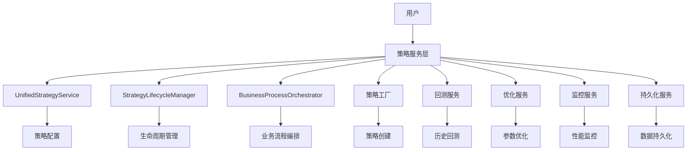

# 策略服务层使用指南

## 📋 文档概述

本文档提供策略服务层的完整使用指南，包括接口定义、策略实现、配置管理和最佳实践。

**版本**: v1.0.0
**更新时间**: 2025年01月27日
**适用范围**: 策略服务层所有组件

## 🏗️ 架构概述

策略服务层基于业务流程驱动架构设计，提供统一的策略管理、回测、优化和监控功能。

### 核心组件



## 🔧 接口定义

### 核心接口

#### IStrategyService - 策略服务接口

```python
from src.strategy.interfaces.strategy_interfaces import IStrategyService

class IStrategyService(ABC):
    @abstractmethod
    def create_strategy(self, config: StrategyConfig) -> str:
        """创建策略"""

    @abstractmethod
    def execute_strategy(self, strategy_id: str, market_data: Dict[str, Any]) -> StrategyResult:
        """执行策略"""

    @abstractmethod
    def get_strategy_performance(self, strategy_id: str) -> Dict[str, Any]:
        """获取策略性能"""

    @abstractmethod
    def update_strategy_config(self, strategy_id: str, config: Dict[str, Any]) -> bool:
        """更新策略配置"""

    @abstractmethod
    def start_strategy(self, strategy_id: str) -> bool:
        """启动策略"""

    @abstractmethod
    def stop_strategy(self, strategy_id: str) -> bool:
        """停止策略"""

    @abstractmethod
    def get_strategy_status(self, strategy_id: str) -> StrategyStatus:
        """获取策略状态"""
```

#### IStrategy - 策略接口

```python
from src.strategy.interfaces.strategy_interfaces import IStrategy

class IStrategy(ABC):
    @abstractmethod
    def initialize(self, config: StrategyConfig) -> bool:
        """初始化策略"""

    @abstractmethod
    def generate_signals(self, market_data: Dict[str, Any]) -> List[StrategySignal]:
        """生成交易信号"""

    @abstractmethod
    def update_parameters(self, parameters: Dict[str, Any]) -> bool:
        """更新策略参数"""

    @abstractmethod
    def get_performance_metrics(self) -> Dict[str, Any]:
        """获取性能指标"""
```

### 数据结构

#### StrategyConfig - 策略配置

```python
@dataclass
class StrategyConfig:
    strategy_id: str                    # 策略唯一标识
    strategy_name: str                  # 策略名称
    strategy_type: StrategyType         # 策略类型
    parameters: Dict[str, Any] = field(default_factory=dict)  # 策略参数
    risk_limits: Dict[str, Any] = field(default_factory=dict)  # 风险限制
    market_data_sources: List[str] = field(default_factory=list)  # 数据源
    created_at: datetime = field(default_factory=datetime.now)   # 创建时间
    updated_at: datetime = field(default_factory=datetime.now)   # 更新时间
```

#### StrategySignal - 策略信号

```python
@dataclass
class StrategySignal:
    signal_id: str                      # 信号唯一标识
    strategy_id: str                    # 策略ID
    signal_type: str                    # 信号类型 ('BUY', 'SELL', 'HOLD')
    symbol: str                         # 交易标的
    price: float                        # 交易价格
    quantity: int                       # 交易数量
    timestamp: datetime                 # 时间戳
    confidence: float = 0.0             # 置信度
    metadata: Dict[str, Any] = field(default_factory=dict)  # 元数据
```

## 🚀 快速开始

### 1. 创建策略配置

```python
from src.strategy.interfaces.strategy_interfaces import StrategyConfig, StrategyType

# 创建动量策略配置
config = StrategyConfig(
    strategy_id="momentum_strategy_001",
    strategy_name="Momentum Strategy",
    strategy_type=StrategyType.MOMENTUM,
    parameters={
        "lookback_period": 20,
        "momentum_threshold": 0.05,
        "volume_threshold": 1.5
    },
    risk_limits={
        "max_drawdown": 0.1,
        "max_position": 1000,
        "risk_per_trade": 0.02
    },
    market_data_sources=["bloomberg", "yahoo_finance"]
)
```

### 2. 使用策略工厂创建策略

```python
from src.strategy.strategies.factory import get_strategy_factory

# 获取策略工厂
factory = get_strategy_factory()

# 创建策略实例
strategy = factory.create_strategy(config)

# 初始化策略
strategy.initialize(config)
```

### 3. 生成交易信号

```python
# 准备市场数据
market_data = {
    "AAPL": [
        {"close": 150.0, "volume": 1000000, "timestamp": "2023-01-01"},
        {"close": 152.0, "volume": 1100000, "timestamp": "2023-01-02"},
        {"close": 151.5, "volume": 1050000, "timestamp": "2023-01-03"}
    ],
    "GOOGL": [
        {"close": 2800.0, "volume": 500000, "timestamp": "2023-01-01"},
        {"close": 2820.0, "volume": 550000, "timestamp": "2023-01-02"},
        {"close": 2810.0, "volume": 520000, "timestamp": "2023-01-03"}
    ]
}

# 生成交易信号
signals = strategy.generate_signals(market_data)

# 处理信号
for signal in signals:
    print(f"Signal: {signal.signal_type} {signal.quantity} {signal.symbol} "
          f"at {signal.price} (confidence: {signal.confidence:.2f})")
```

### 4. 获取性能指标

```python
# 获取策略性能指标
metrics = strategy.get_performance_metrics()

print(f"策略ID: {metrics['strategy_id']}")
print(f"策略类型: {metrics['strategy_type']}")
print(f"总信号数: {metrics['total_signals']}")
print(f"缓存大小: {metrics['cache_size']}")
```

### 5. 更新策略参数

```python
# 更新策略参数
new_parameters = {
    "lookback_period": 30,
    "momentum_threshold": 0.03
}

success = strategy.update_parameters(new_parameters)
if success:
    print("策略参数更新成功")
else:
    print("策略参数更新失败")
```

## 📊 内置策略类型

### 1. 动量策略 (MOMENTUM)

基于价格动量的趋势跟随策略。

**参数配置**:
```python
parameters = {
    "lookback_period": 20,          # 回顾期
    "momentum_threshold": 0.05,     # 动量阈值
    "volume_threshold": 1.5,        # 成交量阈值
    "min_trend_period": 5,          # 最小趋势期
    "max_hold_period": 10           # 最大持仓期
}
```

**适用场景**: 趋势明显的单边行情。

### 2. 均值回归策略 (MEAN_REVERSION)

基于价格偏离均值的回归特性。

**参数配置**:
```python
parameters = {
    "lookback_period": 20,          # 回顾期
    "entry_threshold": 2.0,         # 开仓阈值 (标准差倍数)
    "exit_threshold": 0.5,          # 平仓阈值 (标准差倍数)
    "min_holding_period": 5,        # 最小持仓期
    "max_holding_period": 20        # 最大持仓期
}
```

**适用场景**: 震荡行情，价格围绕均值波动。

### 3. 套利策略 (ARBITRAGE)

利用市场价差的无风险套利。

**参数配置**:
```python
parameters = {
    "price_threshold": 0.005,       # 价差阈值 (0.5%)
    "volume_threshold": 100000,     # 成交量阈值
    "max_spread": 0.01,             # 最大价差
    "hedge_ratio": 1.0              # 对冲比例
}
```

**适用场景**: 相关资产间的价差交易。

## 🔄 策略生命周期管理

### 生命周期阶段

```python
from src.strategy.lifecycle.strategy_lifecycle_manager import LifecycleStage

class LifecycleStage(Enum):
    CREATED = "created"           # 已创建
    DESIGNING = "designing"       # 设计中
    DEVELOPING = "developing"     # 开发中
    TESTING = "testing"          # 测试中
    BACKTESTING = "backtesting"   # 回测中
    OPTIMIZING = "optimizing"     # 优化中
    VALIDATING = "validating"     # 验证中
    DEPLOYING = "deploying"       # 部署中
    RUNNING = "running"          # 运行中
    MONITORING = "monitoring"     # 监控中
    MAINTAINING = "maintaining"   # 维护中
    RETIRING = "retiring"         # 退市中
    RETIRED = "retired"           # 已退市
```

### 使用生命周期管理器

```python
from src.strategy.lifecycle.strategy_lifecycle_manager import StrategyLifecycleManager

# 创建生命周期管理器
lifecycle_manager = StrategyLifecycleManager()

# 初始化策略生命周期
lifecycle_manager.initialize_strategy(strategy_id)

# 转换生命周期阶段
success = lifecycle_manager.transition_stage(strategy_id, LifecycleStage.TESTING)

# 获取生命周期状态
status = lifecycle_manager.get_lifecycle_status(strategy_id)
print(f"当前阶段: {status['current_stage']}")
print(f"开始时间: {status['start_time']}")
print(f"持续时间: {status['duration_days']} 天")
```

## 💾 数据持久化

### 持久化配置

```python
from src.strategy.persistence.strategy_persistence import PersistenceConfig, StrategyPersistence

# 创建持久化配置
config = PersistenceConfig(
    base_path="data/strategies",     # 数据存储路径
    backup_enabled=True,             # 启用备份
    compression_enabled=True,        # 启用压缩
    max_file_size_mb=100             # 最大文件大小
)

# 创建持久化服务
persistence = StrategyPersistence(config)
```

### 保存和加载策略数据

```python
# 保存策略配置
success = persistence.save_strategy_config(config)

# 加载策略配置
loaded_config = persistence.load_strategy_config(strategy_id)

# 保存策略执行结果
persistence.save_strategy_result(result)

# 获取策略执行历史
history = persistence.get_strategy_history(strategy_id)
for result in history:
    print(f"执行时间: {result.timestamp}, 状态: {result.status}")
```

### 备份和恢复

```python
# 备份所有策略数据
backup_success = persistence.backup_strategies()

# 恢复策略数据
restore_success = persistence.restore_strategies(backup_timestamp)
```

## 📈 性能监控

### 监控服务使用

```python
from src.strategy.monitoring.monitoring_service import MonitoringService

# 创建监控服务
monitoring = MonitoringService()

# 收集性能指标
metrics = monitoring.collect_metrics(strategy_id)

# 检查健康状态
health = monitoring.check_health(strategy_id)

# 生成监控报告
report = monitoring.generate_report(strategy_id)
```

## 🧪 测试和验证

### 单元测试

```python
import pytest
from src.strategy.strategies.momentum_strategy import MomentumStrategy
from src.strategy.interfaces.strategy_interfaces import StrategyConfig, StrategyType

class TestMomentumStrategy:
    @pytest.fixture
    def momentum_config(self):
        return StrategyConfig(
            strategy_id="test_momentum",
            strategy_name="Test Momentum",
            strategy_type=StrategyType.MOMENTUM,
            parameters={"lookback_period": 5}
        )

    def test_strategy_creation(self, momentum_config):
        strategy = MomentumStrategy(momentum_config)
        assert strategy.config.strategy_id == "test_momentum"

    def test_signal_generation(self, momentum_config):
        strategy = MomentumStrategy(momentum_config)

        market_data = {
            "AAPL": [
                {"close": 100.0, "volume": 1000000},
                {"close": 102.0, "volume": 1100000},
                {"close": 104.0, "volume": 1200000}
            ]
        }

        signals = strategy.generate_signals(market_data)
        assert isinstance(signals, list)
```

### 集成测试

```python
def test_strategy_full_workflow():
    """测试完整策略工作流程"""
    # 1. 创建配置
    config = StrategyConfig(
        strategy_id="integration_test",
        strategy_name="Integration Test",
        strategy_type=StrategyType.MOMENTUM
    )

    # 2. 创建策略
    factory = get_strategy_factory()
    strategy = factory.create_strategy(config)

    # 3. 初始化
    strategy.initialize(config)

    # 4. 生成信号
    market_data = {"AAPL": [{"close": 100.0, "volume": 1000000}]}
    signals = strategy.generate_signals(market_data)

    # 5. 验证结果
    assert len(signals) >= 0
```

## 🔧 配置管理

### 环境配置

```python
# 开发环境配置
development_config = {
    "database_url": "postgresql://localhost/strategy_dev",
    "cache_url": "redis://localhost:6379/0",
    "log_level": "DEBUG"
}

# 生产环境配置
production_config = {
    "database_url": "postgresql://prod-server/strategy_prod",
    "cache_url": "redis://prod-server:6379/0",
    "log_level": "INFO"
}
```

### 策略参数调优

```python
# 参数网格搜索
param_grid = {
    "lookback_period": [10, 20, 30, 50],
    "momentum_threshold": [0.02, 0.05, 0.08, 0.10],
    "volume_threshold": [1.2, 1.5, 2.0]
}

# 使用优化服务进行参数调优
from src.strategy.optimization.optimization_service import OptimizationService

optimizer = OptimizationService()
best_params = optimizer.optimize_parameters(strategy_id, param_grid, market_data)
```

## 🚨 错误处理和调试

### 常见错误

```python
try:
    strategy = factory.create_strategy(config)
    signals = strategy.generate_signals(market_data)
except ValueError as e:
    print(f"配置错误: {e}")
except ConnectionError as e:
    print(f"连接错误: {e}")
except Exception as e:
    print(f"未知错误: {e}")
    # 记录错误日志
    logger.error(f"Strategy execution failed: {e}", exc_info=True)
```

### 调试技巧

```python
# 启用详细日志
import logging
logging.basicConfig(level=logging.DEBUG)

# 检查策略状态
print(f"策略状态: {strategy.get_strategy_status()}")
print(f"配置信息: {strategy.get_config()}")
print(f"性能指标: {strategy.get_performance_metrics()}")

# 清理缓存
strategy.clear_cache()
```

## 📚 最佳实践

### 1. 策略设计原则

- **单一职责**: 每个策略只关注一种交易逻辑
- **参数化配置**: 避免硬编码参数
- **风险控制**: 设置合理的风险限制
- **可扩展性**: 设计支持扩展的接口

### 2. 性能优化

- **缓存管理**: 合理使用信号缓存
- **批量处理**: 批量处理多个交易信号
- **异步执行**: 对耗时操作使用异步处理
- **内存管理**: 及时清理不需要的数据

### 3. 监控和维护

- **健康检查**: 定期检查策略健康状态
- **性能监控**: 监控关键性能指标
- **日志记录**: 详细记录策略执行过程
- **备份恢复**: 定期备份策略数据

### 4. 测试策略

- **单元测试**: 测试策略的核心逻辑
- **集成测试**: 测试策略与其他组件的集成
- **回测验证**: 使用历史数据验证策略效果
- **压力测试**: 测试极端市场条件下的表现

## 📞 支持与帮助

### 获取帮助

1. **查看文档**: 参考本文档和相关API文档
2. **运行测试**: 执行单元测试验证功能
3. **查看日志**: 检查详细的错误日志信息
4. **联系支持**: 提交问题到技术支持团队

### 常用命令

```bash
# 运行策略测试
python -m pytest tests/unit/strategy/ -v

# 检查策略配置
python -c "from src.strategy.strategies.factory import get_strategy_factory; print(factory.get_supported_types())"

# 查看策略文档
python -c "from src.strategy.strategies.momentum_strategy import MomentumStrategy; help(MomentumStrategy)"
```

---

## 🔗 相关文档

- [策略服务层架构设计](../architecture/strategy_layer_architecture_design.md)
- [核心服务层架构设计](../architecture/core_layer_architecture_design.md)
- [业务流程驱动架构设计](../architecture/BUSINESS_PROCESS_DRIVEN_ARCHITECTURE.md)
- [API文档](../../api/)
- [测试用例](../../tests/unit/strategy/)

---

**策略服务层使用指南** - 让策略开发更简单、更高效！
