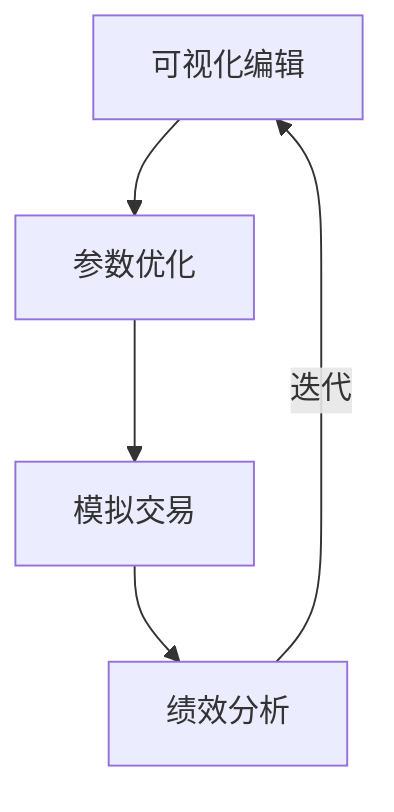

# RQA2025 策略工作台设计文档

## 1. 概述

策略工作台提供量化策略的全生命周期管理，主要功能包括：
- 可视化策略构建
- 参数优化工具
- 模拟交易环境
- 绩效分析面板

## 2. 系统架构

### 2.1 核心组件
```text
VisualEditor       - 可视化策略编辑器
Optimizer          - 参数优化引擎
Simulator          - 模拟交易环境
Analyzer           - 策略分析面板
StrategyStore      - 策略版本仓库
```

### 2.2 工作流程


## 3. 可视化编辑器

### 3.1 节点类型系统
| 节点类型 | 说明 | 示例参数 |
|---------|------|---------|
| data_source | 数据源节点 | symbol, frequency |
| feature | 特征工程节点 | indicators, windows |
| model | 模型节点 | lookback, units |
| trade | 交易规则节点 | thresholds, position |
| risk | 风控节点 | max_drawdown, stop_loss |

### 3.2 连接规则
```text
合法连接路径：
data_source -> feature -> model -> trade -> risk

禁止连接：
- 跨层连接（如data_source直接连model）
- 逆向连接（如trade连回feature）
- 循环连接
```

## 4. 参数优化

### 4.1 优化算法
```python
class Optimizer:
    """参数优化器"""
    
    def grid_search(self, params_grid):
        """网格搜索"""
        pass
        
    def bayesian_optimization(self, bounds, n_iter):
        """贝叶斯优化"""
        pass
        
    def genetic_algorithm(self, population_size):
        """遗传算法"""
        pass
```

### 4.2 参数空间定义
```json
{
    "lookback": {
        "type": "int",
        "bounds": [10, 100],
        "step": 5
    },
    "threshold": {
        "type": "float", 
        "bounds": [0.1, 0.9]
    }
}
```

## 5. 模拟交易

### 5.1 模拟环境配置
```yaml
environment:
  start_date: 2023-01-01
  end_date: 2023-06-30
  initial_capital: 1000000
  commission: 0.0003
  slippage: 0.001
```

### 5.2 市场模拟模式
| 模式 | 说明 |
|------|------|
| 历史回放 | 严格按历史数据时间序列 |
| 随机波动 | 添加价格随机扰动 |
| 极端行情 | 模拟暴涨暴跌场景 |

## 6. 分析面板

### 6.1 核心分析指标
```python
class PerformanceMetrics:
    """策略绩效指标"""
    
    def calculate_returns(self):
        """收益分析"""
        pass
        
    def analyze_risk(self):
        """风险分析"""
        pass
        
    def breakdown_attribution(self):
        """归因分析"""
        pass
```

### 6.2 可视化组件
```javascript
// 示例：收益曲线组件
const ReturnsChart = ({ data }) => (
  <LineChart
    data={data}
    xKey="date"
    yKeys={['cumulative_return']}
    width={800}
    height={400}
  />
);
```

## 7. 策略版本管理

### 7.1 版本控制
```text
版本号规范：v{主版本}.{次版本}.{修订号}
示例：v1.3.2

版本标签：
- dev: 开发中版本
- test: 测试版本  
- prod: 生产版本
```

### 7.2 版本对比
```python
def compare_strategies(base, compare):
    """策略版本对比"""
    return {
        "param_changes": find_param_diffs(base, compare),
        "performance_delta": calc_perf_delta(base, compare),
        "risk_changes": calc_risk_changes(base, compare)
    }
```

## 8. 部署方案

### 8.1 开发环境
```text
开发模式：
  ├─ 实时热更新
  ├─ 调试工具集成
  └─ 模拟数据支持

测试模式：
  ├─ 自动化测试
  ├─ 性能分析
  └─ 压力测试
```

### 8.2 生产环境
```text
Web服务部署：
  ├─ REST API
  ├─ WebSocket实时更新
  └─ 权限控制系统

桌面应用部署：
  ├─ 本地数据存储
  ├─ 离线模式
  └─ 系统集成
```

## 9. 版本历史

- v1.0 (2023-11-01): 基础可视化编辑器
- v1.1 (2023-11-15): 参数优化模块
- v1.2 (2023-12-01): 模拟交易环境
- v1.3 (2023-12-15): 分析面板增强
