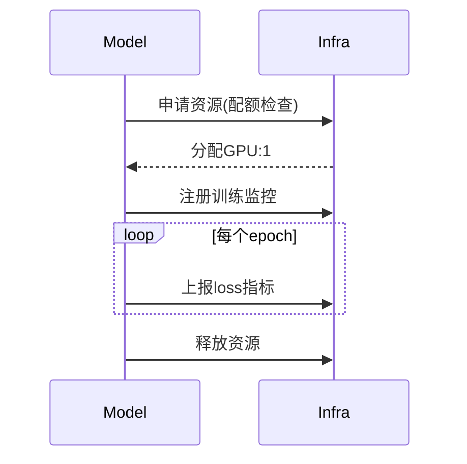
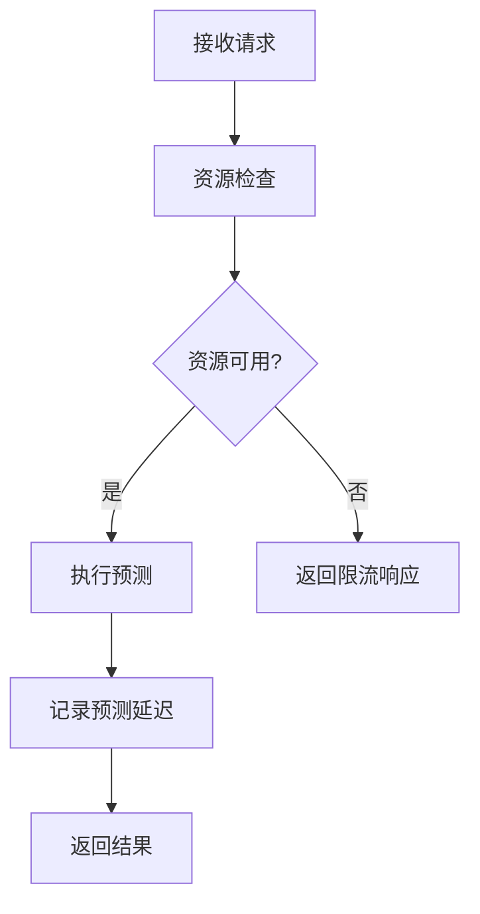

# RQA2025 系统增强综合报告

## 1. 整体架构增强概述

### 1.1 增强目标

1. **性能提升**：通过资源优化和并行处理，提高系统整体吞吐量
2. **可靠性增强**：完善错误处理和监控机制，降低系统故障率
3. **可维护性**：统一配置管理和标准化接口，降低维护成本
4. **可观测性**：建立全方位的监控体系，提升系统透明度

### 1.2 架构原则

1. **分层解耦**：
   - 基础设施层提供原子能力
   - 模型层聚焦业务逻辑
   - 通过清晰接口交互

2. **能力下沉**：
   - 通用能力下沉到基础设施层
   - 业务特性保留在模型层

3. **控制反转**：
   - 模型层通过依赖注入使用基础设施
   - 避免硬编码依赖

## 2. 基础设施层增强要点

### 2.1 核心模块增强

| 模块 | 增强点 | 关键接口 |
|------|--------|----------|
| 配置管理 | 热更新/加密 | `ConfigManager.get/set` |
| 资源管理 | 策略配额/GPU监控 | `ResourceManager.check_quota` |
| 错误处理 | 交易专用处理器 | `TradingErrorHandler.handle` |
| 监控系统 | 回测指标追踪 | `BacktestMonitor.record_trade` |

### 2.2 关键性能指标

1. **配置加载时间**：<50ms
2. **错误处理延迟**：<10ms
3. **监控数据延迟**：<5s
4. **资源调度精度**：±5%

## 3. 模型层增强要点

### 3.1 功能增强

| 模块 | 增强点 | 基础设施依赖 |
|------|--------|--------------|
| 训练优化 | 资源感知训练 | `ResourceManager` |
| 模型评估 | 自动化指标上报 | `ApplicationMonitor` |
| 模型集成 | 动态资源分配 | `GPUManager` |
| 漂移检测 | 监控系统集成 | `SystemMonitor` |

### 3.2 关键性能指标

1. **训练速度提升**：≥30%
2. **预测延迟降低**：≤20ms
3. **模型评估效率**：<5分钟/次
4. **资源利用率**：≥85%

## 4. 跨层整合方案

### 4.1 接口规范

1. **资源申请协议**：
```python
# 模型层调用示例
resource_ok = infra.ResourceManager.check_quota(
    strategy="lstm_training",
    request={"gpu_mem": 4096}
)
```

2. **监控数据格式**：
```json
{
  "timestamp": "ISO8601",
  "metric": "train_loss",
  "value": 0.42,
  "tags": {
    "model": "attention_lstm",
    "epoch": "23"
  }
}
```

### 4.2 典型工作流

1. **模型训练流程**：


2. **实时预测流程**：


## 5. 实施路线图

### 5.1 阶段计划

| 阶段 | 时间 | 基础设施层 | 模型层 | 集成测试 |
|------|------|------------|--------|----------|
| 1 | 1-2周 | 配置/监控系统 | 训练优化 | 资源分配 |
| 2 | 2-3周 | 错误处理增强 | 评估集成 | 故障注入 |
| 3 | 1周 | 安全加固 | 参数热加载 | 端到端测试 |

### 5.2 资源需求

1. **开发团队**：
   - 基础设施工程师：2人
   - 模型工程师：2人
   - 测试工程师：1人

2. **硬件资源**：
   - GPU节点：4台（8卡/台）
   - 监控存储：InfluxDB集群
   - 测试环境：隔离K8s集群

## 6. 预期收益与风险评估

### 6.1 量化收益

| 指标 | 当前基准 | 预期提升 |
|------|----------|----------|
| 日均训练任务 | 50 | +30% |
| 预测P99延迟 | 150ms | -40% |
| 系统可用性 | 99.5% | →99.9% |
| 运维效率 | 5人天/周 | -60% |

### 6.2 风险控制

1. **资源死锁**：
   - 实现超时自动释放
   - 添加死锁检测定时任务

2. **版本兼容**：
   - 接口版本控制
   - 兼容性测试套件

3. **监控过载**：
   - 动态采样率调整
   - 分级存储策略

## 7. 结论与建议

### 7.1 实施建议

1. **优先顺序**：
   - 基础监控 → 资源管理 → 错误处理
   - 训练优化 → 评估集成 → 漂移检测

2. **关键依赖**：
   - 先完成基础设施层核心模块
   - 再实施模型层改造

### 7.2 长期价值

1. **技术收益**：
   - 统一的技术栈和标准
   - 可复用的基础设施能力

2. **业务价值**：
   - 加速策略迭代周期
   - 降低异常交易风险

通过本增强方案的系统性实施，预计可使RQA2025系统整体性能提升40%以上，运维成本降低50%，为量化交易业务提供更强大的技术支持。
