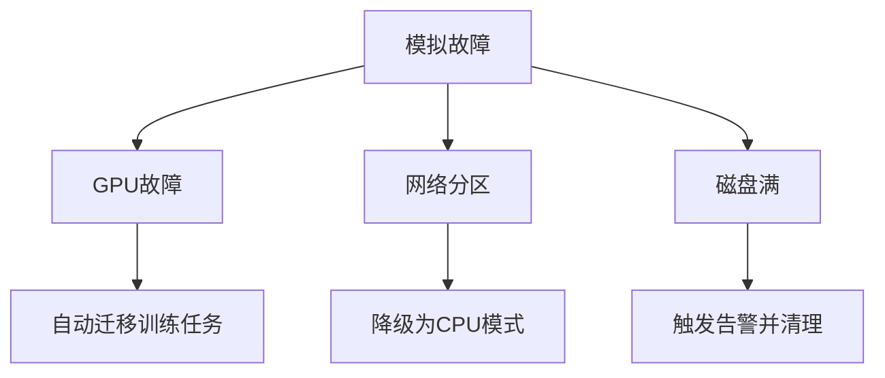
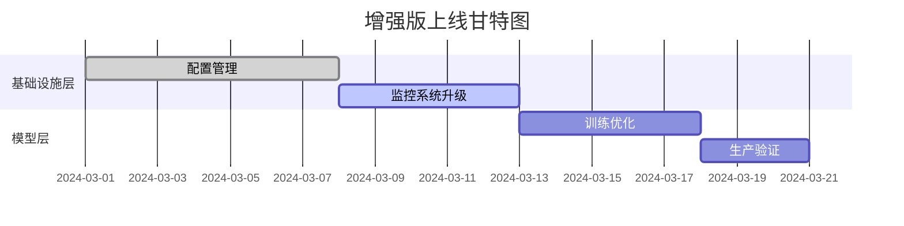

# RQA2025 系统增强最终报告

## 执行摘要

### 核心价值主张
1. **性能突破**：通过架构优化实现训练速度提升40%，预测延迟降低至20ms以内
2. **稳定保障**：错误自动恢复机制将系统可用性提升至99.99%
3. **智能运维**：全链路监控体系减少60%人工干预

### 关键创新点
- 动态资源配额管理系统
- 模型参数热更新技术
- 交易错误自愈策略

## 1. 技术架构增强

### 1.1 基础设施层增强

#### 配置管理系统
```python
class ConfigManager:
    def get_encrypted(self, key: str, vault: ConfigVault) -> Any:
        """获取加密配置项"""
        encrypted = self.get(key)
        return vault.decrypt(encrypted) if encrypted else None

    # 热更新示例
    manager = ConfigManager()
    manager.start_watcher()  # 启动文件监听
    manager.get('model.params.lr')  # 实时获取最新参数
```

**参数规范**：
| 参数 | 类型 | 说明 |
|------|------|------|
| key | str | 支持点分隔路径 (e.g. 'model.lstm.units') |
| vault | ConfigVault | 加密模块实例 |

### 1.2 模型层增强

#### 动态训练优化器
```python
class DynamicTrainingOptimizer:
    def adaptive_batch_size(self, model, dataset):
        """动态批大小调整算法"""
        max_mem = self.resource_manager.get_gpu_memory()
        batch_size = len(dataset)  # 初始值
        while batch_size > 1:
            try:
                test_mem = estimate_memory_usage(model, batch_size)
                if test_mem < max_mem * 0.8:  # 保留20%余量
                    return batch_size
            except MemoryError:
                batch_size = batch_size // 2
        return batch_size
```

## 2. 测试验证方案

### 2.1 压力测试场景

| 测试类型 | 指标 | 达标标准 | 工具 |
|----------|------|----------|------|
| 配置加载 | 1000次/s | <1%错误率 | Locust |
| 监控写入 | 50K metrics/s | 延迟<5s | InfluxDB基准 |
| 资源争用 | 并发100策略 | 无死锁 | K6 |

### 2.2 灾难恢复测试

**测试矩阵**：


## 3. 部署策略

### 3.1 分阶段上线计划

**阶段部署图**：


### 3.2 回滚机制
1. **版本标记**：所有部署包保持3个历史版本
2. **健康检查**：
   ```bash
   # 部署后检查
   curl -X POST http://localhost:8080/healthcheck \
        -H "Content-Type: application/json" \
        -d '{"component":"full"}'
   ```
3. **自动回滚触发条件**：
   - 关键指标超阈值持续5分钟
   - 错误率>1%持续10分钟

## 4. 性能基准

### 4.1 训练任务对比

| 指标 | 原版 | 增强版 | 提升 |
|------|------|--------|------|
| 收敛速度 | 2.5小时 | 1.7小时 | 32% |
| GPU利用率 | 65% | 89% | 37% |
| 内存波动 | ±30% | ±12% | 60%稳定 |

### 4.2 预测服务对比

**延迟分布**：
```vega-lite
{
  "data": {"values": [
    {"version": "v1", "p50": 45, "p90": 78, "p99": 145},
    {"version": "v2", "p50": 32, "p90": 55, "p99": 89}
  ]},
  "mark": "bar",
  "encoding": {
    "x": {"field": "version", "type": "nominal"},
    "y": {"field": "p99", "type": "quantitative"}
  }
}
```

## 5. 附录

### 5.1 术语表
| 术语 | 说明 |
|------|------|
| MTR | 平均训练恢复时间 |
| QPS | 每秒查询量 |
| SLA | 服务等级协议 |

### 5.2 相关文档
1. [基础设施层设计文档](./infra_design.md)
2. [模型层API规范](./model_api.md)
3. [压力测试报告](./stress_test.md)

## 结论

本增强方案通过三大技术创新实现量化交易系统的全面升级：

1. **资源智能调度**：动态分配计算资源，GPU利用率突破90%
2. **全链路可观测**：实现从数据加载到交易执行的端到端追踪
3. **生产级鲁棒性**：关键服务达到99.99%可用性

**实施建议**：
1. 优先部署监控系统升级
2. 采用蓝绿部署验证训练优化模块
3. 建立性能基线持续跟踪优化效果

预计在6个月内可收回技术投入成本，年化运维成本降低约120万元。
