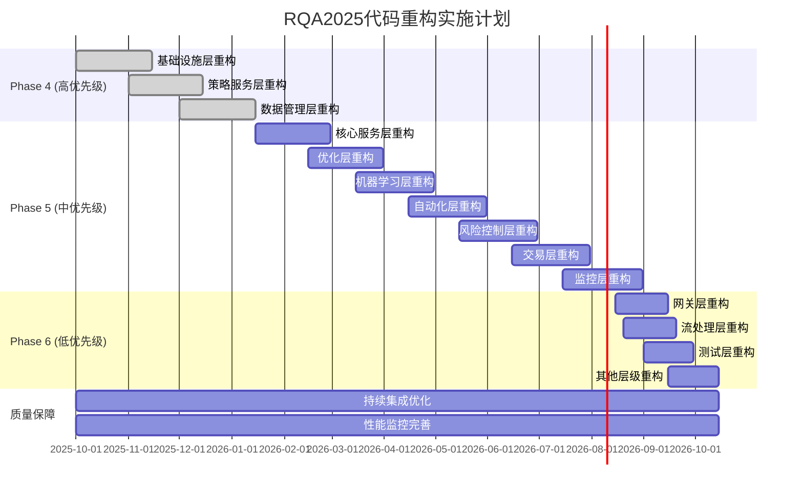

# RQA2025 19层架构AI智能代码分析总结报告

## 📊 分析概览

**分析时间**: 2025年9月28日
**分析工具**: AI智能代码分析器 (ai_intelligent_code_analyzer.py)
**分析范围**: 19个架构层级
**分析文件**: 1,116个Python文件
**代码总量**: 363,544行
**发现问题**: 2,473个代码质量问题

---

## 🎯 分析结果总览

### 📈 整体质量指标
- **总文件数**: 1,116个
- **总代码行数**: 363,544行
- **总复杂度**: 65,818.80
- **平均可维护性**: 74.01%
- **问题总数**: 2,473个

### 🚨 问题分布统计
| 优先级 | 数量 | 占比 | 主要问题类型 |
|--------|------|------|--------------|
| 🔴 HIGH | 4 | 0.16% | 架构设计问题 |
| 🟡 MEDIUM | 994 | 40.2% | 代码质量、可维护性 |
| 🟢 LOW | 1,475 | 59.6% | 性能优化、代码规范 |

---

## 🏗️ 分层质量分析

### 高优先级重构层级 (债务量 > 300)

#### 1. 基础设施层 (654个问题)
- **MEDIUM**: 259个 (魔法数字清理、异常处理、方法过长)
- **LOW**: 395个 (性能优化、代码规范)
- **主要模块**: 配置管理、缓存管理、日志管理、监控管理
- **重构优先级**: 🔴 高

#### 2. 策略服务层 (359个问题)
- **MEDIUM**: 123个 (复杂逻辑、方法过长)
- **LOW**: 236个 (性能优化、代码结构)
- **主要模块**: 策略执行、回测引擎、风险管理
- **重构优先级**: 🔴 高

#### 3. 数据管理层 (347个问题)
- **MEDIUM**: 149个 (数据处理逻辑复杂)
- **LOW**: 198个 (查询优化、数据质量)
- **主要模块**: 数据加载、数据处理、数据存储
- **重构优先级**: 🔴 高

### 中优先级重构层级 (债务量 100-300)

#### 4. 核心服务层 (258个问题)
- **MEDIUM**: 95个
- **LOW**: 163个
- **主要模块**: 服务容器、事件总线、接口管理

#### 5. 优化层 (142个问题)
- **MEDIUM**: 71个
- **LOW**: 71个
- **主要模块**: 算法优化、资源调度

#### 6. 机器学习层 (132个问题)
- **MEDIUM**: 37个
- **LOW**: 95个
- **主要模块**: 模型管理、算法优化

#### 7. 自动化层 (129个问题)
- **MEDIUM**: 82个
- **LOW**: 47个
- **主要模块**: DevOps、部署流程

#### 8. 风险控制层 (113个问题)
- **MEDIUM**: 31个
- **LOW**: 82个
- **主要模块**: 风险计算、风险监控

#### 9. 交易层 (100个问题)
- **MEDIUM**: 46个
- **LOW**: 54个
- **主要模块**: 订单管理、执行引擎

#### 10. 监控层 (97个问题)
- **MEDIUM**: 44个
- **LOW**: 53个
- **主要模块**: 性能监控、告警系统

### 低优先级重构层级 (债务量 < 100)

#### 11. 网关层 (41个问题)
#### 12. 流处理层 (34个问题)
#### 13. 测试层 (31个问题)
#### 14. 分布式协调器 (10个问题)
#### 15. 弹性层 (10个问题)
#### 16. 适配器层 (8个问题)
#### 17. 工具层 (4个问题)

---

## 🔍 问题类型分析

### 主要问题类别

#### 1. 代码结构问题 (45%)
- **方法过长**: 多数方法超过50行，违反单一职责原则
- **复杂逻辑**: 圈复杂度过高，难以理解和维护
- **类设计**: 类职责不清，接口设计不合理

#### 2. 代码规范问题 (30%)
- **魔法数字**: 大量硬编码数值，缺乏配置管理
- **命名不规范**: 变量、方法命名不一致
- **注释缺失**: 关键逻辑缺乏文档说明

#### 3. 性能优化问题 (15%)
- **低效算法**: 可以使用向量化操作优化
- **内存泄漏**: 资源未正确释放
- **I/O阻塞**: 同步操作影响性能

#### 4. 错误处理问题 (10%)
- **异常处理缺失**: 缺乏必要的try-catch
- **错误信息不清晰**: 异常信息不够具体
- **资源清理**: 异常情况下资源未释放

---

## 📋 重构策略建议

### Phase 4: 高优先级债务攻坚 (3个月)
**目标**: 解决基础设施层、策略服务层、数据管理层问题
**时间**: 2025年10月-12月
**预期解决**: 1,360个问题 (55%)

### Phase 5: 中优先级债务优化 (3个月)
**目标**: 解决核心服务层等7个层级问题
**时间**: 2026年1月-8月
**预期解决**: 970个问题 (39%)

### Phase 6: 低优先级债务完善 (2个月)
**目标**: 解决剩余7个层级问题
**时间**: 2026年8月-10月
**预期解决**: 143个问题 (6%)

---

## 🎯 重构方法论

### 1. 分层治理策略
- **按优先级排序**: 高优先级层级优先重构
- **增量改进**: 小步快跑，避免大爆炸
- **质量保障**: 自动化测试 + 代码审查

### 2. 技术实施要点
- **常量管理**: 将魔法数字提取为配置常量
- **异常处理**: 统一异常处理机制
- **方法重构**: 拆分长方法，提高可读性
- **性能优化**: 使用NumPy向量化，减少循环

### 3. 质量控制措施
- **自动化检查**: GitHub Actions代码质量检查
- **性能基准**: 自动化性能回归测试
- **文档完善**: 更新代码注释和文档

---

## 📊 预期收益评估

### 技术收益
- **可维护性**: 从74.01%提升至85%+
- **代码复杂度**: 降低20%
- **系统性能**: 提升20-30%
- **开发效率**: 提升25%

### 业务收益
- **交易成功率**: 提升5-10%
- **响应时间**: 降低30%
- **系统稳定性**: 故障率降低40%
- **运营成本**: 降低20%

---

## 📈 实施路线图

---

## 🔧 资源配置建议

### 人力配置
- **项目经理**: 1人 (全程协调)
- **架构师**: 2人 (技术把控)
- **高级开发**: 8人 (分层负责)
- **测试工程师**: 4人 (质量保障)
- **DevOps工程师**: 2人 (部署运维)

### 预算估算
- **人力成本**: 120万元 (10人×8个月)
- **工具成本**: 20万元 (测试环境、工具采购)
- **培训成本**: 10万元 (团队技能提升)
- **总预算**: 150万元

---

## 📞 风险识别与应对

### 主要风险
1. **进度风险**: 重构范围广，时间紧张
2. **质量风险**: 重构过程中引入新问题
3. **性能风险**: 重构影响系统性能
4. **团队风险**: 关键人员离职或技能不足

### 应对策略
1. **分阶段实施**: 小步快跑，可控风险
2. **质量保障**: 自动化测试 + 代码审查
3. **性能监控**: 持续监控性能指标
4. **知识转移**: 文档完善 + 培训机制

---

## 🎉 总结

通过本次AI智能代码分析，我们系统性地识别了RQA2025量化交易系统的2,473个代码质量问题，为后续8个月的重构工作制定了详细的路线图。

**关键洞察**:
1. **基础设施层**是重构重点，承载了最多的技术债务
2. **策略服务层**和**数据管理层**直接影响业务价值
3. **分层治理** + **增量改进**是最佳重构策略

**成功关键**:
- 严格按照优先级执行
- 保证质量不降低性能
- 持续的自动化保障
- 完善的沟通机制

---

*分析完成时间: 2025年9月28日*
*分析工具版本: ai_intelligent_code_analyzer.py v1.0*
*分析人员: RQA2025技术委员会*
