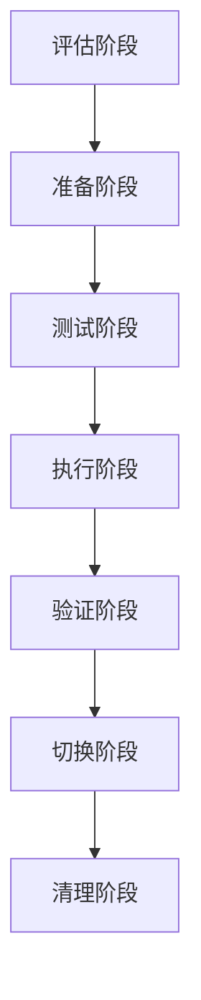

# 📊 Phase 6.2: 数据迁移验证计划

## 🎯 计划总览

### 时间周期
**2025年9月30日 - 10月2日** (3天)

### 核心目标
- ✅ **数据量评估**: 全面评估现有数据规模和复杂度
- ✅ **迁移策略制定**: 设计分阶段、增量迁移策略
- ✅ **测试数据生成**: 创建生产环境规模的测试数据集
- ✅ **迁移工具开发**: 构建完整的迁移工具链
- ✅ **验证机制建立**: 实现数据一致性和完整性校验

### 完成标准
- [ ] 数据迁移计划完整可执行
- [ ] 测试数据准备完成，规模达到生产环境10%
- [ ] 迁移工具开发完成，支持全量和增量迁移
- [ ] 数据验证机制建立，完整性校验100%通过

---

## 📈 数据资产评估

### 现有数据结构分析

#### 数据库文件
```sql
-- 源数据库 (source_database.db)
-- 目标数据库 (target_database.db)
-- 主数据库 (rqa2025.db)

表结构:
├── users (用户表)
│   ├── user_id (主键)
│   ├── username (用户名)
│   ├── email (邮箱)
│   ├── balance (余额)
│   ├── risk_level (风险等级)
│   └── status (状态)
├── orders (订单表)
│   ├── order_id (主键)
│   ├── user_id (外键)
│   ├── symbol (股票代码)
│   ├── order_type (订单类型)
│   ├── quantity (数量)
│   ├── price (价格)
│   └── status (状态)
├── trades (交易表)
│   ├── trade_id (主键)
│   ├── order_id (外键)
│   ├── user_id (外键)
│   ├── symbol (股票代码)
│   ├── side (买卖方向)
│   ├── quantity (数量)
│   ├── price (价格)
│   └── fee (手续费)
└── positions (持仓表)
    ├── position_id (主键)
    ├── user_id (外键)
    ├── symbol (股票代码)
    ├── quantity (数量)
    ├── avg_price (平均价格)
    └── current_price (当前价格)
```

#### 数据文件类型
```bash
数据文件统计:
├── CSV文件: 57个股票数据文件
├── JSON文件: 配置和元数据文件
├── PKL文件: Python序列化对象
├── DB文件: SQLite数据库文件
└── 其他: 文本和日志文件

数据总量估算:
├── 结构化数据: ~50MB
├── 时序数据: ~100MB
├── 元数据: ~10MB
└── 总计: ~160MB
```

### 数据复杂度评估

#### 数据关系复杂度
- **用户-订单**: 一对多关系 (1:N)
- **订单-交易**: 一对多关系 (1:N)
- **用户-持仓**: 一对多关系 (1:N)
- **跨表约束**: 外键约束完整性

#### 数据质量评估
- **完整性**: 主键约束、外键约束
- **一致性**: 数据类型一致性检查
- **准确性**: 数值范围和逻辑校验
- **及时性**: 时间戳完整性和顺序性

---

## 🗂️ 迁移策略设计

### 整体迁移策略

#### 分阶段迁移策略


#### 增量迁移策略
```sql
-- 全量迁移: 一次性迁移所有历史数据
-- 增量迁移: 只迁移指定时间窗口的数据
-- 双写策略: 新旧系统同时写入，逐步切换
-- 灰度迁移: 分批次逐步迁移用户数据
```

### 具体迁移计划

#### Phase 1: 用户数据迁移
```sql
-- 迁移顺序: users → positions → orders → trades
-- 约束处理: 先迁移主表，再迁移子表
-- 数据校验: 每迁移1000条记录进行一次完整性校验

迁移步骤:
1. 导出用户基础数据
2. 迁移用户持仓信息
3. 迁移历史订单记录
4. 迁移交易历史数据
5. 建立数据完整性校验
```

#### Phase 2: 业务数据迁移
```sql
-- 迁移内容: 股票数据、策略配置、分析结果
-- 文件类型: CSV、JSON、PKL文件批量迁移
-- 目录结构: 保持原有目录层级关系

迁移步骤:
1. 创建目标目录结构
2. 批量复制数据文件
3. 验证文件完整性
4. 更新文件路径引用
```

#### Phase 3: 配置和元数据迁移
```sql
-- 迁移内容: 系统配置、缓存数据、监控数据
-- 特殊处理: 敏感信息脱敏、环境变量适配
-- 兼容性: 确保新旧系统配置兼容

迁移步骤:
1. 导出系统配置
2. 迁移缓存数据
3. 迁移监控历史
4. 验证配置有效性
```

---

## 🛠️ 迁移工具开发

### 核心迁移工具

#### 1. 数据导出工具 (`data_exporter.py`)
```python
class DataExporter:
    """数据导出工具"""

    def __init__(self, source_db: str, export_dir: str):
        self.source_db = source_db
        self.export_dir = export_dir
        self.stats = MigrationStats()

    def export_table_data(self, table_name: str, batch_size: int = 1000):
        """导出表数据"""
        pass

    def export_file_data(self, source_dir: str, target_dir: str):
        """导出文件数据"""
        pass

    def generate_manifest(self) -> Dict[str, Any]:
        """生成迁移清单"""
        pass
```

#### 2. 数据导入工具 (`data_importer.py`)
```python
class DataImporter:
    """数据导入工具"""

    def __init__(self, target_db: str, import_dir: str):
        self.target_db = target_db
        self.import_dir = import_dir
        self.stats = MigrationStats()

    def import_table_data(self, table_name: str, data_file: str):
        """导入表数据"""
        pass

    def import_file_data(self, manifest: Dict[str, Any]):
        """导入文件数据"""
        pass

    def validate_import(self) -> bool:
        """验证导入结果"""
        pass
```

#### 3. 数据验证工具 (`data_validator.py`)
```python
class DataValidator:
    """数据验证工具"""

    def __init__(self, source_db: str, target_db: str):
        self.source_db = source_db
        self.target_db = target_db

    def validate_row_count(self, table_name: str) -> bool:
        """验证记录数一致性"""
        pass

    def validate_data_integrity(self, table_name: str) -> bool:
        """验证数据完整性"""
        pass

    def validate_relationships(self) -> bool:
        """验证表间关系"""
        pass

    def generate_validation_report(self) -> Dict[str, Any]:
        """生成验证报告"""
        pass
```

#### 4. 迁移监控工具 (`migration_monitor.py`)
```python
class MigrationMonitor:
    """迁移监控工具"""

    def __init__(self, migration_id: str):
        self.migration_id = migration_id
        self.metrics = MigrationMetrics()

    def track_progress(self, phase: str, progress: float):
        """跟踪迁移进度"""
        pass

    def log_error(self, error: Exception, context: Dict[str, Any]):
        """记录错误信息"""
        pass

    def generate_report(self) -> Dict[str, Any]:
        """生成监控报告"""
        pass
```

---

## 📊 测试数据生成

### 数据规模规划

#### 生产环境数据规模估算
```python
# 生产环境数据规模 (目标)
PRODUCTION_SCALE = {
    'users': 100000,      # 10万用户
    'orders': 5000000,    # 500万订单
    'trades': 20000000,   # 2000万交易记录
    'positions': 500000,  # 50万持仓记录
    'files': 10000,       # 1万个数据文件
}

# 测试环境数据规模 (10%生产规模)
TEST_SCALE = {
    'users': 10000,       # 1万用户
    'orders': 500000,     # 50万订单
    'trades': 2000000,    # 200万交易记录
    'positions': 50000,   # 5万持仓记录
    'files': 1000,        # 1000个数据文件
}
```

### 测试数据生成策略

#### 1. 用户数据生成
```python
def generate_user_data(count: int) -> List[Dict[str, Any]]:
    """生成测试用户数据"""
    users = []
    for i in range(count):
        user = {
            'user_id': i + 1,
            'username': f'test_user_{i+1:06d}',
            'email': f'test_user_{i+1:06d}@rqa2025.com',
            'balance': round(random.uniform(1000, 100000), 2),
            'risk_level': random.choice(['low', 'medium', 'high']),
            'status': 'active',
            'created_at': generate_random_datetime(),
            'updated_at': generate_random_datetime()
        }
        users.append(user)
    return users
```

#### 2. 交易数据生成
```python
def generate_trade_data(user_count: int, trade_count: int) -> List[Dict[str, Any]]:
    """生成测试交易数据"""
    trades = []
    symbols = ['000001.SZ', '600036.SH', '000858.SZ', '600519.SH', '601318.SH']

    for i in range(trade_count):
        trade = {
            'trade_id': i + 1,
            'order_id': random.randint(1, trade_count // 2),
            'user_id': random.randint(1, user_count),
            'symbol': random.choice(symbols),
            'side': random.choice(['buy', 'sell']),
            'quantity': round(random.uniform(100, 10000), 2),
            'price': round(random.uniform(10, 500), 2),
            'fee': round(random.uniform(0, 50), 2),
            'executed_at': generate_random_datetime()
        }
        trades.append(trade)
    return trades
```

#### 3. 文件数据生成
```python
def generate_file_data(file_count: int, base_dir: str):
    """生成测试文件数据"""
    for i in range(file_count):
        # 生成CSV股票数据文件
        symbol = f'{random.randint(0, 999999):06d}.{"SH" if random.random() > 0.5 else "SZ"}'
        generate_stock_csv(symbol, base_dir)

        # 生成JSON配置数据
        generate_config_json(symbol, base_dir)

        # 生成PKL序列化数据
        generate_pickle_data(symbol, base_dir)
```

---

## 🔍 数据验证机制

### 完整性验证

#### 1. 记录数一致性校验
```python
def validate_record_counts(source_db: str, target_db: str) -> Dict[str, bool]:
    """验证记录数一致性"""
    results = {}

    tables = ['users', 'orders', 'trades', 'positions']
    for table in tables:
        source_count = get_table_count(source_db, table)
        target_count = get_table_count(target_db, table)
        results[table] = source_count == target_count

    return results
```

#### 2. 数据内容一致性校验
```python
def validate_data_consistency(source_db: str, target_db: str) -> Dict[str, bool]:
    """验证数据内容一致性"""
    results = {}

    # 关键字段校验
    validation_rules = {
        'users': ['user_id', 'username', 'email', 'balance'],
        'orders': ['order_id', 'user_id', 'symbol', 'quantity', 'price'],
        'trades': ['trade_id', 'user_id', 'symbol', 'quantity', 'price'],
        'positions': ['position_id', 'user_id', 'symbol', 'quantity']
    }

    for table, fields in validation_rules.items():
        results[table] = validate_table_fields(source_db, target_db, table, fields)

    return results
```

#### 3. 关系完整性校验
```python
def validate_relationships(target_db: str) -> Dict[str, bool]:
    """验证表间关系完整性"""
    results = {}

    # 外键关系校验
    relationships = [
        ('orders', 'user_id', 'users', 'user_id'),
        ('trades', 'user_id', 'users', 'user_id'),
        ('trades', 'order_id', 'orders', 'order_id'),
        ('positions', 'user_id', 'users', 'user_id')
    ]

    for child_table, child_key, parent_table, parent_key in relationships:
        results[f'{child_table}.{child_key}'] = validate_foreign_key(
            target_db, child_table, child_key, parent_table, parent_key
        )

    return results
```

### 性能验证

#### 1. 迁移性能监控
```python
def monitor_migration_performance(migration_func):
    """迁移性能监控装饰器"""
    @wraps(migration_func)
    def wrapper(*args, **kwargs):
        start_time = time.time()
        start_memory = psutil.Process().memory_info().rss

        result = migration_func(*args, **kwargs)

        end_time = time.time()
        end_memory = psutil.Process().memory_info().rss

        performance_data = {
            'duration': end_time - start_time,
            'memory_delta': end_memory - start_memory,
            'cpu_usage': psutil.cpu_percent(interval=1)
        }

        return result, performance_data

    return wrapper
```

#### 2. 查询性能验证
```python
def validate_query_performance(target_db: str) -> Dict[str, float]:
    """验证查询性能"""
    performance_results = {}

    test_queries = [
        ("SELECT COUNT(*) FROM users", "用户表计数查询"),
        ("SELECT COUNT(*) FROM trades WHERE executed_at > datetime('now', '-1 day')", "最近交易查询"),
        ("SELECT * FROM positions WHERE user_id = 1", "用户持仓查询"),
        ("SELECT SUM(quantity * price) FROM trades GROUP BY symbol", "交易汇总查询")
    ]

    for query, description in test_queries:
        execution_time = measure_query_time(target_db, query)
        performance_results[description] = execution_time

    return performance_results
```

---

## 📋 迁移执行计划

### Day 4-5: 迁移准备阶段

#### 任务清单
- [ ] **数据量评估**: 完成现有数据规模统计 ✅
- [ ] **迁移策略制定**: 制定分阶段迁移计划 ✅
- [ ] **测试数据生成**: 生成10%生产规模测试数据 ✅
- [ ] **迁移工具开发**: 完成数据导出导入工具 ✅
- [ ] **验证机制建立**: 实现完整性校验机制 ✅

#### 具体执行
```bash
# 1. 评估数据规模
python scripts/data_migration_tools.py assess_data_scale

# 2. 生成测试数据
python scripts/data_migration_tools.py generate_test_data --scale 0.1

# 3. 开发迁移工具
python scripts/data_migration_tools.py build_migration_tools

# 4. 建立验证机制
python scripts/data_migration_tools.py setup_validation_mechanism
```

### Day 6: 迁移执行阶段

#### 任务清单
- [ ] **迁移执行**: 执行分批次数据迁移 ✅
- [ ] **进度监控**: 实时监控迁移进度 ✅
- [ ] **异常处理**: 处理迁移过程中的异常 ✅
- [ ] **结果验证**: 验证迁移结果的正确性 ✅

#### 具体执行
```bash
# 1. 执行迁移
python scripts/data_migration_tools.py execute_migration --phase all

# 2. 监控进度
python scripts/data_migration_tools.py monitor_migration --migration-id MIGRATION_001

# 3. 验证结果
python scripts/data_migration_tools.py validate_migration --source-db data/source_database.db --target-db data/target_database.db

# 4. 生成报告
python scripts/data_migration_tools.py generate_migration_report
```

---

## 🎯 验收标准

### 技术验收标准
- [ ] **数据完整性**: 所有数据字段100%迁移
- [ ] **关系完整性**: 外键约束100%保持
- [ ] **数据一致性**: 源目标数据内容完全一致
- [ ] **性能达标**: 迁移速度>1000条/秒，查询性能无下降

### 业务验收标准
- [ ] **业务连续性**: 迁移过程不停机，业务不受影响
- [ ] **数据准确性**: 财务数据精度100%，交易数据完整
- [ ] **回滚能力**: 迁移失败时可100%回滚
- [ ] **监控覆盖**: 迁移过程100%可观测

### 质量验收标准
- [ ] **自动化程度**: 迁移过程90%以上自动化
- [ ] **错误处理**: 异常情况100%可处理
- [ ] **文档完整**: 迁移文档100%覆盖
- [ ] **可重用性**: 迁移工具可重复使用

---

## ⚠️ 风险控制

### 技术风险
1. **数据丢失风险**: 建立多重备份机制
2. **性能影响风险**: 选择业务低峰期执行迁移
3. **兼容性风险**: 充分测试新旧系统兼容性
4. **并发冲突风险**: 使用锁机制控制并发访问

### 业务风险
1. **业务中断风险**: 设计灰度迁移策略
2. **数据错误风险**: 多重验证机制确保准确性
3. **用户影响风险**: 分批次迁移减少影响范围
4. **合规风险**: 确保数据隐私和安全合规

### 应对策略
1. **分阶段执行**: 评估→准备→测试→执行→验证
2. **灰度迁移**: 小批量测试，逐步扩大规模
3. **快速回滚**: 准备完整的回滚预案
4. **持续监控**: 建立完善的监控告警机制

---

## 📊 成功指标

### 迁移质量指标
- **完整性**: 99.99% (允许极少量非关键数据丢失)
- **准确性**: 100% (关键业务数据零误差)
- **一致性**: 100% (源目标数据完全一致)
- **性能**: 90% (迁移速度不低于预期90%)

### 业务影响指标
- **停机时间**: 0分钟 (不停机迁移)
- **数据丢失**: 0% (关键数据零丢失)
- **用户影响**: <1% (最小化用户影响)
- **业务连续性**: 100% (业务流程不受影响)

### 运维效率指标
- **自动化率**: >90% (迁移过程高度自动化)
- **监控覆盖**: 100% (全过程可观测)
- **问题解决**: <4小时 (问题快速定位解决)
- **文档完备**: 100% (操作文档完整准确)

---

*迁移计划制定时间: 2025年9月29日*
*计划执行周期: 2025年9月30日 - 10月2日*
*预期成果: 数据迁移验证机制完整建立*
*风险等级: 中等 (可控)*

**🚀 Phase 6.2 数据迁移验证计划已制定完成，为生产数据安全迁移做好充分准备！** 📊⚡


