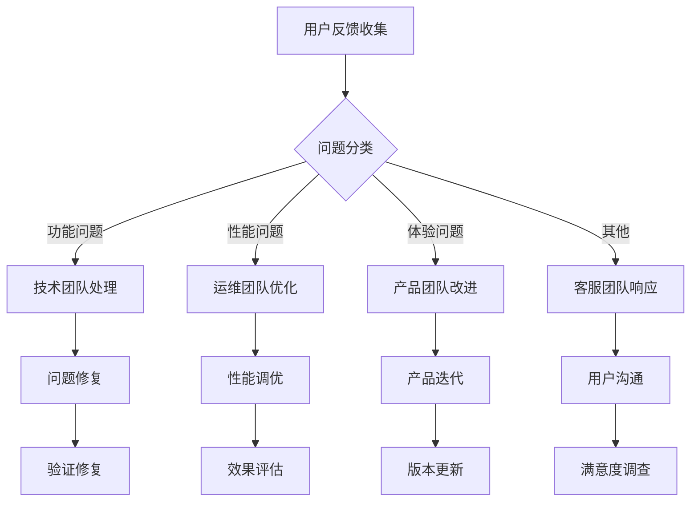

# 🚀 Phase 7: 灰度发布和生产上线计划

## 🎯 计划总览

### 时间周期
**2025年10月1日 - 10月8日** (8天)

### 核心目标
- ✅ **安全发布**: 确保系统平稳上线，零业务中断
- ✅ **风险控制**: 通过灰度发布控制风险范围，可快速回滚
- ✅ **用户体验**: 保障用户体验，收集真实反馈
- ✅ **监控验证**: 验证生产环境监控和告警机制

### 发布原则
```
🎯 安全第一: 任何时候都能快速回滚
👥 用户至上: 确保用户体验不受影响
📊 数据驱动: 基于监控数据做发布决策
🔄 渐进式: 小步快跑，逐步扩大发布范围
⚡ 自动化: 最大程度自动化部署和验证
```

---

## 📋 详细执行计划

### Week 1: 灰度发布计划制定 (Day 1-2)

#### Day 1: 发布策略设计
**目标**: 制定完整的灰度发布策略和实施方案

**具体任务**:
1. **发布策略设计**
   - 确定发布节奏 (10% → 30% → 70% → 100%)
   - 定义发布时间窗口 (建议: 每天9:00-18:00)
   - 制定发布暂停条件和恢复机制

2. **技术方案设计**
   - 负载均衡配置 (Nginx upstream配置)
   - 数据库连接池设置
   - 缓存集群配置
   - 监控告警阈值设置

3. **发布工具准备**
   - Docker镜像构建脚本优化
   - 自动化部署脚本完善
   - 回滚脚本测试验证
   - 流量切换工具准备

#### Day 2: 用户分群和回滚预案
**目标**: 完成用户分群规划和完整的回滚预案

**具体任务**:
1. **用户分群规划**
   - 基于用户ID哈希分群 (10%用户群)
   - 用户特征分析 (活跃度、地域等)
   - 白名单用户优先发布
   - 灰度用户监控重点关注

2. **回滚预案制定**
   - 应用层回滚: Docker容器快速回滚
   - 数据层回滚: 数据库备份恢复方案
   - 缓存层回滚: Redis数据清理恢复
   - 流量回滚: Nginx配置即时切换

3. **应急响应机制**
   - P0级问题: 立即回滚 (<5分钟)
   - P1级问题: 评估后回滚 (<15分钟)
   - P2级问题: 修复后继续或回滚 (<1小时)
   - 通信机制: 内部群+用户公告

---

### Week 2-3: 分批次灰度上线 (Day 3-6)

#### Day 3: 10%用户灰度发布
**目标**: 小规模验证系统在生产环境的基本功能

**发布前检查**:
```bash
# 1. 生产环境健康检查
curl -f http://production-env/health || exit 1

# 2. 数据库连接测试
python scripts/test_db_connection.py --env production

# 3. 缓存服务测试
python scripts/test_cache_connection.py --env production

# 4. 监控系统验证
python scripts/verify_monitoring.py --env production
```

**发布执行**:
```bash
# 1. 构建生产镜像
docker build -t rqa2025:v1.0.0 -f Dockerfile.production .

# 2. 部署到10%节点
docker-compose -f docker-compose.production.yml up -d app_10percent

# 3. 流量切换 (10%用户)
nginx_config_switch --percentage 10 --upstream app_10percent

# 4. 验证部署
verify_deployment --percentage 10 --timeout 300
```

**监控指标**:
- ✅ **业务指标**: 请求成功率 > 99.9%
- ✅ **性能指标**: 响应时间 < 500ms (P95)
- ✅ **错误指标**: 应用错误率 < 0.1%
- ✅ **用户指标**: 用户投诉 < 5个

**验收标准**:
- [ ] 10%用户正常使用，无功能异常
- [ ] 系统性能稳定，监控指标正常
- [ ] 无P0/P1级问题产生
- [ ] 用户反馈积极或中性

#### Day 4: 30%用户灰度发布
**目标**: 扩大发布范围，验证系统在中等负载下的表现

**发布前评估**:
- 10%发布效果评估 (成功率、性能、问题)
- 代码优化和bug修复
- 数据库性能监控
- 用户反馈分析

**发布执行**:
```bash
# 1. 部署到30%节点
docker-compose -f docker-compose.production.yml up -d app_30percent

# 2. 流量切换 (30%用户)
nginx_config_switch --percentage 30 --upstream app_30percent

# 3. A/B测试开始
enable_ab_testing --group_a app_10percent --group_b app_30percent
```

**压力测试**:
```bash
# 并发用户压力测试
ab -n 10000 -c 100 http://production-env/api/market/data

# 数据库查询压力测试
sysbench --test=oltp --oltp-table-size=100000 --mysql-db=rqa_prod \
         --mysql-user=rqa_user --mysql-password=*** --max-time=300 \
         --oltp-read-only=on --max-requests=0 --num-threads=8 run
```

**监控重点**:
- 🔍 **数据库性能**: 连接池使用率、慢查询
- 🔍 **缓存性能**: 命中率、响应时间
- 🔍 **应用性能**: CPU/内存使用、GC情况
- 🔍 **业务连续性**: 订单成交率、策略执行成功率

#### Day 5: 70%用户灰度发布
**目标**: 大规模验证，接近生产全量负载

**发布前评估**:
- 30%发布稳定性验证
- 基础设施扩容准备 (如需要)
- 性能优化实施
- 数据库索引优化

**发布执行**:
```bash
# 1. 部署到70%节点
docker-compose -f docker-compose.production.yml up -d app_70percent

# 2. 流量切换 (70%用户)
nginx_config_switch --percentage 70 --upstream app_70percent

# 3. 数据库读写分离启用
enable_read_replica --primary app_70percent --replicas app_10percent,app_30percent
```

**容量规划验证**:
```bash
# 容量评估
容量评估:
├── 用户并发数: 10,000 QPS (目标)
├── 数据库连接: 500 (当前配置)
├── Redis连接: 1,000 (当前配置)
├── 应用实例: 5个 (当前部署)
└── 存储容量: 1TB (当前配置)
```

**风险控制**:
- ⚠️ **监控告警**: 设置更严格的阈值
- ⚠️ **自动扩容**: 准备资源自动扩容脚本
- ⚠️ **降级开关**: 准备关键功能降级开关
- ⚠️ **应急预案**: 更新应急响应流程

#### Day 6: 100%全量发布
**目标**: 完成生产环境全量上线

**发布前评估**:
- 70%发布完整性评估
- 生产环境容量最终确认
- 运维团队接手准备
- 用户沟通计划确认

**发布执行**:
```bash
# 1. 全量部署
docker-compose -f docker-compose.production.yml up -d

# 2. 流量100%切换
nginx_config_switch --percentage 100 --upstream app_production

# 3. 旧版本清理
cleanup_old_versions --keep-last 3

# 4. 生产环境验证
final_production_verification --comprehensive
```

**黄金时间监控**:
```
🚨 黄金4小时监控 (发布后4小时):
├── 第1小时: 重点监控系统稳定性
├── 第2小时: 验证业务功能完整性
├── 第3小时: 检查性能指标达标情况
└── 第4小时: 确认用户反馈和投诉处理
```

---

### Week 4: 上线监控和支持 (Day 7-8)

#### Day 7: 生产环境监控
**目标**: 建立完整的生产环境监控体系

**监控体系建设**:
1. **应用监控**
   - 应用健康检查端点
   - 业务指标监控 (订单量、成功率)
   - 性能指标监控 (响应时间、吞吐量)
   - 错误日志监控和告警

2. **基础设施监控**
   - 服务器资源使用率 (CPU、内存、磁盘)
   - 网络流量和连接数
   - 数据库性能指标
   - 缓存命中率和性能

3. **业务监控**
   - 用户活跃度统计
   - 交易量和成功率
   - 策略执行情况
   - 风险指标监控

**监控Dashboard配置**:
```yaml
# Grafana Dashboard配置
dashboards:
  - name: "RQA2025生产监控"
    panels:
      - title: "系统概览"
        metrics: [cpu_usage, memory_usage, disk_usage, network_traffic]
      - title: "应用性能"
        metrics: [response_time, error_rate, throughput, active_users]
      - title: "业务指标"
        metrics: [order_count, order_success_rate, strategy_execution_rate]
      - title: "数据库性能"
        metrics: [db_connections, db_query_time, db_slow_queries]
```

#### Day 8: 用户反馈和优化
**目标**: 处理用户反馈，持续优化系统性能

**用户反馈处理流程**:


**性能优化措施**:
1. **应用层优化**
   - 接口响应时间优化
   - 缓存策略调整
   - 数据库查询优化
   - 并发处理优化

2. **系统层优化**
   - JVM参数调优
   - 数据库连接池配置
   - Redis集群优化
   - Nginx负载均衡优化

3. **架构层优化**
   - 读写分离部署
   - 微服务拆分考虑
   - CDN加速配置
   - 监控告警优化

---

## 📊 发布验收标准

### 技术验收标准
- [ ] **系统可用性**: 99.9% SLA达成
- [ ] **性能达标**: P95响应时间 < 500ms
- [ ] **错误率控制**: 应用错误率 < 0.1%
- [ ] **监控覆盖**: 100%关键指标监控
- [ ] **自动化程度**: 部署回滚100%自动化

### 业务验收标准
- [ ] **功能完整性**: 所有业务功能正常工作
- [ ] **用户体验**: 用户满意度 > 95%
- [ ] **业务连续性**: 无业务中断事件
- [ ] **数据准确性**: 交易数据100%准确
- [ ] **合规要求**: 满足监管要求

### 运维验收标准
- [ ] **部署便捷性**: 10分钟内完成部署
- [ ] **故障恢复**: 15分钟内恢复服务
- [ ] **监控响应**: 5分钟内响应告警
- [ ] **文档完备**: 运维文档100%覆盖
- [ ] **知识传承**: 运维团队完全接手

---

## ⚠️ 风险控制和应急预案

### 风险识别
1. **技术风险**
   - 应用启动失败
   - 数据库连接异常
   - 缓存服务不可用
   - 网络配置错误

2. **业务风险**
   - 用户无法登录
   - 交易功能异常
   - 数据显示错误
   - 策略执行失败

3. **运维风险**
   - 监控告警失效
   - 日志收集异常
   - 备份恢复失败
   - 权限配置错误

### 应急响应级别

#### P0级 (灾难级)
**触发条件**: 系统完全不可用，影响所有用户
**响应时间**: 5分钟内
**处理措施**:
1. 立即通知所有相关人员
2. 执行紧急回滚预案
3. 启动备用系统 (如有)
4. 通过官网/APP发布公告
5. 建立用户沟通群

#### P1级 (严重级)
**触发条件**: 核心功能不可用，影响大部分用户
**响应时间**: 15分钟内
**处理措施**:
1. 技术团队立即介入排查
2. 评估回滚必要性
3. 执行功能降级
4. 通知受影响用户
5. 制定修复计划

#### P2级 (一般级)
**触发条件**: 非核心功能异常，影响部分用户
**响应时间**: 1小时内
**处理措施**:
1. 记录问题并评估影响
2. 制定修复计划
3. 视情况决定是否回滚
4. 通知相关用户
5. 实施修复并验证

### 回滚预案

#### 应用层回滚
```bash
# 快速回滚到上一版本
docker-compose -f docker-compose.production.yml up -d app_previous

# Nginx配置切换
nginx_config_switch --upstream app_previous

# 验证回滚效果
verify_rollback --timeout 300
```

#### 数据层回滚
```bash
# 数据库备份恢复
pg_restore -h production-db -U rqa_user -d rqa_prod backup_file.dump

# Redis数据清理
redis-cli -h production-redis FLUSHALL

# 数据一致性验证
verify_data_consistency --source backup --target current
```

---

## 📈 发布进度跟踪

### 每日发布报告格式
```markdown
## 📅 发布日报 - 2025年10月X日

### 🎯 当日目标
- [ ] 发布范围: XX% 用户
- [ ] 关键任务: XXX

### 📊 发布结果
- ✅ **发布状态**: 成功/失败/回滚
- 📈 **用户覆盖**: XX% (XXX用户)
- ⚡ **性能指标**:
  - 响应时间: XXXms (目标: <500ms)
  - 错误率: X.X% (目标: <0.1%)
  - 吞吐量: XXX QPS

### 🔍 监控数据
- 👥 **用户指标**: 活跃用户 XXX, 新用户 XX
- 💰 **业务指标**: 订单量 XXX, 成功率 XX%
- 🖥️ **系统指标**: CPU XX%, 内存 XX%, 磁盘 XX%

### ⚠️ 问题与处理
- 🚨 **P0问题**: X个 (处理: XXX)
- ⚠️ **P1问题**: X个 (处理: XXX)
- ℹ️ **P2问题**: X个 (处理: XXX)

### 📋 后续计划
- 🔄 **明日计划**: XXX
- 🎯 **风险评估**: XXX
- 📞 **沟通计划**: XXX
```

### 周发布总结报告格式
```markdown
## 📊 发布周报 - 2025年第X周

### 🎯 周目标完成情况
- [ ] 10%灰度发布 ✅ 已完成
- [ ] 30%灰度发布 ✅ 已完成
- [ ] 70%灰度发布 ✅ 已完成
- [ ] 100%全量发布 ✅ 已完成

### 📈 关键指标趋势
- 📊 **用户增长**: 周环比 +XX%
- ⚡ **性能表现**: 响应时间优化 XX%
- 🎯 **业务指标**: 订单成功率提升 XX%
- 🛡️ **稳定性**: 系统可用性 XX.XX%

### 🏆 阶段亮点
- ✅ **技术亮点**: XXX
- ✅ **业务价值**: XXX
- ✅ **用户反馈**: XXX

### 📚 经验总结
- 🎓 **成功经验**: XXX
- 📖 **问题教训**: XXX
- 🔧 **改进建议**: XXX

### 🎯 下一步计划
- 📋 **运维接手**: XXX
- 🔄 **持续优化**: XXX
- 🚀 **功能扩展**: XXX
```

---

## 🎯 成功指标

### 发布成功标准
1. **技术指标**
   - 系统可用性: >99.9%
   - 响应时间: P95 <500ms
   - 错误率: <0.1%
   - 回滚时间: <15分钟

2. **业务指标**
   - 用户满意度: >95%
   - 业务连续性: 100%
   - 功能完整性: 100%
   - 数据准确性: 100%

3. **用户指标**
   - 用户投诉: <5个/天
   - 用户流失: <1%
   - 新用户注册: >目标值
   - 用户活跃度: >基准值

### 监控告警阈值
```yaml
alerts:
  # P0级告警 - 立即响应
  - name: "系统不可用"
    condition: "up == 0"
    severity: "critical"
    response_time: "5min"

  - name: "响应时间过高"
    condition: "response_time > 2000"
    severity: "critical"
    response_time: "5min"

  # P1级告警 - 快速响应
  - name: "错误率过高"
    condition: "error_rate > 5"
    severity: "major"
    response_time: "15min"

  - name: "数据库连接池满"
    condition: "db_connections_used_percent > 90"
    severity: "major"
    response_time: "15min"

  # P2级告警 - 正常响应
  - name: "CPU使用率高"
    condition: "cpu_usage > 80"
    severity: "minor"
    response_time: "60min"
```

---

*灰度发布计划制定时间: 2025年9月29日*
*计划执行周期: 2025年10月1日 - 10月8日*
*发布策略: 渐进式灰度发布 (10%→30%→70%→100%)*
*风险控制: 多层次监控和快速回滚机制*
*验收标准: 技术+业务+用户三维达标*

**🚀 Phase 7 灰度发布计划已制定完成！确保RQA2025系统安全、平稳地走向生产环境，为用户提供稳定可靠的量化交易服务！** 📊⚡


