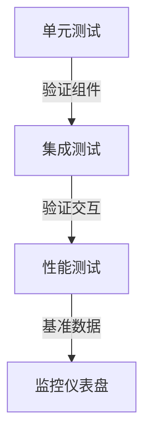
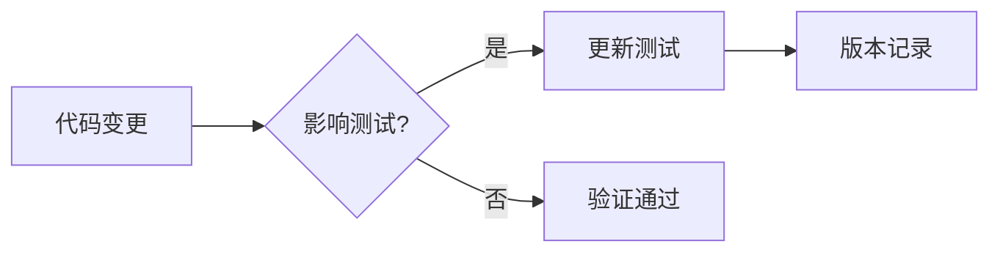

# RQA2025 测试框架使用指南
<!-- 
版本更新记录：
2024-03-28 v1.0.0 - 初始版本
-->

## 1. 快速开始

### 1.1 本地测试
```bash
# 运行全部单元测试
pytest tests/unit/ -v

# 运行特定模块测试
pytest tests/unit/infrastructure/config/ -m "not slow"

# 生成覆盖率报告
pytest --cov=src --cov-report=html
```

### 1.2 CI集成
```yaml
# .github/workflows/test.yml 示例
- name: Run unit tests
  run: |
    pytest tests/unit/ \
      --cov=src \
      --cov-report=xml \
      -n auto
```

## 2. 核心功能

### 2.1 分层测试执行


### 2.2 测试标记系统
```ini
# pytest.ini 配置示例
[pytest]
markers =
    unit: 单元测试
    integration: 集成测试
    performance: 性能测试
    slow: 长时间运行测试
```

### 2.3 测试数据管理
```python
# 使用fixture示例
@pytest.fixture
def sample_config():
    return {"db": {"host": "test.db"}}

def test_config_load(sample_config):
    loader = ConfigLoader()
    assert loader.validate(sample_config)
```

## 3. 高级用法

### 3.1 性能基准测试
```python
# 基准测试示例
def test_cache_performance(benchmark):
    cache = ThreadSafeTTLCache()
    benchmark(cache.bulk_set, {"key": "value"})
```

### 3.2 异常测试
```python
# 测试异常场景
def test_invalid_config():
    with pytest.raises(ConfigError):
        load_config("invalid.json")
```

### 3.3 CI集成进阶
```yaml
# 并行测试配置
jobs:
  unit-tests:
    strategy:
      matrix:
        python: ["3.8", "3.9", "3.10"]
      fail-fast: true
```

## 4. 最佳实践

### 4.1 测试结构规范
```
tests/
├── unit/               # 单元测试
│   └── infrastructure/ # 基础设施测试
├── integration/        # 集成测试  
└── performance/        # 性能测试
```

### 4.2 测试编写原则
1. **原子性**：每个测试只验证一个功能点
2. **独立性**：测试之间不依赖执行顺序
3. **可重复**：每次运行结果一致
4. **文档化**：测试名称即文档

### 4.3 调试技巧
```bash
# 失败时进入PDB调试
pytest --pdb

# 输出详细日志
pytest -v --log-level=DEBUG

# 只运行上次失败的测试
pytest --last-failed
```

## 5. 与监控系统集成

### 5.1 测试指标暴露
```python
# 测试指标收集示例
def test_error_handling_metrics():
    handler = ErrorHandler()
    handler.process(sample_error)
    assert handler.metrics["processed"] == 1
```

### 5.2 Prometheus监控
```yaml
# prometheus配置示例
scrape_configs:
  - job_name: 'test_metrics'
    metrics_path: '/metrics'
    static_configs:
      - targets: ['localhost:8000']
```

## 6. 故障排查

| 问题现象 | 排查步骤 | 解决方案 |
|---------|----------|----------|
| 测试超时 | 1. 检查资源使用<br>2. 分析测试依赖 | 增加超时阈值或优化测试 |
| 覆盖率下降 | 1. 对比差异版本<br>2. 检查新增代码 | 补充缺失测试用例 |
| 性能回退 | 1. 对比历史基准<br>2. 分析资源变化 | 优化热点代码路径 |

## 7. 更新与维护


