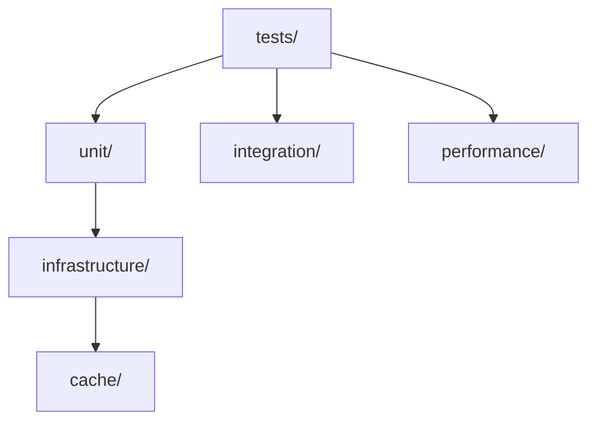

# RQA2025 测试计划
<!-- 
版本更新记录：
2024-06-15 v2.5.0 - 测试计划更新
    - 添加文档结构验证测试
    - 更新自动化测试脚本
    - 完善测试覆盖率统计
-->

## 测试目录结构

### 标准结构


### 结构验证
- **验证脚本**: `python scripts/check_test_structure.py`
- **CI集成**: 自动验证目录结构
- **验证内容**:
  - 必须存在`unit/infrastructure/cache`目录
  - 必须存在`integration`目录
  - 必须存在`performance`目录

## CI/CD集成说明

### 5.1 CI测试阶段


### 5.2 质量标准
| 测试类型 | 执行频率 | 通过标准 | 超时时间 |
|---------|----------|----------|----------|
| 结构验证 | 每次提交 | 100%通过 | 1分钟 |
| 单元测试 | 每次提交 | 覆盖率≥80% | 10分钟 |
| 集成测试 | 每次合并 | 关键路径100% | 15分钟 |
| 性能测试 | 每日 | 不退化 | 30分钟 |

## 测试范围说明

### 测试规范 (pytest风格)

1. **测试结构**:
   [保持原有内容不变]

2. **示例结构**:
   [保持原有内容不变]

3. **日志采样测试规范**:
```markdown
### 日志采样测试要求
- **测试范围**:
  - 采样率配置验证
  - 不同日志级别采样验证
  - 交易时段采样策略验证
  - 动态采样率调整验证
  - 采样统计信息收集验证

- **测试用例示例**:
  ```python
  def test_sampling_rate():
      # 测试DEBUG级别10%采样率
      sampler = LogSampler({'DEBUG': 0.1})
      samples = [sampler.should_sample('DEBUG') for _ in range(1000)]
      assert 0.08 < sum(samples)/1000 < 0.12  # 允许±2%偏差
  
  def test_trading_hours_sampling():
      # 测试交易时段全量采样
      sampler = LogSampler({'trading_hours_rate': 1.0})
      set_trading_hours(True)
      assert sampler.should_sample('INFO') == True
  ```

- **通过标准**:
  - 采样率误差<±2%
  - 动态调整响应时间<100ms
  - 统计信息准确率>99.9%
```

3. **配置管理测试规范**:
   ```markdown
   ### 配置管理测试要求
   - **测试范围**:
     - 环境策略初始化
     - 不同环境配置加载
     - 策略应用验证
     - 自定义策略支持
     - 并发安全测试
     - 交易时段配置验证
       - 必须配置检查
       - 时段格式验证
       - 多时段冲突检测

4. **锁管理测试规范**:
   ```markdown
   ### 锁管理测试要求
   - **测试范围**:
     - 基础锁操作(acquire/release)
     - 超时机制验证
     - 并发场景测试
     - 死锁检测功能
     - 统计信息收集

   - **标记规范**:
     ```python
     @pytest.mark.unit  # 单元测试
     @pytest.mark.stress  # 压力测试
     @pytest.mark.lock  # 锁相关测试
     ```

   - **验证标准**:
     - 100%基础功能覆盖
     - 并发测试需验证20+线程场景
     - 死锁检测响应时间<100ms
     - 统计信息准确率>99.9%
   ```

3. **标记分类**:
   - `@pytest.mark.unit`: 单元测试
   - `@pytest.mark.integration`: 集成测试  
   - `@pytest.mark.performance`: 性能测试
   - `@pytest.mark.slow`: 慢速测试

4. **标记注册规范**:
   - 所有测试标记必须在pytest.ini中注册
   - 示例配置:
     ```ini
     [pytest]
     markers =
         unit: 单元测试标记
         integration: 集成测试标记
         performance: 性能测试标记
         slow: 慢速测试标记
         windows: Windows平台特定测试
         linux: Linux平台特定测试
     ```
   - 未注册的标记会导致警告
   - 新标记添加需同步更新pytest.ini

5. **夹具使用**:
   [保持原有内容不变]

[...保持文档其余部分不变...]
