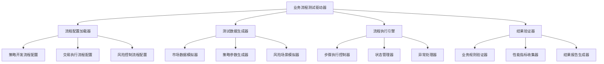

# RQA2025 业务流程测试方案和计划

## 📋 文档概述

本文档基于业务流程驱动架构设计，制定RQA2025量化交易系统的完整业务流程测试方案和计划。通过系统性的业务流程测试，确保系统能够正确、稳定、高效地支撑量化交易的核心业务场景。

**文档版本**: v1.0
**制定日期**: 2025年12月27日
**测试范围**: 3个核心业务流程 × 21个架构层级
**测试目标**: 验证业务流程完整性、正确性和性能表现

## 🎯 测试目标

### 1. 业务完整性验证
- ✅ 量化策略开发流程的端到端完整性
- ✅ 交易执行流程的实时性和准确性
- ✅ 风险控制流程的合规性和安全性
- ✅ 跨流程业务数据一致性和状态同步

### 2. 架构层级覆盖验证
- ✅ 21个架构层级的协同工作能力
- ✅ 层间接口调用的正确性和稳定性
- ✅ 业务流程跨层级数据流转的完整性
- ✅ 各层级组件在业务流程中的职责履行

### 3. 性能质量保障
- ✅ 业务流程执行时间满足量化交易时效要求
- ✅ 系统资源使用在合理范围内
- ✅ 高并发场景下的业务流程稳定性
- ✅ 异常情况下的业务流程容错能力

### 4. 业务规则验证
- ✅ 量化交易业务逻辑的正确实现
- ✅ 风控规则的有效执行
- ✅ 合规要求的严格遵守
- ✅ 业务流程的状态管理和转换

## 🏗️ 测试架构设计

### 1. 测试层次结构

```
业务流程测试体系
├── 端到端流程测试 (E2E Business Flow Tests)
│   ├── 量化策略开发流程测试
│   ├── 交易执行流程测试
│   └── 风险控制流程测试
├── 跨层级集成测试 (Cross-Layer Integration Tests)
│   ├── 业务数据流转测试
│   ├── 接口调用链路测试
│   └── 状态同步测试
├── 架构组件测试 (Architecture Component Tests)
│   ├── 8个核心子系统测试
│   ├── 9个辅助支撑层级测试
│   └── 4个专项服务层级测试
└── 性能压力测试 (Performance Stress Tests)
    ├── 业务流程性能测试
    ├── 并发处理能力测试
    └── 系统稳定性测试
```

### 2. 测试驱动架构



## 📊 测试策略和方法

### 1. 测试策略

#### 1.1 基于业务流程的测试策略
- **流程驱动**: 以实际业务流程为测试基础，确保测试覆盖真实业务场景
- **端到端验证**: 从业务输入到最终输出进行完整流程验证
- **数据流追踪**: 跟踪业务数据在各架构层级间的流转过程
- **状态一致性**: 验证业务流程各环节的状态同步和数据一致性

#### 1.2 分层递进测试策略
- **单元层级**: 验证单个组件的业务逻辑正确性
- **集成层级**: 验证跨组件的业务数据流转
- **系统层级**: 验证完整业务流程的端到端执行
- **性能层级**: 验证业务流程在压力环境下的表现

#### 1.3 风险导向测试策略
- **核心业务优先**: 优先测试对业务影响最大的核心流程
- **高风险场景覆盖**: 重点测试市场异常、系统故障等高风险场景
- **边界条件验证**: 测试业务流程的边界条件和异常处理
- **回归测试保障**: 确保业务流程修改后的正确性

### 2. 测试方法

#### 2.1 功能测试方法
- **等价类划分**: 将业务输入数据划分为有效等价类和无效等价类
- **边界值分析**: 测试业务参数的边界值和临界值
- **决策表测试**: 基于业务规则建立决策表进行测试
- **状态转换测试**: 验证业务流程状态转换的正确性

#### 2.2 性能测试方法
- **负载测试**: 测试业务流程在正常负载下的性能表现
- **压力测试**: 测试业务流程在极限负载下的稳定性和性能
- **并发测试**: 测试多用户同时执行业务流程的处理能力
- ** endurance 测试**: 测试业务流程长时间运行的稳定性

#### 2.3 可靠性测试方法
- **故障注入测试**: 模拟各种故障场景验证业务流程容错能力
- **恢复测试**: 测试业务流程从故障状态恢复的能力
- **数据一致性测试**: 验证分布式环境下的数据一致性
- **异常处理测试**: 测试各种异常情况的处理机制

## 🔄 核心业务流程测试设计

### 1. 量化策略开发流程测试

#### 1.1 流程描述
```
策略构思 → 数据收集 → 特征工程 → 模型训练 → 策略回测 → 性能评估 → 策略部署 → 监控优化
```

#### 1.2 测试场景设计

| 测试场景 | 输入条件 | 预期输出 | 验证重点 |
|---------|---------|---------|---------|
| 策略创建场景 | 策略参数配置 | 策略对象创建成功 | 参数验证、对象初始化 |
| 数据收集场景 | 数据源配置 | 历史数据获取完成 | 数据完整性、格式正确性 |
| 特征工程场景 | 原始数据 | 特征数据生成 | 特征计算准确性、数据质量 |
| 模型训练场景 | 特征数据+标签 | 训练模型 | 模型收敛性、性能指标 |
| 策略回测场景 | 训练模型+历史数据 | 回测结果 | 收益计算准确性、风险指标 |
| 性能评估场景 | 回测结果 | 评估报告 | 指标计算正确性、报告完整性 |
| 策略部署场景 | 评估通过的策略 | 部署成功 | 部署状态、配置生效 |
| 监控优化场景 | 运行中的策略 | 优化建议 | 监控数据准确性、优化效果 |

#### 1.3 架构层级验证矩阵

| 架构层级 | 策略开发流程验证点 | 测试方法 |
|---------|-------------------|---------|
| 策略层 | 策略创建、配置管理、生命周期管理 | 功能测试 + 状态验证 |
| 数据管理层 | 数据收集、预处理、存储 | 数据流转测试 + 质量验证 |
| 特征层 | 技术指标计算、特征提取、工程处理 | 计算准确性测试 + 性能测试 |
| 机器学习层 | 模型训练、调优、评估 | 算法正确性测试 + 收敛测试 |
| 基础设施层 | 配置管理、缓存、存储 | 集成测试 + 性能测试 |
| 核心服务层 | 流程编排、状态管理、事件处理 | 编排测试 + 同步测试 |
| 监控层 | 性能监控、告警、报告 | 监控数据验证 + 告警测试 |

### 2. 交易执行流程测试

#### 2.1 流程描述
```
市场监控 → 信号生成 → 风险检查 → 订单生成 → 智能路由 → 成交执行 → 结果反馈 → 持仓管理
```

#### 2.2 测试场景设计

| 测试场景 | 输入条件 | 预期输出 | 验证重点 |
|---------|---------|---------|---------|
| 市场监控场景 | 市场数据流 | 实时数据解析 | 数据实时性、解析准确性 |
| 信号生成场景 | 市场数据+策略模型 | 交易信号 | 信号计算正确性、时效性 |
| 风险检查场景 | 交易信号+风险规则 | 风险评估结果 | 风控规则执行、评估准确性 |
| 订单生成场景 | 风险通过的信号 | 交易订单 | 订单参数正确性、格式合规 |
| 智能路由场景 | 交易订单 | 路由决策 | 路由算法正确性、最优路径选择 |
| 成交执行场景 | 路由后的订单 | 成交结果 | 执行成功率、成交价格、滑点控制 |
| 结果反馈场景 | 成交结果 | 反馈通知 | 反馈及时性、信息完整性 |
| 持仓管理场景 | 成交结果 | 持仓更新 | 持仓计算准确性、风险控制 |

#### 2.3 高频交易专项测试

| 测试场景 | 输入条件 | 预期输出 | 性能要求 |
|---------|---------|---------|---------|
| 微秒级信号处理 | 高频市场数据 | 信号生成 | < 100μs |
| 订单闪电执行 | 高频交易信号 | 订单成交 | < 1ms |
| 低延迟路由 | 大量并发订单 | 最优路由选择 | < 10μs |
| 高吞吐量处理 | 峰值市场数据 | 稳定处理 | > 100,000 TPS |

### 3. 风险控制流程测试

#### 3.1 流程描述
```
实时监测 → 风险评估 → 风险拦截 → 合规检查 → 风险报告 → 告警通知
```

#### 3.2 测试场景设计

| 测试场景 | 输入条件 | 预期输出 | 验证重点 |
|---------|---------|---------|---------|
| 实时监测场景 | 市场数据+持仓数据 | 风险指标计算 | 指标计算准确性、实时性 |
| 风险评估场景 | 风险指标+评估模型 | 风险等级评定 | 评估算法正确性、风险识别 |
| 风险拦截场景 | 高风险交易 | 交易阻断 | 拦截及时性、规则执行 |
| 合规检查场景 | 交易订单 | 合规验证结果 | 合规规则检查、违规识别 |
| 风险报告场景 | 风险评估结果 | 风险报告生成 | 报告内容完整性、格式规范 |
| 告警通知场景 | 风险阈值触发 | 告警通知发出 | 通知及时性、多渠道送达 |

#### 3.3 极端风险场景测试

| 风险场景 | 触发条件 | 预期响应 | 验证重点 |
|---------|---------|---------|---------|
| 闪崩风险 | 价格暴跌5% | 立即停止所有交易 | 响应速度、停止彻底性 |
| 流动性风险 | 成交量锐减 | 降低交易频率 | 动态调整、风险控制 |
| 对手方风险 | 券商异常 | 自动切换券商 | 切换速度、数据连续性 |
| 系统性风险 | 市场整体异常 | 全面风险模式 | 全局控制、应急响应 |

## 📋 测试用例设计框架

### 1. 测试用例结构

```python
class BusinessProcessTestCase:
    """业务流程测试用例基类"""

    def __init__(self, process_name, test_scenario):
        self.process_name = process_name
        self.test_scenario = test_scenario
        self.test_data = {}
        self.expected_results = {}
        self.actual_results = {}
        self.performance_metrics = {}

    def setup_test_data(self):
        """准备测试数据"""
        pass

    def execute_process_step(self, step_name):
        """执行流程步骤"""
        pass

    def validate_step_result(self, step_name):
        """验证步骤结果"""
        pass

    def collect_performance_metrics(self):
        """收集性能指标"""
        pass

    def generate_test_report(self):
        """生成测试报告"""
        pass
```

### 2. 测试数据管理

#### 2.1 市场数据模拟器
```python
class MarketDataSimulator:
    """市场数据模拟器"""

    def generate_real_time_data(self, symbol, frequency='1s'):
        """生成实时市场数据"""
        pass

    def generate_historical_data(self, symbol, start_date, end_date):
        """生成历史市场数据"""
        pass

    def simulate_market_events(self, event_type):
        """模拟市场事件"""
        pass

    def inject_anomalies(self, anomaly_type):
        """注入数据异常"""
        pass
```

#### 2.2 策略参数生成器
```python
class StrategyParameterGenerator:
    """策略参数生成器"""

    def generate_valid_parameters(self):
        """生成有效策略参数"""
        pass

    def generate_invalid_parameters(self):
        """生成无效策略参数"""
        pass

    def generate_boundary_parameters(self):
        """生成边界策略参数"""
        pass

    def generate_extreme_parameters(self):
        """生成极端策略参数"""
        pass
```

### 3. 测试执行引擎

#### 3.1 流程执行控制器
```python
class ProcessExecutionController:
    """流程执行控制器"""

    def __init__(self, process_config):
        self.process_config = process_config
        self.execution_context = {}
        self.step_results = {}

    def initialize_process(self):
        """初始化流程"""
        pass

    def execute_step(self, step_name, step_config):
        """执行单个步骤"""
        pass

    def handle_step_exception(self, step_name, exception):
        """处理步骤异常"""
        pass

    def validate_step_transition(self, from_step, to_step):
        """验证步骤转换"""
        pass

    def finalize_process(self):
        """完成流程"""
        pass
```

#### 3.2 状态管理器
```python
class ProcessStateManager:
    """流程状态管理器"""

    def __init__(self):
        self.process_states = {}
        self.step_states = {}

    def initialize_process_state(self, process_id):
        """初始化流程状态"""
        pass

    def update_step_state(self, process_id, step_name, state):
        """更新步骤状态"""
        pass

    def validate_state_transition(self, process_id, from_state, to_state):
        """验证状态转换"""
        pass

    def get_process_status(self, process_id):
        """获取流程状态"""
        pass

    def persist_state(self, process_id):
        """持久化状态"""
        pass
```

## 📊 测试执行计划

### 1. 测试阶段划分

#### Phase 1: 单元测试阶段 (1-2周)
- **目标**: 验证单个组件的业务逻辑正确性
- **范围**: 21个架构层级的单元功能测试
- **标准**: 单元测试覆盖率 > 80%
- **输出**: 单元测试报告、代码覆盖率报告

#### Phase 2: 集成测试阶段 (2-3周)
- **目标**: 验证跨组件的业务数据流转
- **范围**: 层级间的接口调用和数据传递
- **标准**: 集成测试通过率 > 95%
- **输出**: 集成测试报告、接口测试报告

#### Phase 3: 系统测试阶段 (3-4周)
- **目标**: 验证完整业务流程的端到端执行
- **范围**: 3个核心业务流程的完整测试
- **标准**: 业务流程成功率 > 98%
- **输出**: 系统测试报告、业务流程测试报告

#### Phase 4: 性能测试阶段 (1-2周)
- **目标**: 验证业务流程在压力环境下的表现
- **范围**: 高并发、高负载场景测试
- **标准**: 性能指标满足量化交易要求
- **输出**: 性能测试报告、压力测试报告

#### Phase 5: 验收测试阶段 (1周)
- **目标**: 验证系统整体满足业务需求
- **范围**: 端到端业务验收和用户验收
- **标准**: 验收测试通过率 > 95%
- **输出**: 验收测试报告、系统验收报告

### 2. 测试环境规划

#### 2.1 开发测试环境
- **用途**: 日常开发测试
- **配置**: 单机部署，基础配置
- **数据**: 测试数据集，模拟数据
- **监控**: 基础监控和日志

#### 2.2 集成测试环境
- **用途**: 集成测试和系统测试
- **配置**: 分布式部署，生产级配置
- **数据**: 生产级测试数据
- **监控**: 完整监控和告警

#### 2.3 性能测试环境
- **用途**: 性能测试和压力测试
- **配置**: 高性能集群，优化配置
- **数据**: 大规模测试数据
- **监控**: 性能监控和指标收集

#### 2.4 预生产环境
- **用途**: 验收测试和生产验证
- **配置**: 与生产环境一致
- **数据**: 生产数据副本
- **监控**: 生产级监控

### 3. 测试资源规划

#### 3.1 人力资源
- **测试经理**: 1人，全程负责测试计划和协调
- **测试架构师**: 1人，负责测试框架设计和技术方案
- **业务测试工程师**: 3人，负责业务流程测试用例设计和执行
- **性能测试工程师**: 2人，负责性能测试和压力测试
- **自动化测试工程师**: 2人，负责测试自动化和工具开发
- **测试支持工程师**: 2人，负责测试环境搭建和维护

#### 3.2 测试工具
- **测试管理工具**: TestRail/JIRA，用于测试用例管理和缺陷跟踪
- **自动化测试工具**: pytest + Selenium，用于功能自动化测试
- **性能测试工具**: JMeter/Locust，用于性能和压力测试
- **监控工具**: Prometheus + Grafana，用于测试过程监控
- **代码覆盖率工具**: coverage.py，用于代码覆盖率统计
- **API测试工具**: Postman + Newman，用于API接口测试

#### 3.3 测试数据
- **基础测试数据**: 标准化的测试数据集
- **边界测试数据**: 边界值和异常值的测试数据
- **性能测试数据**: 大规模和高并发的测试数据
- **生产模拟数据**: 接近生产环境的测试数据

## 📈 测试评估标准

### 1. 功能测试评估标准

#### 1.1 正确性标准
- **业务逻辑正确性**: 业务规则执行100%正确
- **数据处理准确性**: 数据计算和转换准确率 > 99.9%
- **状态转换正确性**: 业务流程状态转换100%正确
- **异常处理正确性**: 异常情况处理100%符合预期

#### 1.2 完整性标准
- **功能覆盖率**: 业务流程功能覆盖率 > 95%
- **接口覆盖率**: 系统接口调用覆盖率 > 90%
- **数据流覆盖率**: 业务数据流转覆盖率 > 95%
- **异常场景覆盖率**: 异常场景覆盖率 > 80%

### 2. 性能测试评估标准

#### 2.1 响应时间标准
- **策略信号生成**: < 100ms
- **订单执行时间**: < 50ms
- **风险评估时间**: < 20ms
- **数据查询时间**: < 10ms

#### 2.2 吞吐量标准
- **交易处理能力**: > 1,000 TPS
- **数据处理能力**: > 10,000 records/s
- **并发用户数**: > 500 concurrent users
- **网络带宽利用**: < 70%

#### 2.3 资源利用标准
- **CPU使用率**: < 80%
- **内存使用率**: < 85%
- **磁盘I/O**: < 90%
- **网络延迟**: < 5ms

### 3. 可靠性测试评估标准

#### 3.1 可用性标准
- **系统可用性**: > 99.9%
- **业务连续性**: 故障恢复时间 < 5分钟
- **数据一致性**: 分布式数据一致性 > 99.9%
- **服务稳定性**: 单服务可用性 > 99.5%

#### 3.2 容错性标准
- **故障恢复能力**: 自动故障恢复成功率 > 95%
- **数据备份完整性**: 数据备份完整性 > 99.9%
- **降级服务可用性**: 降级服务可用性 > 95%
- **异常处理覆盖率**: 异常处理覆盖率 > 90%

### 4. 兼容性测试评估标准

#### 4.1 浏览器兼容性
- **Chrome**: 完全支持
- **Firefox**: 完全支持
- **Safari**: 完全支持
- **Edge**: 完全支持

#### 4.2 操作系统兼容性
- **Windows**: 完全支持
- **Linux**: 完全支持
- **macOS**: 完全支持

#### 4.3 移动端兼容性
- **iOS**: 完全支持
- **Android**: 完全支持

## 📋 测试风险评估和应对策略

### 1. 主要风险识别

#### 1.1 技术风险
- **复杂性风险**: 21个架构层级的复杂交互
- **性能风险**: 高频交易对延迟的极高要求
- **并发风险**: 大量并发交易的处理能力
- **数据风险**: 海量数据的处理和存储

#### 1.2 业务风险
- **合规风险**: 金融监管要求的严格遵守
- **市场风险**: 市场异常情况的正确处理
- **业务连续性风险**: 系统故障对交易的影响
- **数据安全风险**: 交易数据的安全保护

#### 1.3 项目风险
- **时间风险**: 测试周期紧张
- **资源风险**: 测试资源不足
- **质量风险**: 测试质量不达标
- **协调风险**: 多团队协作困难

### 2. 风险应对策略

#### 2.1 技术风险应对
- **分层测试策略**: 按架构层级分阶段测试
- **性能基准测试**: 建立性能基准和监控
- **并发测试模拟**: 真实环境并发测试
- **数据管理优化**: 优化数据处理和存储

#### 2.2 业务风险应对
- **合规专家咨询**: 引入合规专家参与测试
- **市场专家验证**: 邀请市场专家验证业务逻辑
- **容灾演练**: 定期进行容灾演练
- **安全审计**: 第三方安全审计

#### 2.3 项目风险应对
- **里程碑管控**: 关键节点里程碑管控
- **资源保障**: 提前规划和保障测试资源
- **质量门禁**: 严格的质量门禁制度
- **沟通机制**: 建立有效的沟通协调机制

## 🎯 测试执行和监控

### 1. 测试执行流程

#### 1.1 每日测试执行流程
```
测试计划制定 → 测试用例准备 → 测试环境检查 → 测试执行 → 结果记录 → 缺陷提交 → 每日总结
```

#### 1.2 缺陷管理流程
```
缺陷发现 → 缺陷确认 → 缺陷分配 → 缺陷修复 → 回归测试 → 缺陷关闭
```

#### 1.3 版本发布流程
```
功能开发完成 → 单元测试 → 集成测试 → 系统测试 → 性能测试 → 验收测试 → 版本发布
```

### 2. 测试监控指标

#### 2.1 过程监控指标
- **测试执行进度**: 计划 vs 实际进度对比
- **测试用例执行率**: 已执行 vs 总用例数量
- **缺陷发现率**: 每日缺陷发现数量趋势
- **缺陷修复率**: 缺陷修复及时率

#### 2.2 质量监控指标
- **测试通过率**: 各阶段测试通过率趋势
- **缺陷密度**: 每千行代码缺陷数
- **代码覆盖率**: 单元测试覆盖率
- **性能指标**: 关键性能指标达成率

#### 2.3 效率监控指标
- **测试执行效率**: 每天测试用例执行数量
- **缺陷修复效率**: 缺陷修复平均时间
- **自动化率**: 自动化测试用例占比
- **资源利用率**: 测试资源使用效率

## 📊 测试报告和评估

### 1. 测试报告结构

#### 1.1 总体测试报告
- **测试概述**: 测试目标、范围、方法
- **测试执行总结**: 执行情况、结果统计
- **质量评估**: 功能质量、性能质量、可靠性质量
- **风险评估**: 残留风险、建议措施
- **结论建议**: 系统质量评估、发布建议

#### 1.2 详细测试报告
- **业务流程测试报告**: 3个核心业务流程的详细测试结果
- **架构层级测试报告**: 21个架构层级的测试覆盖和结果
- **性能测试报告**: 性能指标测试结果和分析
- **缺陷分析报告**: 缺陷统计、趋势分析、修复情况

### 2. 测试评估标准

#### 2.1 发布标准
- **功能完整性**: 核心业务流程100%通过
- **性能达标**: 关键性能指标全部达标
- **缺陷控制**: 高严重性缺陷为0
- **用户验收**: 用户验收测试100%通过

#### 2.2 质量等级标准
- **A级 (优秀)**: 测试通过率 > 98%，性能指标全部达标，无严重缺陷
- **B级 (良好)**: 测试通过率 > 95%，性能指标基本达标，少量一般缺陷
- **C级 (合格)**: 测试通过率 > 90%，性能指标部分达标，可控缺陷数量
- **D级 (不合格)**: 测试通过率 < 90%，性能指标不达标，较多缺陷

### 3. 持续改进机制

#### 3.1 测试过程改进
- **测试用例优化**: 基于测试结果优化测试用例
- **测试方法改进**: 引入新的测试技术和方法
- **自动化提升**: 提高测试自动化程度和效率
- **工具优化**: 优化测试工具和环境

#### 3.2 质量保障改进
- **质量门禁**: 建立严格的质量门禁制度
- **评审机制**: 完善代码评审和测试评审
- **培训提升**: 提升测试团队的专业能力和技术水平
- **知识积累**: 建立测试知识库和最佳实践

---

## 📋 总结

RQA2025业务流程测试方案基于业务流程驱动架构，制定了系统性的测试策略和详细的执行计划。通过分阶段、分层级的测试方法，确保系统能够正确、稳定、高效地支撑量化交易的核心业务场景。

**测试目标**: 验证3个核心业务流程在21个架构层级上的完整性、正确性和性能表现

**测试方法**: 结合功能测试、性能测试、可靠性测试等多种测试方法

**测试保障**: 完善的风险评估、资源规划、监控机制，确保测试质量和效率

**预期成果**: 系统全面达标量化交易模型要求，具备企业级质量标准

---

**文档状态**: ✅ 完成制定
**审核状态**: 待业务团队和测试团队审核
**实施状态**: 待测试团队开始执行
