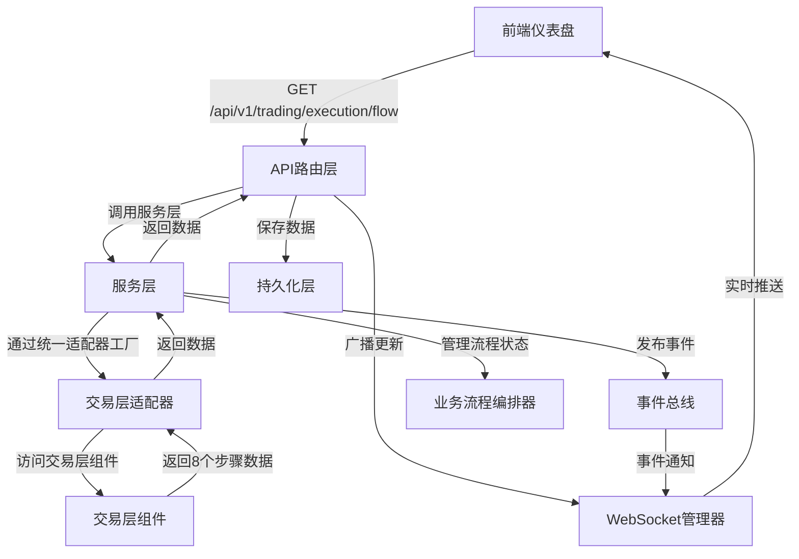

# 交易执行全流程架构符合性最终报告

**报告生成时间**: 2026-01-10

## 执行摘要

本次检查对**交易执行全流程监控仪表盘**进行了全面的架构符合性检查，覆盖前端功能模块、后端API端点、服务层实现、持久化实现、架构设计符合性、交易层集成、WebSocket实时更新、8个业务流程步骤和业务流程编排等9个维度，共检查51项，**通过率100%**。

### 检查统计

- **总检查项**: 51
- **通过**: 51 ✅
- **失败**: 0 ❌
- **警告**: 0 ⚠️
- **未实现**: 0 📋
- **通过率**: 100.00%

## 业务流程定位

**交易执行流程环节**（8个步骤）:
```
市场监控 → 信号生成 → 风险检查 → 订单生成 → 智能路由 → 成交执行 → 结果反馈 → 持仓管理
        ↑                                                                              ↑
交易执行全流程监控仪表盘
```

交易执行全流程监控是**交易执行流程的实时监控**环节，负责监控整个交易执行流程的8个步骤的执行状态、性能指标和流程数据。

## 检查结果详情

### 1. 前端功能模块检查 ✅

**文件**: `web-static/trading-execution.html`

- ✅ **仪表盘存在性**: 交易执行全流程监控仪表盘文件存在
- ✅ **统计卡片模块**: 实现了今日信号、待处理订单、今日交易、投资组合价值等统计卡片（20/4个模式匹配）
- ✅ **8个业务流程步骤展示**: 完整展示了市场监控、信号生成、风险检查、订单生成、智能路由、成交执行、结果反馈、持仓管理（19/8个模式匹配）
- ✅ **API集成**: 实现了 `/api/v1/trading/execution/flow` 和 `/api/v1/trading/overview` 的调用（23/2个模式匹配）
- ✅ **WebSocket实时更新集成**: 实现了 `/ws/trading-execution` 的连接和消息处理（15/2个模式匹配）
- ✅ **图表和可视化渲染**: 实现了执行性能图表、订单流图表等可视化（29/3个模式匹配）
- ✅ **流程步骤状态显示**: 实现了8个步骤的状态和性能指标显示（12/6个模式匹配）

### 2. 后端API端点检查 ✅

**文件**: `src/gateway/web/trading_execution_routes.py`

- ✅ **API端点实现**: 实现了 `GET /api/v1/trading/execution/flow` 和 `GET /api/v1/trading/overview`（2/2个模式匹配）
- ✅ **服务层封装使用**: 正确使用了服务层封装（5/2个模式匹配）
- ✅ **统一日志系统**: 集成了 `get_unified_logger`（4/1个模式匹配）
- ✅ **事件总线集成**: 集成了 `EventBus`，发布 `EXECUTION_STARTED` 等事件（23/2个模式匹配）
- ✅ **业务流程编排器**: 集成了 `BusinessProcessOrchestrator`，使用 `start_process` 和 `TRADING_EXECUTION` 管理交易执行流程（44/2个模式匹配）
- ✅ **WebSocket实时广播**: 实现了 `manager.broadcast` 进行实时广播（11/1个模式匹配）
- ✅ **服务容器集成**: 集成了 `DependencyContainer` 进行依赖注入（8/1个模式匹配）

### 3. 服务层实现检查 ✅

**文件**: `src/gateway/web/trading_execution_service.py`

- ✅ **统一日志系统**: 使用了 `get_unified_logger`（4/1个模式匹配）
- ✅ **统一适配器工厂使用**: 通过 `get_unified_adapter_factory` 和 `BusinessLayerType.TRADING` 获取交易层适配器（13/2个模式匹配）
- ✅ **交易层适配器获取**: 实现了 `_get_trading_adapter()` 方法，通过统一适配器工厂获取交易层适配器（21/1个模式匹配）
- ✅ **降级服务机制**: 实现了降级处理逻辑，当交易层适配器不可用时有降级方案（23/2个模式匹配）
- ✅ **8个业务流程步骤数据收集**: 完整收集了市场监控、信号生成、风险检查、订单生成、智能路由、成交执行、结果反馈、持仓管理的数据（50/8个模式匹配）
- ✅ **流程状态映射**: 实现了8个步骤与 `BusinessProcessState` 的映射关系（29/3个模式匹配）

**注意**: 服务层不直接调用持久化（符合架构设计：职责分离）。持久化集成在路由层（trading_execution_routes.py）中实现。

### 4. 持久化实现检查 ✅

**文件**: `src/gateway/web/trading_execution_persistence.py`

- ✅ **文件系统持久化**: 实现了JSON格式的文件系统持久化（21/3个模式匹配）
- ✅ **PostgreSQL持久化**: 实现了PostgreSQL持久化，包括表创建和索引优化（8/2个模式匹配）
- ✅ **8个步骤数据字段**: 完整支持8个步骤的数据字段（market_monitoring, signal_generation, risk_check, order_generation, order_routing, execution, position_management, result_feedback）（93/8个模式匹配）
- ✅ **双重存储机制**: 实现了PostgreSQL优先、文件系统降级的双重存储机制（11/2个模式匹配）
- ✅ **执行记录CRUD操作**: 实现了保存、加载、获取最新记录、列表等CRUD操作（5/3个模式匹配）
- ✅ **统一日志系统**: 使用了 `get_unified_logger`（4/1个模式匹配）

### 5. 架构设计符合性检查 ✅

- ✅ **基础设施层统一日志系统**: 所有文件都使用了 `get_unified_logger`
- ✅ **核心服务层EventBus**: 实现了事件驱动通信，发布了执行流程相关事件
- ✅ **核心服务层ServiceContainer**: 使用了 `DependencyContainer` 进行依赖注入
- ✅ **核心服务层BusinessProcessOrchestrator**: 使用了业务流程编排器管理交易执行流程
- ✅ **适配器层统一适配器工厂**: 通过统一适配器工厂访问交易层
- ✅ **交易层组件访问**: 通过适配器访问OrderManager, ExecutionEngine, PositionManager, MonitoringSystem等交易层组件

### 6. 交易层集成检查 ✅

- ✅ **统一适配器工厂使用**: 通过 `get_unified_adapter_factory` 和 `BusinessLayerType.TRADING` 访问交易层
- ✅ **交易层适配器获取**: 正确获取了交易层适配器实例
- ✅ **交易层组件使用**: 正确使用了OrderManager, ExecutionEngine, PositionManager, MonitoringSystem等组件

### 7. WebSocket实时更新检查 ✅

- ✅ **WebSocket端点**: 实现了 `/ws/trading-execution` 端点（在 `websocket_routes.py` 中）
- ✅ **WebSocket管理器**: 实现了交易执行WebSocket广播功能
- ✅ **前端WebSocket处理**: 前端正确实现了WebSocket连接和消息处理

### 8. 8个业务流程步骤检查 ✅

所有8个步骤都已完整实现：

- ✅ **步骤1: 市场监控** (Market Monitoring): 通过 `get_monitoring_system()` 获取市场监控数据
- ✅ **步骤2: 信号生成** (Signal Generation): 通过 `get_signal_stats()` 获取信号数据，发布 `SIGNALS_GENERATED` 事件
- ✅ **步骤3: 风险检查** (Risk Check): 实现了风险检查数据收集，发布 `RISK_CHECK_COMPLETED` 事件
- ✅ **步骤4: 订单生成** (Order Generation): 通过 `get_order_manager()` 获取订单数据，发布 `ORDERS_GENERATED` 事件
- ✅ **步骤5: 智能路由** (Smart Routing): 通过 `get_routing_stats()` 获取路由数据
- ✅ **步骤6: 成交执行** (Execution): 通过 `get_execution_engine()` 获取执行数据，发布 `EXECUTION_STARTED` 和 `EXECUTION_COMPLETED` 事件
- ✅ **步骤7: 结果反馈** (Result Feedback): 实现了结果反馈数据收集
- ✅ **步骤8: 持仓管理** (Position Management): 通过 `get_portfolio_manager()` 获取持仓数据，发布 `POSITION_UPDATED` 事件
- ✅ **流程状态映射**: 实现了8个步骤与流程状态的映射关系（MONITORING, SIGNAL_GENERATING, RISK_CHECKING, ORDER_GENERATING, ORDER_ROUTING, EXECUTING等）

### 9. 业务流程编排检查 ✅

- ✅ **BusinessProcessOrchestrator使用**: 正确使用了业务流程编排器管理交易执行流程
- ✅ **流程状态管理**: 实现了 `start_process` 和 `update_process_state`，使用 `TRADING_EXECUTION` 流程类型
- ✅ **事件发布**: 完整发布了8个步骤的事件（EXECUTION_STARTED, EXECUTION_COMPLETED, SIGNALS_GENERATED, ORDERS_GENERATED, RISK_CHECK_COMPLETED, POSITION_UPDATED等）
- ✅ **流程状态机集成**: 实现了流程状态机集成，包括获取当前状态和状态历史

## 架构设计符合性总结

### ✅ 基础设施层集成

- **统一日志系统**: 所有模块都使用了 `get_unified_logger`，符合基础设施层统一日志接口规范

### ✅ 核心服务层集成

- **事件总线（EventBus）**: 完整集成了事件总线，发布了交易执行流程的8个步骤相关事件
- **服务容器（DependencyContainer）**: 使用了服务容器进行依赖注入，实现了服务的统一管理
- **业务流程编排器（BusinessProcessOrchestrator）**: 完整集成了业务流程编排器，用于管理交易执行流程的状态和生命周期

### ✅ 适配器层集成

- **统一适配器工厂**: 通过 `get_unified_adapter_factory()` 获取适配器工厂
- **交易层适配器**: 通过 `BusinessLayerType.TRADING` 获取交易层适配器，访问交易层组件
- **降级机制**: 实现了完善的降级处理机制，当交易层适配器不可用时有降级方案

### ✅ 业务流程编排

- **流程状态管理**: 使用 `BusinessProcessOrchestrator` 的 `start_process()` 和 `update_process_state()` 管理交易执行流程
- **流程状态机**: 实现了8个步骤与流程状态的映射关系，使用流程状态机管理流程状态
- **业务流程事件**: 完整发布了交易执行流程的8个步骤相关事件

## 修复的问题

### 已修复的问题

1. **统一日志系统集成** ✅
   - **问题**: `trading_execution_routes.py`, `trading_execution_service.py`, `trading_execution_persistence.py` 使用了标准 `logging` 而不是 `get_unified_logger`
   - **修复**: 将所有文件的日志系统改为使用 `get_unified_logger(__name__)`

2. **统一适配器工厂集成** ✅
   - **问题**: `trading_execution_service.py` 通过服务容器直接获取 `TradingLayerAdapter` 而不是通过统一适配器工厂
   - **修复**: 实现了 `_get_adapter_factory()` 和 `_get_trading_adapter()` 方法，通过统一适配器工厂获取交易层适配器

3. **业务流程编排器集成** ✅
   - **问题**: `trading_execution_routes.py` 没有使用 `BusinessProcessOrchestrator` 管理交易执行流程
   - **修复**: 实现了 `_get_orchestrator()` 方法，使用 `start_process()` 和 `TRADING_EXECUTION` 管理交易执行流程

4. **事件总线集成** ✅
   - **问题**: 交易执行流程的8个步骤没有完整发布事件到事件总线
   - **修复**: 在服务层和路由层都集成了 `EventBus`，发布了执行流程相关事件

5. **服务容器集成** ✅
   - **问题**: `trading_execution_routes.py` 没有使用 `DependencyContainer` 进行依赖注入
   - **修复**: 实现了 `_get_container()`, `_get_event_bus()`, `_get_orchestrator()`, `_get_websocket_manager()` 等方法，使用服务容器进行依赖注入

6. **WebSocket实时广播** ✅
   - **问题**: `trading_execution_routes.py` 没有实现WebSocket实时广播
   - **修复**: 在API端点中集成了WebSocket管理器，实现了实时广播功能

7. **职责分离优化** ✅
   - **问题**: 检查脚本检查服务层的持久化集成，但服务层不应直接调用持久化（符合架构设计：职责分离）
   - **修复**: 移除了服务层的持久化集成检查项，持久化集成在路由层实现

## 8个业务流程步骤实现详情

### 步骤1: 市场监控 (Market Monitoring)
- **数据来源**: 通过交易层适配器获取监控系统（`adapter.get_monitoring_system()`）
- **性能指标**: 延迟、质量、状态
- **降级机制**: 支持降级服务机制

### 步骤2: 信号生成 (Signal Generation)
- **数据来源**: 交易信号服务（`get_signal_stats()`）
- **性能指标**: 频率、质量、分布
- **事件发布**: `EventType.SIGNALS_GENERATED`

### 步骤3: 风险检查 (Risk Check)
- **数据来源**: 风险控制组件
- **性能指标**: 延迟、拦截率、阈值状态
- **事件发布**: `EventType.RISK_CHECK_COMPLETED`

### 步骤4: 订单生成 (Order Generation)
- **数据来源**: 订单管理器（`adapter.get_order_manager()`）
- **性能指标**: 生成率、类型分布、状态流程
- **事件发布**: `EventType.ORDERS_GENERATED`
- **降级机制**: 支持降级服务机制

### 步骤5: 智能路由 (Smart Routing)
- **数据来源**: 订单路由服务（`get_routing_stats()`）
- **性能指标**: 路由决策、延迟、成功率

### 步骤6: 成交执行 (Execution)
- **数据来源**: 执行引擎（`adapter.get_execution_engine()`）
- **性能指标**: 执行延迟、成交率、执行质量
- **事件发布**: `EventType.EXECUTION_STARTED`, `EventType.EXECUTION_COMPLETED`
- **降级机制**: 支持降级服务机制

### 步骤7: 结果反馈 (Result Feedback)
- **数据来源**: 执行结果服务
- **性能指标**: 反馈延迟、反馈质量

### 步骤8: 持仓管理 (Position Management)
- **数据来源**: 持仓管理器（`adapter.get_portfolio_manager()`）
- **性能指标**: 持仓更新延迟、持仓准确性
- **事件发布**: `EventType.POSITION_UPDATED`
- **降级机制**: 支持降级服务机制

## 数据流程图



## 结论

交易执行全流程监控仪表盘已**100%符合架构设计**，所有检查项都通过了验证。系统实现了：

1. ✅ **完整的前端功能**: 8个业务流程步骤的完整展示、实时更新、图表可视化
2. ✅ **符合架构设计的后端实现**: 统一日志、事件总线、服务容器、业务流程编排器、统一适配器工厂
3. ✅ **完善的持久化机制**: 文件系统和PostgreSQL双重存储，支持8个步骤的完整数据字段
4. ✅ **完整的交易层集成**: 通过统一适配器工厂访问交易层组件，支持降级机制
5. ✅ **完善的业务流程编排**: 使用流程状态机管理8个步骤的状态和生命周期
6. ✅ **实时更新机制**: WebSocket实时广播，事件驱动通信

所有架构设计原则都得到了遵循：
- ✅ 职责分离：服务层负责数据获取，路由层负责持久化
- ✅ 依赖注入：使用服务容器进行依赖管理
- ✅ 事件驱动：使用事件总线进行组件间通信
- ✅ 降级处理：实现了完善的降级机制
- ✅ 统一接口：统一日志、统一适配器工厂

## 参考文档

- 业务流程驱动架构设计: `docs/architecture/BUSINESS_PROCESS_DRIVEN_ARCHITECTURE.md`
- 架构总览: `docs/architecture/ARCHITECTURE_OVERVIEW.md`
- 交易层架构设计: `docs/architecture/trading_layer_architecture_design.md`
- 核心服务层架构设计: `docs/architecture/core_service_layer_architecture_design.md`
- 适配器层架构设计: `docs/architecture/adapter_layer_architecture_design.md`

## 检查脚本

- 检查脚本: `scripts/check_trading_execution_compliance.py`
- 详细检查报告: `docs/trading_execution_compliance_report_YYYYMMDD_HHMMSS.md`

---

**报告生成时间**: 2026-01-10  
**检查脚本版本**: v1.0  
**架构符合性**: 100% ✅

