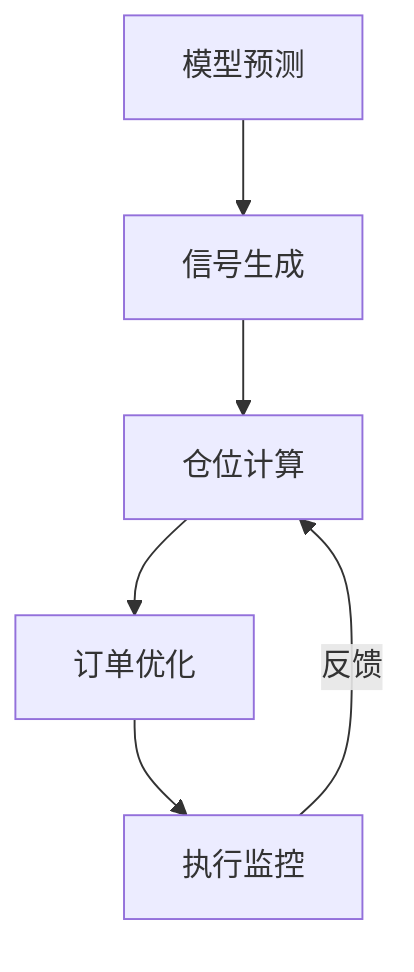
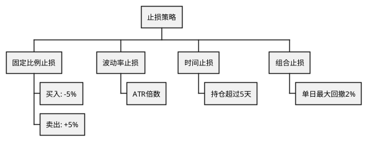

# RQA2025 交易执行系统设计文档

## 1. 概述

交易执行系统实现从信号到交易的完整闭环，主要功能包括：
- 交易信号处理
- 动态仓位管理
- 智能订单执行
- 组合风险监控
- 执行成本优化

## 2. 系统架构

### 2.1 核心组件
```text
SignalProcessor - 信号处理器
PositionManager - 仓位管理器
OrderGenerator   - 订单生成器
ExecutionOptimizer - 执行优化器
RiskMonitor     - 风险监控器
```

### 2.2 工作流程


## 3. 执行策略

### 3.1 订单类型选择
| 类型 | 适用场景 | 优势 |
|------|----------|------|
| 市价单 | 高流动性标的 | 即时成交 |
| 限价单 | 正常市场条件 | 控制成本 |
| TWAP | 大额订单 | 减少市场冲击 |
| VWAP | 跟随市场成交量 | 隐蔽执行 |

### 3.2 执行算法参数
```python
class ExecutionParams:
    def __init__(self,
                urgency: int = 1,
                max_slippage: float = 0.001,
                participation_rate: float = 0.1):
        """
        Args:
            urgency: 紧急程度(1-5)
            max_slippage: 最大允许滑点
            participation_rate: 市场参与率
        """
```

## 4. 风险管理

### 4.1 风险控制矩阵
| 维度 | 阈值 | 监控频率 | 应对措施 |
|------|------|----------|----------|
| 单票风险 | 2%资本 | 实时 | 自动平仓 |
| 组合风险 | 20%资本 | 分钟级 | 停止交易 |
| 流动性风险 | 10%ADV | 订单前检查 | 拆分订单 |
| 集中度风险 | 30%组合 | 日终 | 强制调仓 |

### 4.2 止损策略


## 5. 执行优化

### 5.1 成本控制
| 成本类型 | 控制方法 | 优化目标 |
|----------|----------|----------|
| 佣金 | 批量执行 | 减少交易次数 |
| 滑点 | 算法拆分 | 降低市场冲击 |
| 冲击成本 | 流动性探测 | 优化参与时机 |
| 机会成本 | 紧急度调整 | 平衡速度与成本 |

### 5.2 执行质量评估
| 指标 | 公式 | 基准 |
|------|------|------|
| 实现价差 | (执行价-到达价)/到达价 | <5bps |
| 参与度 | 成交量/ADV | 10-20% |
| 完成率 | 成交数量/订单数量 | >95% |
| 延迟 | 执行时间-决策时间 | <1s |

## 6. 系统集成

### 6.1 数据接口
```python
class MarketDataInterface:
    def get_real_time_price(self, symbol: str) -> float:
        """获取实时价格"""
        
    def get_order_book(self, symbol: str) -> Dict:
        """获取订单簿快照"""
        
    def get_historical_volumes(self, symbol: str) -> pd.DataFrame:
        """获取历史成交量"""
```

### 6.2 生产部署
```text
                   +---------------+
                   | 执行管理系统  |
                   +-------+-------+
                           | FIX
+------------------+       |       +-----------------+
| 量化策略引擎     | <-----+-----> | 券商交易系统    |
+------------------+               +-----------------+
```

## 7. 版本历史

- v1.0 (2025-09-01): 基础执行框架
- v1.1 (2025-09-15): 算法执行增强
- v1.2 (2025-10-01): 风险控制模块
- v1.3 (2025-10-15): 执行优化系统
