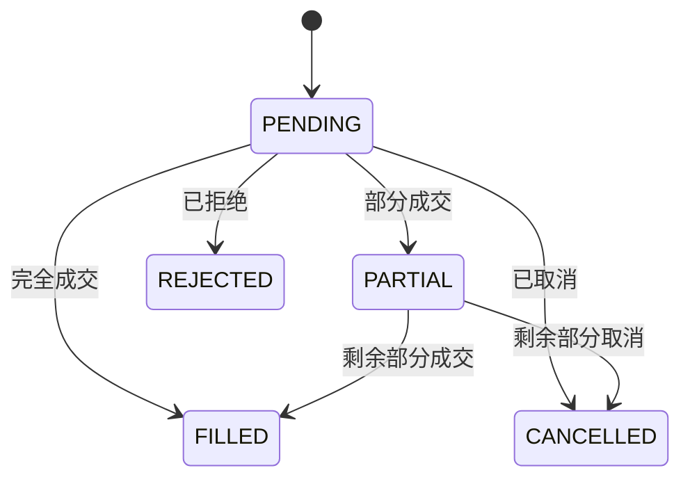

# RQA2025 交易层设计文档

## 1. 概述

交易层负责将模型预测信号转换为实际交易操作，主要功能包括：
- 信号到订单的转换
- 订单执行和管理
- 风险控制和头寸管理
- 交易绩效分析

## 2. 核心组件

### 2.1 交易引擎
```text
TradingEngine       - 核心交易逻辑
OrderManager        - 订单生命周期管理
PositionManager     - 持仓跟踪
```

### 2.2 风险控制系统
```text
RiskEvaluator       - 实时风险计算
CircuitBreaker      - 熔断机制
ExposureController  - 风险暴露控制
```

## 3. 交易流程

### 3.1 信号处理流程
```python
# 初始化交易引擎
engine = TradingEngine(risk_config=risk_config)

# 生成交易信号
signals = pd.DataFrame({
    "symbol": ["600000", "000001"],
    "signal": [1, -1],  # 1:买入, -1:卖出
    "strength": [0.8, 0.5]  # 信号强度
})

# 获取当前市场数据
market_data = data_manager.get_real_time_prices()

# 生成订单
orders = engine.generate_orders(signals, market_data)

# 执行订单
for order in orders:
    broker.execute_order(order)
```

### 3.2 风险控制流程
```python
# 风险控制检查点
1. 单笔交易风险 < 2%资本金
2. 单标的风险暴露 < 10%资本金
3. 组合波动率 < 5%/日
4. 最大回撤 < 20%
```

## 4. 订单管理

### 4.1 订单状态机


### 4.2 订单生命周期
```python
# 订单创建
order = {
    "order_id": "unique_id",
    "symbol": "600000",
    "direction": OrderDirection.BUY,
    "quantity": 1000,
    "price": 10.50,
    "type": OrderType.LIMIT
}

# 订单状态更新
engine.update_order_status(
    order_id="unique_id",
    filled_quantity=500,
    avg_price=10.48,
    status=OrderStatus.PARTIAL
)

# 订单完成
engine.update_order_status(
    order_id="unique_id",
    filled_quantity=1000,
    avg_price=10.49,
    status=OrderStatus.FILLED
)
```

## 5. 风险控制

### 5.1 风险指标
| 指标名称 | 计算公式 | 阈值 |
|---------|---------|------|
| 单笔风险 | 交易金额/总资本 | <2% |
| 最大回撤 | Max(1 - 当日净值/历史最高净值) | <20% |
| 夏普比率 | 年化收益/年化波动率 | >1.5 |
| 胜率 | 盈利交易数/总交易数 | >55% |

### 5.2 熔断机制
```python
# 熔断触发条件
if daily_loss > 5%:
    circuit_breaker.activate()
    
# 熔断后操作
1. 暂停新订单
2. 平仓部分头寸
3. 等待市场稳定
```

## 6. 监控集成

### 6.1 关键监控指标
```python
# 订单监控
monitor.record_metric("order_created", tags={"symbol": "600000"})

# 风险监控
monitor.record_metric("risk_exposure", value=0.15)

# 性能监控
monitor.record_metric("portfolio_value", value=1200000)
```

### 6.2 监控看板
```text
1. 实时仓位看板
2. 风险热力图
3. 交易流水
4. 绩效指标
```

## 7. 最佳实践

### 7.1 订单执行策略
```python
# 大额订单拆分执行
def execute_large_order(order):
    chunk_size = calc_optimal_chunk_size(order)
    for i in range(0, order.quantity, chunk_size):
        partial_order = create_partial_order(order, chunk_size)
        broker.execute(partial_order)
        time.sleep(execution_interval)
```

### 7.2 异常处理流程
```python
try:
    engine.execute_strategy(strategy)
except MarketClosedError:
    logger.warning("Market closed, postponing execution")
except RiskLimitExceededError as e:
    circuit_breaker.activate()
    alert_risk_team(e)
except Exception as e:
    logger.error(f"Unexpected error: {e}")
    engine.cancel_all_pending_orders()
```

## 8. 性能指标

| 操作类型 | 平均延迟 | 吞吐量 |
|---------|---------|--------|
| 信号生成 | 50ms | 1000信号/秒 |
| 订单生成 | 10ms | 5000订单/秒 |
| 订单执行 | 100ms | 500订单/秒 |
| 风险计算 | 20ms | 10000次/秒 |

## 9. 版本历史

- v1.0 (2023-07-01): 基础交易引擎
- v1.1 (2023-08-01): 增强风险控制
- v1.2 (2023-08-15): 实时监控集成
