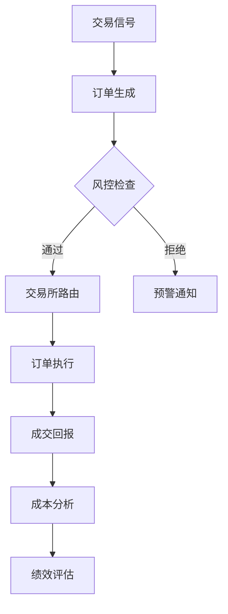
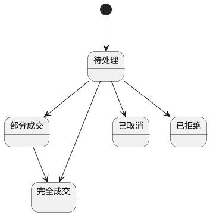

# RQA2025 交易系统设计文档

## 1. 执行引擎概述

交易执行系统实现从信号到成交的全流程自动化，主要功能包括：
- 多类型订单处理
- 智能交易所路由
- 实时风险控制
- 算法策略执行
- 交易成本优化

## 2. 系统架构

### 2.1 核心组件
```text
OrderManager      - 订单管理
ExchangeRouter    - 交易所路由
RiskEngine        - 风控引擎
StrategyExecutor  - 策略执行
CostAnalyzer      - 成本分析
```

### 2.2 执行流程


## 3. 订单管理

### 3.1 订单类型
| 类型 | 特点 | 适用场景 |
|------|------|----------|
| 市价单 | 即时成交 | 高流动性 |
| 限价单 | 指定价格 | 价格敏感 |
| TWAP | 时间加权 | 大额订单 |
| VWAP | 量价加权 | 减少冲击 |
| 冰山单 | 隐藏数量 | 隐蔽交易 |

### 3.2 状态流转


## 4. 路由策略

### 4.1 路由规则
| 规则 | 逻辑 | 参数配置 |
|------|------|----------|
| 代码匹配 | 根据股票代码前缀 | 6->SSE,0->SZSE |
| 流动性优先 | 选择盘口深度最佳 | 深度阈值 |
| 成本最优 | 选择佣金最低 | 费率表 |
| 智能路由 | 综合评估 | 权重参数 |

### 4.2 性能指标
```text
| 指标          | 目标值       | 监控频率 |
|---------------|-------------|----------|
| 路由延迟      | <10ms       | 实时     |
| 成交率        | >95%        | 每分钟   |
| 价格改善      | >20%        | 每笔成交 |
| 失败重试      | ≤3次        | 每次失败 |
```

## 5. 风控机制

### 5.1 风控层级
| 层级 | 检查点 | 响应速度 |
|------|--------|----------|
| 预交易 | 订单生成 | <1ms |
| A股预交易 | 涨跌停/T+1检查 | <2ms |
| 实时 | 订单执行 | <5ms |
| 后交易 | 成交回报 | <10ms |
| 日终 | 组合风险 | 批量处理 |

### 5.2 风控规则
#### 通用规则
| 规则 | 阈值 | 处置方式 |
|------|------|----------|
| 单笔金额 | 50万 | 拒绝 |
| 单日限额 | 1000万 | 熔断 |
| 价格偏离 | ±2% | 预警 |
| 撤单率 | >30% | 限制 |

#### A股特有规则
| 规则 | 阈值 | 处置方式 |
|------|------|----------|
| 涨跌停限制 | ±10% | 拒绝 |
| T+1交易 | 当日买入 | 禁止卖出 |
| 科创板涨跌幅 | ±20% | 预警 |
| 创业板申报价 | ±2% | 拒绝 |

## 6. 交易策略

### 6.1 算法策略
| 策略 | 实现要点 | 参数优化 |
|------|----------|----------|
| TWAP | 均匀分时 | 时间间隔 |
| VWAP | 跟随成交量 | 历史窗口 |
| 冰山 | 隐藏量比例 | 显示规模 |
| 狙击 | 快速捕捉流动性 | 反应阈值 |

### 6.2 策略矩阵
```text
| 场景              | 首选策略 | 备选策略 |
|-------------------|----------|----------|
| 大额建仓          | TWAP     | VWAP     |
| 流动性不足        | 冰山     | 限价     |
| 市场波动          | 狙击     | 市价     |
| 程序化交易        | VWAP     | TWAP     |
```

## 7. 版本历史

- v1.0 (2025-11-01): 基础执行框架
- v1.1 (2025-11-15): 智能路由系统
- v1.2 (2025-12-01): 多策略支持
- v1.3 (2025-12-15): 生产级优化
