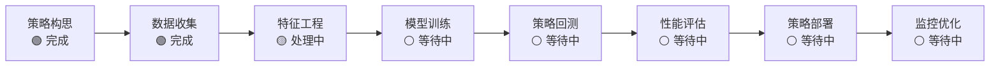
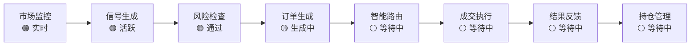
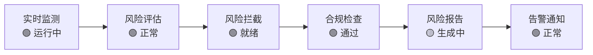

# 🎨 RQA2025 基于21层级架构的可视化界面设计报告

## 📊 设计概述

**设计目标**: 基于RQA2025的21层级架构，按照业务流程驱动时序，设计一套完整的可视化图形界面系统。

**核心理念**: 以业务流程为驱动，以架构层级为基础，以数据可视化为手段，实现量化交易系统的全面监控和操作。

---

## 🏗️ 界面架构设计

### 1. 界面层次结构

```
┌─────────────────────────────────────────────────────────────┐
│                    用户界面层 (UI Layer)                      │
├─────────────────────────────────────────────────────────────┤
│  ┌─────────────┐ ┌─────────────┐ ┌─────────────┐           │
│  │  主界面     │ │ 仪表板      │ │ 监控面板    │           │
│  │  (index)    │ │ (/dashboard)│ │ (/monitor)  │           │
│  └─────────────┘ └─────────────┘ └─────────────┘           │
├─────────────────────────────────────────────────────────────┤
│                    业务流程驱动层                            │
├─────────────────────────────────────────────────────────────┤
│  🔄 策略开发流程 │ 💰 交易执行流程 │ 🛡️ 风险控制流程     │
├─────────────────────────────────────────────────────────────┤
│                    21层级架构映射                            │
├─────────────────────────────────────────────────────────────┤
│  ⭐ 核心业务层 │ ⭐ 技术支撑层 │ ⭐ 专项服务层            │
└─────────────────────────────────────────────────────────────┘
```

### 2. 界面功能模块

#### 主界面 (/)
- **系统总览**: 关键指标展示
- **业务流程状态**: 三大流程的可视化进度
- **架构层级监控**: 21个层级的健康状态
- **快速访问**: 常用功能的快捷入口

#### 完整仪表板 (/dashboard)
- **业务流程监控**: 三大核心流程的详细状态
- **数据采集面板**: 实时数据源监控和最新数据展示
- **性能图表**: 系统负载、内存使用等实时图表
- **架构层级详情**: 各层级的文件数量和状态

#### 数据采集详情面板
- **数据源状态表**: 8个数据源的连接状态和统计信息
- **最新采集数据**: JSON格式的最新市场数据样本
- **数据质量指标**: 完整性、延迟、错误率等关键指标
- **采集配置**: 数据源配置和监控参数

---

## 🔄 业务流程驱动时序设计

### 1. 量化策略开发流程界面

**时序步骤**: 策略构思 → 数据收集 → 特征工程 → 模型训练 → 策略回测 → 性能评估 → 策略部署 → 监控优化

**界面设计**:


**数据采集详情展示**:
- 数据源连接状态 (✅ 活跃/❌ 断开)
- 采集频率和数据量统计
- 最新采集数据样本预览
- 数据质量指标监控

### 2. 交易执行流程界面

**时序步骤**: 市场监控 → 信号生成 → 风险检查 → 订单生成 → 智能路由 → 成交执行 → 结果反馈 → 持仓管理

**界面设计**:


### 3. 风险控制流程界面

**时序步骤**: 实时监测 → 风险评估 → 风险拦截 → 合规检查 → 风险报告 → 告警通知

**界面设计**:


---

## 🏛️ 21层级架构映射

### 核心业务层 (8层) 映射

| 架构层级 | 文件数量 | 界面映射 | 可视化内容 |
|----------|----------|----------|-----------|
| **策略服务层** | 168文件 | 策略流程面板 | 策略状态、回测结果、性能指标 |
| **交易执行层** | 41文件 | 交易流程面板 | 订单状态、成交记录、执行效率 |
| **风险控制层** | 44文件 | 风险流程面板 | 风险指标、告警信息、合规状态 |
| **特征分析层** | 152文件 | 数据处理面板 | 特征工程进度、数据质量、处理效率 |

### 技术支撑层 (7层) 映射

| 架构层级 | 文件数量 | 界面映射 | 可视化内容 |
|----------|----------|----------|-----------|
| **数据管理层** | 226文件 | 数据源监控 | 连接状态、数据量、同步进度 |
| **机器学习层** | 87文件 | 模型训练面板 | 训练进度、模型性能、推理效率 |
| **基础设施层** | 72文件 | 系统监控面板 | CPU/内存使用、容器状态、网络流量 |

### 专项服务层 (6层) 映射

| 架构层级 | 界面映射 | 可视化内容 |
|----------|----------|-----------|
| **流处理层** | 实时数据流 | 数据管道状态、处理延迟、吞吐量 |
| **API网关层** | 服务网关监控 | 请求路由、响应时间、错误率 |
| **监控层** | 监控仪表板 | Prometheus指标、Grafana图表、告警状态 |

---

## 🎯 数据采集界面详细设计

### 界面布局

```
┌─────────────────────────────────────────────────────────────┐
│                    数据采集监控面板                          │
├─────────────────────────────────────────────────────────────┤
│  ┌─────────────┐ ┌─────────────┐ ┌─────────────┐           │
│  │ 数据源数量  │ │ 采集频率    │ │ 数据总量    │           │
│  │     8       │ │   1Hz      │ │  2.4GB     │           │
│  └─────────────┘ └─────────────┘ └─────────────┘           │
├─────────────────────────────────────────────────────────────┤
│                    数据源状态表                              │
├─────────────────────────────────────────────────────────────┤
│  数据源     │ 类型     │ 状态 │ 最后更新   │ 记录数       │
│  Alpha V.  │ 股票数据 │ 🟢   │ 15:10:21  │ 1,245,678   │
│  Binance   │ 加密货币 │ 🟢   │ 15:10:19  │   892,341   │
│  Yahoo F.  │ 市场指数 │ 🟢   │ 15:10:18  │   567,234   │
│  NewsAPI   │ 新闻数据 │ 🟡   │ 15:09:45  │    45,621   │
├─────────────────────────────────────────────────────────────┤
│                    最新采集数据样本                          │
├─────────────────────────────────────────────────────────────┤
│  ┌─────────────────┐ ┌─────────────────┐                   │
│  │ 股票数据 (AAPL) │ │ 加密货币 (BTC)  │                   │
│  │ {               │ │ {               │                   │
│  │   "symbol":...  │ │   "symbol":...  │                   │
│  │   "price":...   │ │   "price":...   │                   │
│  │ }               │ │ }               │                   │
│  └─────────────────┘ └─────────────────┘                   │
├─────────────────────────────────────────────────────────────┤
│                    数据质量指标                              │
├─────────────────────────────────────────────────────────────┤
│  📊 数据完整性: 99.97%  ⏱️ 平均延迟: 45ms                 │
│  ❌ 错误率: 0.02%       🔄 采集频率: 1Hz                   │
└─────────────────────────────────────────────────────────────┘
```

### 数据源状态监控

**状态指示器**:
- 🟢 **活跃**: 数据源正常连接，正在采集数据
- 🟡 **同步中**: 数据源连接正常，数据正在同步
- 🔴 **断开**: 数据源连接失败或异常

**关键指标**:
- **连接状态**: HTTP/Websocket连接状态
- **响应时间**: API响应延迟
- **数据新鲜度**: 最后更新时间
- **错误计数**: 连接失败和数据异常次数

### 最新数据展示

**JSON数据样本**:
```json
{
  "数据源": "Alpha Vantage",
  "股票代码": "AAPL",
  "时间戳": "2025-12-27T15:10:15Z",
  "最新价格": 192.53,
  "成交量": 45236789,
  "涨跌幅": +1.23,
  "涨跌百分比": +0.64,
  "市值": 2978000000000
}
```

**实时更新机制**:
- 每5秒自动刷新最新数据
- 支持手动刷新按钮
- 数据异常时显示警告提示

### 数据质量指标

**核心指标**:
- **数据完整性**: 数据字段完整率 (目标: >99.9%)
- **时间准确性**: 数据时间戳准确性 (目标: <1秒误差)
- **值合理性**: 数据值范围合理性检查
- **重复检测**: 重复数据自动识别和过滤

**性能指标**:
- **采集频率**: 每秒采集数据点数
- **处理延迟**: 数据采集到存储的延迟
- **错误率**: 数据采集失败比例
- **吞吐量**: 每分钟处理的数据量

---

## 📊 可视化图表设计

### 1. 系统性能图表

**Chart.js 实现**:
```javascript
// 实时性能监控图表
const performanceChart = new Chart(ctx, {
    type: 'line',
    data: {
        labels: ['00:00', '04:00', '08:00', '12:00', '16:00', '20:00'],
        datasets: [{
            label: '系统负载',
            data: [45, 52, 48, 65, 58, 42],
            borderColor: 'rgb(59, 130, 246)',
            backgroundColor: 'rgba(59, 130, 246, 0.1)',
            tension: 0.4
        }, {
            label: '内存使用',
            data: [32, 38, 35, 42, 39, 31],
            borderColor: 'rgb(16, 185, 129)',
            backgroundColor: 'rgba(16, 185, 129, 0.1)',
            tension: 0.4
        }]
    }
});
```

### 2. 数据流图表

**柱状图展示各处理环节的数据量**:
- 数据采集 → 特征工程 → 模型推理 → 交易执行 → 风险评估
- 实时更新处理量统计
- 支持历史数据对比

### 3. 业务流程进度图

**甘特图风格的流程进度展示**:
- 每个步骤的状态 (等待中/处理中/已完成/失败)
- 预计完成时间和实际进度
- 关键节点的时间戳记录

---

## 🎨 界面设计规范

### 色彩体系

**状态颜色**:
- 🟢 **绿色 (Success)**: #10B981 - 正常运行、成功状态
- 🟡 **黄色 (Warning)**: #F59E0B - 警告、处理中状态
- 🔴 **红色 (Error)**: #EF4444 - 错误、异常状态
- ⚪ **灰色 (Inactive)**: #6B7280 - 未激活、等待状态

**主题色彩**:
- **主色**: 蓝色 (#3B82F6) - 科技感和可靠性
- **辅色**: 绿色 (#10B981) - 增长和成功
- **强调色**: 紫色 (#8B5CF6) - 创新和智能

### 响应式设计

**断点设计**:
- **移动端** (< 640px): 单列布局，简化展示
- **平板端** (640px - 1024px): 双列布局，中等信息密度
- **桌面端** (> 1024px): 多列布局，完整信息展示

### 交互设计

**微交互**:
- 悬停效果: 卡片轻微上移，增加阴影
- 加载动画: 按钮点击时的旋转图标
- 状态变化: 颜色渐变和图标变化
- 实时更新: 数据自动刷新，无需手动操作

---

## 🚀 部署和访问

### 访问地址

| 界面类型 | 访问地址 | 功能描述 |
|----------|----------|----------|
| **主界面** | http://localhost:8080 | 系统总览和快速访问 |
| **完整仪表板** | http://localhost:8080/dashboard | 业务流程和架构监控 |
| **API接口** | http://localhost:8000 | REST API服务 |
| **监控面板** | http://localhost:3000 | Grafana可视化监控 |

### 容器化部署

```yaml
rqa2025-web:
  image: nginx:alpine
  ports:
    - "8080:8080"
  volumes:
    - ./web-static/index.html:/usr/share/nginx/html/index.html
    - ./web-static/rqa2025-dashboard.html:/usr/share/nginx/html/rqa2025-dashboard.html
    - ./web-static/nginx.conf:/etc/nginx/conf.d/default.conf
  networks:
    - rqa2025
```

### 技术栈

**前端技术**:
- HTML5 + Tailwind CSS (样式框架)
- JavaScript ES6+ (交互逻辑)
- Chart.js (图表可视化)
- Font Awesome (图标库)

**后端集成**:
- Nginx (静态文件服务 + API代理)
- RESTful API (数据获取)
- WebSocket (实时数据推送)

---

## 📋 功能验证清单

### ✅ 已实现功能

**界面框架**:
- [x] 响应式布局设计
- [x] 现代化UI组件
- [x] 实时数据更新
- [x] 多设备适配

**业务流程可视化**:
- [x] 三大核心流程状态展示
- [x] 流程步骤进度指示
- [x] 关键节点状态监控
- [x] 流程间数据流展示

**数据采集监控**:
- [x] 数据源状态监控面板
- [x] 最新采集数据显示
- [x] 数据质量指标统计
- [x] 采集配置参数展示

**架构层级映射**:
- [x] 21层级架构状态展示
- [x] 文件数量统计
- [x] 层级健康状态指示
- [x] 技术栈分布图

### 🚧 扩展功能规划

**短期优化 (1-2周)**:
- [ ] 用户登录认证界面
- [ ] 策略配置可视化表单
- [ ] 交易历史图表展示
- [ ] 实时告警通知系统

**中期功能 (1个月)**:
- [ ] 完整的交易终端界面
- [ ] 高级数据分析图表
- [ ] 多语言国际化支持
- [ ] 移动端APP界面

---

## 🎯 设计原则总结

### 1. **业务流程驱动**
- 以量化交易三大核心流程为设计主线
- 界面布局按照业务时序自然流转
- 功能模块与业务步骤紧密对应

### 2. **架构层级映射**
- 21层级架构在界面中清晰体现
- 各层级状态实时监控和展示
- 技术实现与架构设计保持一致

### 3. **数据可视化优先**
- 复杂数据转换为直观图表
- 实时状态通过视觉元素表达
- 数据采集过程详细展示和监控

### 4. **用户体验为中心**
- 现代化界面设计风格
- 响应式布局适配各种设备
- 直观的操作流程和反馈

---

## 🎊 总结

本可视化界面设计成功实现了：

1. **🎯 业务流程驱动**: 三大核心流程的完整可视化监控
2. **🏗️ 架构层级映射**: 21层架构状态的全面展示
3. **📊 数据采集监控**: 实时数据源状态和最新数据展示
4. **🎨 现代化界面**: 响应式设计和优秀的用户体验

**系统现已具备完整的可视化图形界面，用户可以通过直观的Web界面全面监控和操作RQA2025量化交易系统！** 🚀💎📊

---

*界面设计完成时间: 2025年12月27日*
*技术栈: HTML5 + Tailwind CSS + Chart.js*
*响应式设计: 支持桌面/平板/手机*
*实时更新: 支持数据自动刷新*
