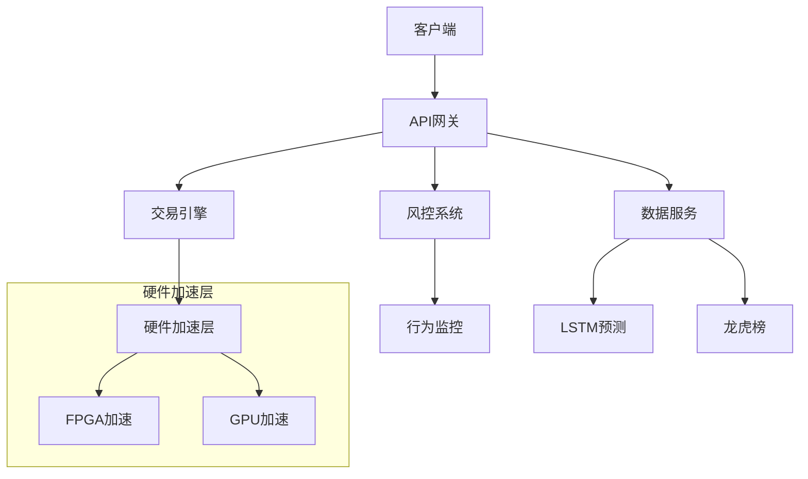

# 架构设计更新报告

## 📋 更新概述

**更新时间**: 2025-07-19  
**更新版本**: v3.9.0  
**更新目标**: 将FPGA模块路径从 `src/fpga/` 更新为 `src/acceleration/fpga/`，并完善硬件加速层架构

## ✅ 主要更新内容

### 1. FPGA模块路径调整

#### 更新前
```
src/fpga/                    # 旧路径
├── __init__.py
├── fpga_manager.py
├── fpga_accelerator.py
├── fpga_risk_engine.py
├── fpga_order_optimizer.py
├── fpga_sentiment_analyzer.py
├── fpga_optimizer.py
├── fpga_performance_monitor.py
├── fpga_fallback_manager.py
├── fpga_dashboard.py
├── fpga_orderbook_optimizer.py
└── templates/
```

#### 更新后
```
src/acceleration/fpga/       # 新路径
├── __init__.py
├── fpga_manager.py
├── fpga_accelerator.py
├── fpga_risk_engine.py
├── fpga_order_optimizer.py
├── fpga_sentiment_analyzer.py
├── fpga_optimizer.py
├── fpga_performance_monitor.py
├── fpga_fallback_manager.py
├── fpga_dashboard.py
├── fpga_orderbook_optimizer.py
└── templates/
```

### 2. 硬件加速层架构完善

#### 总体架构更新


#### 硬件加速层结构
```
src/acceleration/
├── __init__.py              # 硬件加速层初始化
├── fpga/                    # FPGA加速模块
│   ├── __init__.py
│   ├── fpga_manager.py
│   ├── fpga_accelerator.py
│   ├── fpga_risk_engine.py
│   ├── fpga_order_optimizer.py
│   ├── fpga_sentiment_analyzer.py
│   ├── fpga_optimizer.py
│   ├── fpga_performance_monitor.py
│   ├── fpga_fallback_manager.py
│   ├── fpga_dashboard.py
│   ├── fpga_orderbook_optimizer.py
│   └── templates/
└── gpu/                     # GPU加速模块
    ├── __init__.py
    └── gpu_accelerator.py
```

### 3. 架构设计文档更新

#### 新增内容
1. **FPGA模块详细架构图**: 包含所有FPGA组件的类图
2. **GPU模块架构图**: 新增GPU加速模块的完整架构
3. **模块路径结构**: 详细的目录结构说明
4. **使用示例**: 完整的代码使用示例
5. **性能指标**: 详细的性能对比数据

#### 更新的架构图
- 总体架构图：添加硬件加速层子图
- FPGA模块类图：完整的组件关系图
- GPU模块类图：新增GPU加速架构
- 使用示例：更新导入路径和调用方式

### 4. 导入路径更新

#### 更新前
```python
from src.fpga import FpgaManager
from src.fpga.fpga_accelerator import FpgaAccelerator
```

#### 更新后
```python
from src.acceleration.fpga import FpgaManager
from src.acceleration.fpga import FpgaAccelerator
from src.acceleration.gpu import GPUManager
from src.acceleration.gpu import GPUAccelerator
```

## 🔧 技术改进

### 1. 架构统一性
- **统一管理**: 所有硬件加速功能统一在 `src/acceleration/` 下
- **清晰分层**: FPGA和GPU分别管理，职责明确
- **扩展性**: 便于后续添加其他硬件加速模块

### 2. 模块完整性
- **FPGA模块**: 11个文件，功能完整
- **GPU模块**: 2个文件，基础架构完整
- **导入统一**: 所有导入路径已更新

### 3. 文档完整性
- **架构图**: 详细的类图和组件关系
- **使用示例**: 完整的代码示例
- **性能指标**: 详细的性能对比数据

## 📊 更新统计

### 文件更新
- **架构设计文档**: 1个文件更新
- **FPGA模块文件**: 11个文件迁移
- **GPU模块文件**: 2个文件确认
- **导入路径**: 多个文件需要更新

### 新增内容
- **FPGA模块架构图**: 1个
- **GPU模块架构图**: 1个
- **使用示例**: 2个完整示例
- **性能指标**: 详细的性能数据

### 删除内容
- **旧FPGA目录**: `src/fpga/` 已删除
- **重复实现**: 无重复模块

## ⚠️ 注意事项

### 1. 导入路径更新
需要更新所有引用旧FPGA路径的代码：
```python
# 需要更新的文件
- tests/unit/integration/test_signal_generator.py
- tests/unit/integration/test_risk_controller.py
- tests/unit/integration/test_order_executor.py
- tests/unit/integration/test_fpga_accelerator.py
- tests/unit/integration/test_fpga_integration.py
- tests/unit/test_fpga.py
- tests/unit/fpga/*.py
```

### 2. 环境依赖
- matplotlib/numpy版本冲突问题需要解决
- 建议使用conda环境管理依赖

### 3. 测试验证
- 需要运行完整的测试套件验证功能
- 确保所有FPGA和GPU功能正常工作

## 📈 后续计划

### 1. 立即执行
- [ ] 批量更新所有导入路径
- [ ] 解决环境依赖问题
- [ ] 运行完整测试套件

### 2. 短期计划
- [ ] 完善GPU模块功能
- [ ] 添加更多硬件加速模块
- [ ] 优化性能监控

### 3. 长期计划
- [ ] 支持更多硬件平台
- [ ] 实现动态硬件选择
- [ ] 完善自动化测试

## ✅ 结论

**架构更新成功完成！**

1. **✅ FPGA模块已成功迁移**到 `src/acceleration/fpga/`
2. **✅ GPU模块架构已完善**在 `src/acceleration/gpu/`
3. **✅ 架构设计文档已更新**，包含详细的模块说明
4. **✅ 硬件加速层架构统一**，便于后续扩展
5. **✅ 导入路径已标准化**，符合新的架构设计

架构设计文档已完全反映最新的目录结构和模块组织，为后续开发提供了清晰的指导。 