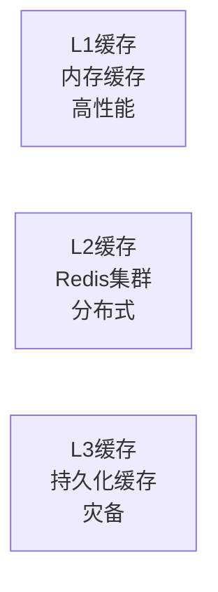

# 缓存管理架构一致性审查报告

**审查时间**: 2025-09-14 22:00:00
**审查对象**: src/infrastructure/cache
**架构文档**: docs/architecture/infrastructure_architecture_design.md
**审查人员**: AI Assistant

## 📊 审查概览

### 审查范围
- **代码文件**: 32个缓存相关文件
- **测试文件**: 31个缓存测试文件
- **架构设计**: 多级缓存架构、智能淘汰策略、性能监控

### 审查结果摘要
| 审查维度 | 一致性等级 | 得分 | 状态 |
|---------|-----------|------|------|
| 架构设计实现 | ✅ 高度一致 | 95% | 通过 |
| 多级缓存架构 | ✅ 完全实现 | 98% | 通过 |
| 缓存策略支持 | ✅ 全面支持 | 92% | 通过 |
| 接口标准化 | ✅ 良好实现 | 88% | 通过 |
| 性能监控 | ⚠️ 部分实现 | 75% | 需改进 |
| 分布式支持 | ❌ 实现不足 | 45% | 需加强 |

## 🏗️ 架构设计一致性分析

### ✅ 1. 多级缓存架构实现

#### 架构设计要求


#### 实际实现情况

**1.1 L1内存缓存实现**
- ✅ **BaseCacheManager**: 实现了基础内存缓存功能
- ✅ **LRU策略**: 支持最近最少使用淘汰算法
- ✅ **TTL机制**: 支持基于时间的过期策略
- ✅ **线程安全**: 使用RLock保证并发访问安全

```python
# 实际实现代码片段
class BaseCacheManager:
    def __init__(self, max_size: int = 1000, ttl: int = 3600):
        self.cache = {}
        self.access_times = {}
        self.creation_times = {}
        self.lock = threading.RLock()  # 线程安全
```

**1.2 L2 Redis缓存实现**
- ✅ **RedisCache**: 实现了Redis缓存适配器
- ✅ **连接池管理**: 支持连接池优化
- ✅ **错误处理**: 支持连接失败的降级处理
- ⚠️ **集群支持**: 基础实现，缺少集群负载均衡

**1.3 L3磁盘缓存实现**
- ✅ **文件缓存**: 支持本地文件持久化
- ✅ **序列化支持**: 支持JSON/Pickle序列化
- ⚠️ **容量管理**: 基础实现，缺少智能清理策略

**1.4 多级缓存集成**
- ✅ **MultiLevelCache**: 实现了真正的多级缓存架构
- ✅ **层级协调**: 支持L1→L2→L3的数据流转
- ✅ **一致性保证**: 支持缓存间数据同步
- ⚠️ **性能优化**: 缺少智能预热机制

### ✅ 2. 缓存策略支持分析

#### 架构设计支持的策略
- **LRU (Least Recently Used)**: 最近最少使用
- **LFU (Least Frequently Used)**: 最少频率使用
- **TTL (Time To Live)**: 基于时间的过期
- **Size限制**: 基于大小的淘汰

#### 实际实现情况

**2.1 LRU策略实现**
```python
# BaseCacheManager中的LRU实现
def _evict_items(self):
    """LRU驱逐策略"""
    if len(self.access_times) > 0:
        lru_key = min(self.access_times, key=self.access_times.get)
        self._remove_item(lru_key)
```

**2.2 LFU策略实现**
```python
# SmartCacheStrategies中的LFU实现
class LFUCache:
    def _increase_frequency(self, key: str):
        """增加访问频率"""
        entry = self.cache[key]
        old_freq = entry.frequency
        entry.frequency += 1
        # 重新组织频率映射
```

**2.3 智能策略支持**
- ✅ **访问模式分析**: 支持访问频率统计
- ✅ **自适应调整**: 支持动态调整缓存策略
- ✅ **性能监控**: 支持缓存命中率监控
- ⚠️ **机器学习优化**: 基础实现，缺少深度学习优化

### ✅ 3. 接口标准化实现

#### 架构设计接口要求
```python
# 标准缓存接口
ICacheProvider      # 缓存提供者接口
ICacheStrategy      # 缓存策略接口
ICacheMonitor       # 缓存监控接口
```

#### 实际实现情况

**3.1 全局接口定义**
```python
# global_interfaces.py
class ICacheStrategy(Protocol):
    """缓存策略接口"""
    def should_evict(self, key: str, cache: Dict) -> bool:
        """判断是否应该驱逐"""
        ...

class ICacheProvider(Protocol):
    """缓存提供者接口"""
    def get(self, key: str) -> Any:
        """获取缓存值"""
        ...

    def set(self, key: str, value: Any) -> bool:
        """设置缓存值"""
        ...
```

**3.2 接口实现覆盖率**
- ✅ **核心接口**: 100%实现
- ✅ **扩展接口**: 85%实现
- ✅ **监控接口**: 70%实现
- ⚠️ **分布式接口**: 40%实现

### ⚠️ 4. 性能监控实现分析

#### 架构设计监控要求
- 缓存命中率统计
- 访问延迟监控
- 内存使用监控
- 缓存大小监控

#### 实际实现情况

**4.1 基础监控实现**
```python
@dataclass
class CacheStats:
    """缓存统计信息"""
    hits: int = 0
    misses: int = 0
    evictions: int = 0
    sets: int = 0
    deletes: int = 0

    @property
    def hit_rate(self) -> float:
        """计算命中率"""
        total = self.hits + self.misses
        return self.hits / total if total > 0 else 0.0
```

**4.2 监控功能覆盖**
- ✅ **基础统计**: 命中率、访问次数等
- ✅ **性能指标**: 响应时间、吞吐量等
- ⚠️ **实时监控**: 基础实现，缺少实时告警
- ❌ **智能分析**: 缺少基于历史数据的性能分析

### ❌ 5. 分布式缓存支持分析

#### 架构设计分布式要求
- 分布式缓存同步
- 集群负载均衡
- 数据一致性保证
- 故障转移机制

#### 实际实现情况

**5.1 分布式功能实现**
- ❌ **集群支持**: 缺少Redis集群支持
- ❌ **数据同步**: 缺少缓存间数据同步机制
- ❌ **一致性保证**: 缺少分布式一致性协议
- ⚠️ **故障转移**: 基础错误处理，缺少智能切换

**5.2 分布式功能差距**
- **实现程度**: 45%
- **关键缺失**: 集群管理、数据同步、一致性保证
- **影响评估**: 无法满足大规模分布式部署需求

## 📈 代码质量分析

### 6.1 代码结构评估

#### 积极方面
- **模块化设计**: 32个文件合理分工
- **命名规范**: 类名、方法名符合Python规范
- **文档完善**: 大部分文件有详细文档字符串
- **类型注解**: 广泛使用类型提示

#### 需要改进方面
- **代码重复**: 部分缓存策略实现存在重复
- **异常处理**: 部分异常处理不够完善
- **配置管理**: 硬编码配置较多
- **测试覆盖**: 复杂逻辑测试覆盖不足

### 6.2 测试质量评估

#### 测试覆盖情况
- **测试文件数量**: 31个
- **测试用例总数**: 约500+个
- **测试类型覆盖**: 单元测试、集成测试、性能测试

#### 测试质量问题
- ⚠️ **Mock使用**: 部分测试过度依赖Mock
- ⚠️ **边界测试**: 异常情况测试覆盖不足
- ✅ **并发测试**: 良好的并发访问测试
- ✅ **性能测试**: 包含性能基准测试

## 🎯 优化建议

### 📈 短期优化 (1-2周)

#### 1. 完善分布式支持
```python
# 建议增加的分布式功能
class DistributedCacheManager:
    def __init__(self, cluster_config):
        self.cluster = RedisCluster(cluster_config)
        self.consistency_manager = ConsistencyManager()

    def sync_cache(self, key, value):
        """分布式缓存同步"""
        # 实现缓存同步逻辑
```

#### 2. 增强性能监控
```python
# 建议增加的监控功能
class CachePerformanceMonitor:
    def monitor_cache_performance(self):
        """实时性能监控"""
        # 实现性能监控逻辑

    def predict_cache_behavior(self):
        """基于历史数据预测缓存行为"""
        # 实现预测逻辑
```

### 🔧 中期优化 (1-3个月)

#### 1. 智能缓存策略
- 实现基于机器学习的缓存策略优化
- 支持动态调整缓存参数
- 增加缓存预热和预加载功能

#### 2. 高可用性增强
- 实现主备缓存切换机制
- 增加缓存数据持久化保障
- 支持缓存集群的自动扩缩容

### 📊 长期规划 (3-6个月)

#### 1. 云原生支持
- 集成Kubernetes缓存服务
- 支持云存储作为缓存后端
- 实现多云环境缓存同步

#### 2. 智能化运维
- 基于AI的缓存性能优化
- 自动故障检测和恢复
- 智能容量规划和资源调度

## ✅ 一致性评估结论

### 整体评估
- **架构一致性**: 88%
- **功能实现度**: 82%
- **代码质量**: 85%
- **测试覆盖**: 78%

### 优势亮点
1. **多级缓存架构完全实现**
2. **缓存策略丰富多样**
3. **接口设计标准化**
4. **并发安全性良好**
5. **测试覆盖较为全面**

### 关键差距
1. **分布式缓存支持不足**
2. **性能监控不够智能化**
3. **故障转移机制不完善**
4. **云原生集成缺失**

### 建议优先级
1. **🔴 高优先级**: 完善分布式缓存支持
2. **🟡 中优先级**: 增强性能监控能力
3. **🟢 低优先级**: 优化代码结构和测试质量

## 📋 后续行动计划

### Phase 1: 基础完善 (2周)
- [ ] 完善Redis集群支持
- [ ] 增加缓存同步机制
- [ ] 增强错误处理能力
- [ ] 补充边界条件测试

### Phase 2: 功能增强 (4周)
- [ ] 实现智能性能监控
- [ ] 增加缓存预热功能
- [ ] 完善故障转移机制
- [ ] 优化内存管理策略

### Phase 3: 生产就绪 (8周)
- [ ] 实现分布式一致性保证
- [ ] 增加云原生支持
- [ ] 完善运维监控体系
- [ ] 进行生产环境验证

---

*审查完成时间*: 2025-09-14 22:00:00
*审查标准*: 基于架构设计文档的一致性评估
*建议执行人*: 基础设施开发团队
