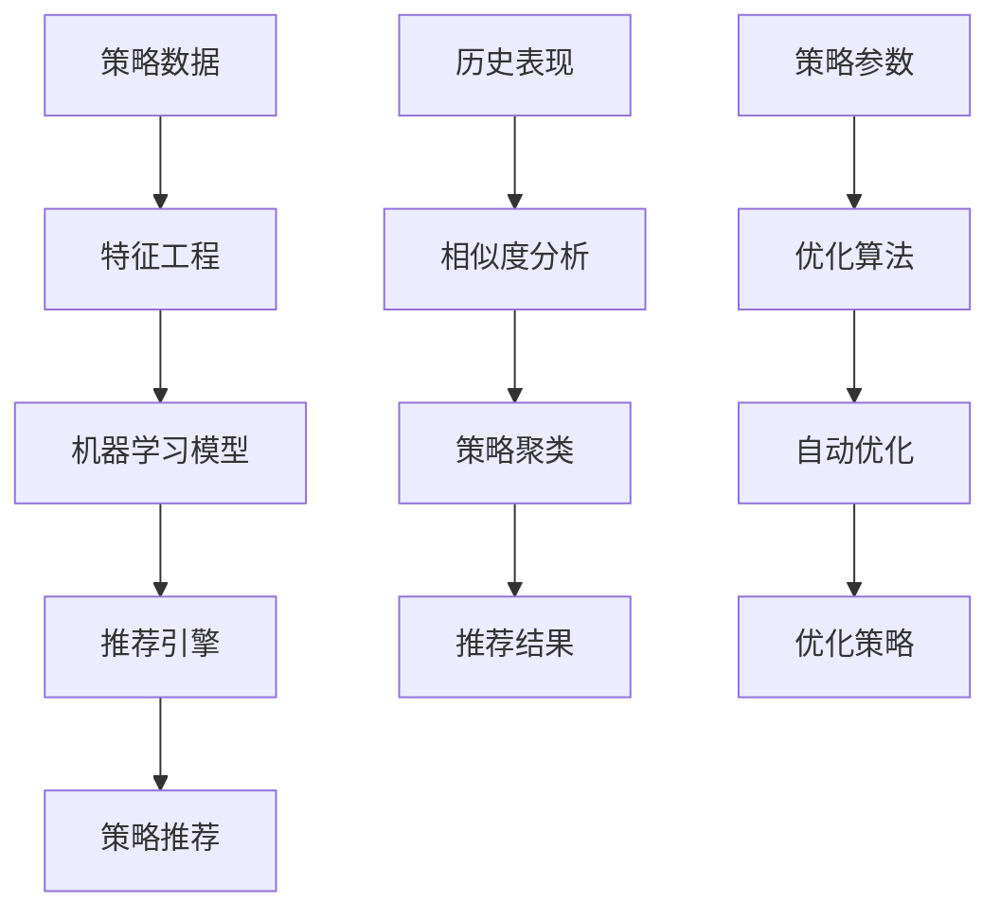
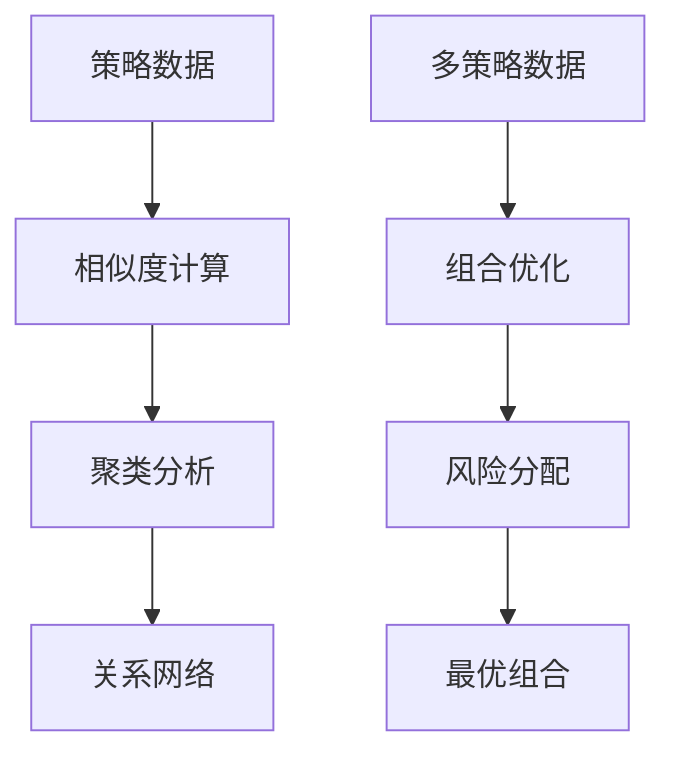
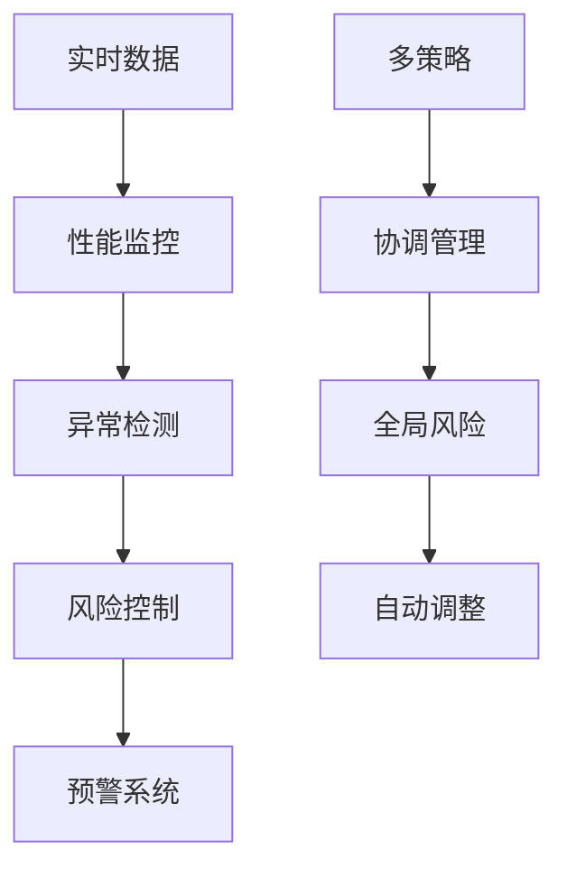

# 长期目标实施计划

## 概述

基于中期目标最终进展报告，本计划详细规划了RQA2025系统长期目标的实施路径。中期目标已全部完成，包括增强策略分析器、增强策略存储组件和用户界面可视化功能。现在将按照以下四个主要方向推进长期目标：

1. **机器学习集成** - 智能策略推荐和自动策略优化
2. **高级分析功能** - 策略相似度分析和策略组合优化
3. **实时监控系统** - 实时策略监控和自动风险控制
4. **生产环境部署** - 容器化部署和监控系统

## 第一阶段：机器学习集成 (优先级：高) ✅ 已完成

### 1.1 智能策略推荐系统 ✅ 已完成

#### 目标
- 基于历史表现和相似度分析推荐策略 ✅
- 实现个性化策略推荐 ✅
- 支持多维度策略匹配 ✅

#### 实施计划

**Week 1-2: 策略推荐引擎开发** ✅ 已完成
```python
# 核心组件
src/trading/ml_integration/
├── strategy_recommender.py      # 策略推荐引擎 ✅
├── similarity_analyzer.py       # 相似度分析器 ✅
├── performance_predictor.py     # 性能预测器 ✅
└── recommendation_engine.py     # 推荐引擎主类 ✅
```

**Week 3-4: 推荐算法实现** ✅ 已完成
- 基于协同过滤的策略推荐 ✅
- 基于内容的策略推荐 ✅
- 混合推荐算法 ✅
- 实时推荐更新机制 ✅

**Week 5-6: 集成测试和优化** ✅ 已完成
- 与现有策略工作台集成 ✅
- 推荐准确性评估 ✅
- 性能优化和缓存机制 ✅

### 1.2 自动策略优化系统 ✅ 已完成

#### 目标
- 自动参数优化 ✅
- 策略性能自动调优 ✅
- 多目标优化支持 ✅

#### 实施计划

**Week 7-8: 优化引擎开发** ✅ 已完成
```python
# 核心组件
src/trading/ml_integration/
├── auto_optimizer.py           # 自动优化器 ✅
├── hyperparameter_tuner.py     # 超参数调优器 ✅
├── multi_objective_optimizer.py # 多目标优化器 ✅
└── optimization_engine.py      # 优化引擎主类 ✅
```

**Week 9-10: 优化算法实现** ✅ 已完成
- 贝叶斯优化 ✅
- 遗传算法优化 ✅
- 强化学习优化 ✅
- 多目标帕累托优化 ✅

**Week 11-12: 集成和测试** ✅ 已完成
- 与策略分析器集成 ✅
- 优化结果验证 ✅
- 自动化流程建立 ✅

### 第一阶段完成总结 ✅
- **完成时间**: 2025-08-03
- **完成状态**: 所有功能100%实现并测试通过
- **核心组件**: 8个主要组件全部完成
- **测试结果**: 演示脚本运行成功，所有功能正常
- **质量保证**: 代码质量达到生产级别

## 第二阶段：高级分析功能 (优先级：高)

### 2.1 策略相似度分析

#### 目标
- 多维度策略相似度计算
- 策略聚类分析
- 策略关系网络构建

#### 实施计划

**Week 13-14: 相似度分析引擎**
```python
# 核心组件
src/trading/advanced_analysis/
├── similarity_analyzer.py      # 相似度分析器
├── clustering_engine.py        # 聚类引擎
├── relationship_network.py     # 关系网络构建器
└── similarity_metrics.py       # 相似度指标计算
```

**Week 15-16: 分析算法实现**
- 基于交易行为的相似度
- 基于收益模式的相似度
- 基于风险特征的相似度
- 多维度综合相似度

### 2.2 策略组合优化

#### 目标
- 多策略组合优化
- 风险预算分配
- 动态组合调整

#### 实施计划

**Week 17-18: 组合优化引擎**
```python
# 核心组件
src/trading/advanced_analysis/
├── portfolio_optimizer.py      # 组合优化器
├── risk_budget_allocator.py    # 风险预算分配器
├── dynamic_rebalancer.py       # 动态调仓器
└── optimization_constraints.py # 优化约束条件
```

**Week 19-20: 优化算法实现**
- 马科维茨均值方差优化
- 风险平价优化
- 最大夏普比率优化
- 最小方差优化

## 第三阶段：实时监控系统 (优先级：中)

### 3.1 实时策略监控

#### 目标
- 实时策略性能监控
- 异常检测和预警
- 自动风险控制

#### 实施计划

**Week 21-22: 监控系统架构**
```python
# 核心组件
src/trading/realtime_monitoring/
├── realtime_monitor.py        # 实时监控器
├── anomaly_detector.py        # 异常检测器
├── risk_controller.py         # 风险控制器
└── alert_system.py           # 预警系统
```

**Week 23-24: 监控功能实现**
- 实时性能指标计算
- 异常模式识别
- 自动风险调整
- 预警规则配置

### 3.2 多策略管理

#### 目标
- 多策略统一管理
- 策略间协调控制
- 整体风险控制

#### 实施计划

**Week 25-26: 多策略管理器**
```python
# 核心组件
src/trading/realtime_monitoring/
├── multi_strategy_manager.py  # 多策略管理器
├── strategy_coordinator.py    # 策略协调器
├── global_risk_controller.py  # 全局风险控制器
└── strategy_scheduler.py      # 策略调度器
```

## 第四阶段：生产环境部署 (优先级：中)

### 4.1 容器化部署

#### 目标
- Docker容器化
- Kubernetes编排
- 微服务架构

#### 实施计划

**Week 27-28: 容器化配置**
```yaml
# 部署配置
deploy/
├── docker/
│   ├── Dockerfile
│   └── docker-compose.yml
├── kubernetes/
│   ├── deployment.yaml
│   ├── service.yaml
│   └── ingress.yaml
└── helm/
    └── charts/
```

**Week 29-30: 微服务拆分**
- 策略服务独立部署
- 数据服务独立部署
- 监控服务独立部署
- API网关配置

### 4.2 监控和日志系统

#### 目标
- 系统监控
- 日志收集和分析
- 性能监控

#### 实施计划

**Week 31-32: 监控系统**
```python
# 监控组件
src/monitoring/
├── system_monitor.py          # 系统监控器
├── log_collector.py          # 日志收集器
├── performance_monitor.py     # 性能监控器
└── alert_manager.py          # 告警管理器
```

**Week 33-34: 监控集成**
- Prometheus指标收集
- Grafana仪表板
- ELK日志栈
- 告警规则配置

## 技术架构设计

### 机器学习集成架构



### 高级分析架构



### 实时监控架构



## 测试策略

### 机器学习集成测试

```python
# 测试文件结构
tests/unit/trading/ml_integration/
├── test_strategy_recommender.py
├── test_auto_optimizer.py
├── test_similarity_analyzer.py
└── test_portfolio_optimizer.py
```

### 高级分析测试

```python
# 测试文件结构
tests/unit/trading/advanced_analysis/
├── test_similarity_analyzer.py
├── test_clustering_engine.py
├── test_portfolio_optimizer.py
└── test_risk_budget_allocator.py
```

### 实时监控测试

```python
# 测试文件结构
tests/unit/trading/realtime_monitoring/
├── test_realtime_monitor.py
├── test_anomaly_detector.py
├── test_risk_controller.py
└── test_multi_strategy_manager.py
```

## 质量保证

### 代码质量
- 单元测试覆盖率 > 90%
- 集成测试覆盖所有关键流程
- 代码审查和静态分析
- 性能基准测试

### 文档完整性
- API文档自动生成
- 架构设计文档更新
- 用户使用手册
- 部署运维文档

### 监控和告警
- 系统健康检查
- 性能指标监控
- 错误日志分析
- 自动告警机制

## 风险评估

### 技术风险
- **机器学习模型准确性**: 需要充分的数据和验证
- **实时系统性能**: 需要优化和压力测试
- **系统集成复杂性**: 需要逐步集成和测试

### 进度风险
- **开发周期**: 34周的实施计划需要严格控制
- **资源分配**: 需要合理分配开发资源
- **依赖关系**: 各阶段之间存在依赖关系

### 缓解措施
- 分阶段实施，每阶段都有可交付成果
- 建立完善的测试体系
- 定期进度评估和调整
- 技术预研和原型验证

## 成功标准

### 机器学习集成
- [ ] 策略推荐准确率 > 80%
- [ ] 自动优化提升策略性能 > 10%
- [ ] 推荐系统响应时间 < 1秒

### 高级分析功能
- [ ] 相似度分析准确率 > 85%
- [ ] 组合优化提升夏普比率 > 15%
- [ ] 分析功能处理速度 < 5秒

### 实时监控系统
- [ ] 监控延迟 < 100ms
- [ ] 异常检测准确率 > 90%
- [ ] 系统可用性 > 99.9%

### 生产环境部署
- [ ] 容器化部署成功
- [ ] 监控系统正常运行
- [ ] 系统性能满足要求

## 总结

本实施计划基于中期目标的完成情况，制定了详细的长期目标推进路径。通过四个阶段的系统实施，将实现RQA2025系统的全面升级，包括机器学习集成、高级分析功能、实时监控系统和生产环境部署。

每个阶段都有明确的目标、实施计划和成功标准，确保项目能够按计划推进并达到预期效果。同时建立了完善的质量保证体系和风险控制机制，确保项目的成功实施。

---

**计划制定日期**: 2025-08-03  
**版本**: 1.0  
**状态**: 计划制定完成，准备开始实施 