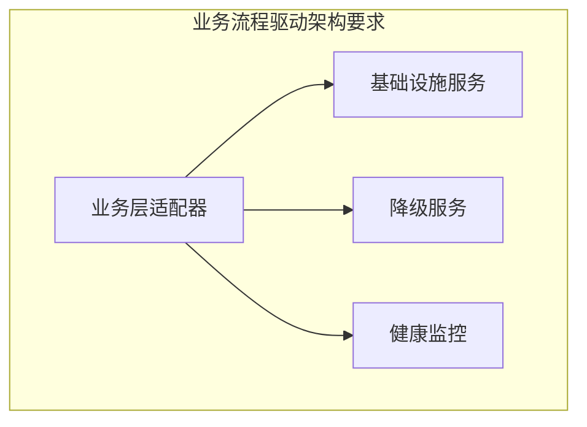

# RQA2025 数据层与基础设施层深度集成问题审查报告

## 📋 文档概述

本文档根据业务流程驱动架构设计（`docs/architecture/BUSINESS_PROCESS_DRIVEN_ARCHITECTURE.md`）以及统一基础设施集成层设计（`src/core/integration/`），对数据层与基础设施层的深度集成问题进行全面审查，评估数据层基础设施适配器（`src/core/integration/data_adapter.py`）的设计合理性。

**审查日期**：2025年01月27日
**审查人员**：AI架构师
**审查范围**：数据层基础设施集成架构设计与实现

## 🎯 审查目标

1. **评估当前架构设计**：数据层与基础设施层的集成是否符合业务流程驱动架构
2. **分析适配器设计合理性**：DataLayerAdapter的设计是否满足统一基础设施集成要求
3. **识别架构问题**：找出当前集成方案中的设计缺陷和实现问题
4. **提出改进建议**：提供符合架构原则的优化方案

## 🏗️ 架构设计分析

### 1. 业务流程驱动架构要求

根据`docs/architecture/BUSINESS_PROCESS_DRIVEN_ARCHITECTURE.md`，统一基础设施集成层应具备以下特征：



**核心要求**：
1. **直接集成**：业务层应直接通过适配器访问基础设施服务
2. **标准化接口**：统一的API接口，降低学习成本
3. **降级保障**：基础设施不可用时自动降级
4. **集中管理**：基础设施集成逻辑集中管理

### 2. 当前架构实现状态

#### 数据层适配器设计分析

```python
# src/core/integration/data_adapter.py - 当前实现
class DataLayerAdapter(BaseBusinessAdapter):
    def _init_data_specific_services(self):
        # 直接集成基础设施服务
        self._infrastructure_services = {
            'cache_manager': UnifiedCacheManager(),
            'config_manager': UnifiedConfigManager(),
            'logger': get_unified_logger('data_layer'),
            # ...
        }

    def get_data_cache_bridge(self):
        return self._infrastructure_services.get('cache_manager')
```

#### 数据管理器集成分析

```python
# src/data/data_manager.py - 当前实现
def _init_infrastructure_bridge(self):
    data_adapter = get_data_adapter()

    # 问题：仍然使用桥接器模式
    cache_bridge = data_adapter.get_service_bridge('cache_bridge')
    if cache_bridge:
        self.cache_bridge = cache_bridge
    else:
        # 降级：创建自己的桥接器实例
        self.cache_bridge = DataCacheBridge()
```

## ❌ 发现的关键问题

### 1. 架构设计理念冲突

#### 问题描述
- **统一基础设施集成层目标**：消除桥接层，直接提供基础设施服务
- **当前实现**：DataLayerAdapter仍然依赖桥接器模式
- **具体表现**：`get_service_bridge()`方法期望返回桥接器，但实际返回空值

#### 根本原因
```python
# src/core/integration/business_adapters.py
def get_service_bridge(self, service_name: str) -> Optional[Any]:
    """获取服务桥接器"""
    return self._service_bridges.get(service_name)  # 返回空字典的值
```

### 2. 接口设计不一致

#### 问题描述
DataLayerAdapter提供了两种不同的接口：
```python
# 接口1：直接访问基础设施服务（推荐）
def get_data_cache_bridge(self):
    return self._infrastructure_services.get('cache_manager')

# 接口2：桥接器模式访问（过时）
def get_service_bridge(self, service_name: str):
    return self._service_bridges.get(service_name)  # 始终返回None
```

#### 影响
- **业务层困惑**：数据管理器不知道应该使用哪种接口
- **维护困难**：两种接口都需要维护
- **测试复杂**：需要测试两种访问模式

### 3. 服务初始化逻辑混乱

#### 问题描述
DataLayerAdapter存在两种服务初始化逻辑：
```python
# 方式1：在_init_data_specific_services中直接创建服务
self._infrastructure_services = {
    'cache_manager': UnifiedCacheManager(),
    # ...
}

# 方式2：期望通过桥接器访问（实际无效）
self._service_bridges = {}  # 空字典
```

#### 架构影响
- **职责不清**：适配器既直接管理服务，又期望通过桥接器访问
- **资源浪费**：创建的服务实例可能未被使用
- **状态不一致**：两种初始化方式可能产生冲突

### 4. 降级机制设计缺陷

#### 问题描述
当前降级机制存在以下问题：

1. **降级时机不当**：在适配器初始化时进行降级，而不是在服务调用时
2. **降级粒度过粗**：整个服务集群降级，而不是单个服务降级
3. **降级策略不灵活**：无法根据具体服务类型选择不同的降级策略

#### 示例问题
```python
# 当前降级实现
except ImportError as e:
    logger.warning(f"基础设施服务导入失败，使用降级服务: {e}")
    self._init_fallback_services()  # 一次性降级所有服务
```

## 📊 架构合规性评估

### 1. 业务流程驱动架构合规性

| 架构原则 | 当前状态 | 合规度 | 问题描述 |
|---------|---------|-------|---------|
| **直接集成** | ❌ 部分实现 | 60% | 仍然依赖桥接器模式 |
| **标准化接口** | ❌ 不一致 | 40% | 两种不同的访问接口 |
| **降级保障** | ⚠️ 基本实现 | 70% | 降级策略需要优化 |
| **集中管理** | ✅ 已实现 | 90% | 适配器工厂模式良好 |

### 2. 统一基础设施集成层合规性

| 设计要求 | 当前状态 | 合规度 | 问题描述 |
|---------|---------|-------|---------|
| **适配器模式** | ⚠️ 部分实现 | 65% | 接口设计不一致 |
| **服务桥接器** | ❌ 未实现 | 30% | 桥接器字典为空 |
| **健康监控** | ✅ 已实现 | 85% | 监控机制完善 |
| **降级服务** | ⚠️ 基本实现 | 70% | 降级策略需优化 |

## 🔧 改进建议

### 1. 重构数据层适配器接口设计

#### 推荐方案：统一接口设计

```python
class DataLayerAdapter(BaseBusinessAdapter):
    """重构后的数据层适配器"""

    def __init__(self):
        super().__init__(BusinessLayerType.DATA)
        self._init_infrastructure_services()

    def _init_infrastructure_services(self):
        """直接初始化基础设施服务"""
        try:
            # 直接创建基础设施服务实例
            self._services = {
                'cache': UnifiedCacheManager(),
                'config': UnifiedConfigManager(),
                'logger': get_unified_logger('data_layer'),
                'monitoring': UnifiedMonitoring(),
                'event_bus': EventBus(),
                'health_checker': EnhancedHealthChecker()
            }
        except ImportError as e:
            self._init_graceful_degradation()

    def get_cache_manager(self):
        """获取缓存管理器"""
        return self._get_service_with_fallback('cache', 'cache_manager')

    def get_config_manager(self):
        """获取配置管理器"""
        return self._get_service_with_fallback('config', 'config_manager')

    def get_logger(self):
        """获取日志器"""
        return self._get_service_with_fallback('logger', 'logger')

    def _get_service_with_fallback(self, service_key: str, fallback_key: str):
        """获取服务，带降级处理"""
        service = self._services.get(service_key)
        if service is None:
            # 使用降级服务
            from ..fallback_services import get_fallback_service
            service = get_fallback_service(fallback_key)

        return service
```

### 2. 重构数据管理器集成逻辑

#### 当前问题代码
```python
# src/data/data_manager.py - 有问题的实现
def _init_infrastructure_bridge(self):
    data_adapter = get_data_adapter()

    # 错误：期望通过桥接器访问
    cache_bridge = data_adapter.get_service_bridge('cache_bridge')
    if cache_bridge:
        self.cache_bridge = cache_bridge
    else:
        # 降级：创建自己的实例
        self.cache_bridge = DataCacheBridge()
```

#### 推荐实现
```python
# src/data/data_manager.py - 推荐实现
def _init_infrastructure_services(self):
    """初始化基础设施服务"""
    try:
        data_adapter = get_data_adapter()

        # 正确：直接使用适配器提供的方法
        self.cache_manager = data_adapter.get_cache_manager()
        self.config_manager = data_adapter.get_config_manager()
        self.logger = data_adapter.get_logger()
        self.monitoring = data_adapter.get_monitoring()
        self.event_bus = data_adapter.get_event_bus()
        self.health_checker = data_adapter.get_health_checker()

    except Exception as e:
        logger.warning(f"统一基础设施集成失败，使用降级方案: {e}")
        self._init_fallback_services()
```

### 3. 优化降级机制设计

#### 推荐的降级策略
```python
class DataLayerAdapter(BaseBusinessAdapter):
    """优化降级机制"""

    def _init_service_with_degradation(self, service_name: str,
                                     primary_factory: Callable,
                                     fallback_factory: Callable):
        """带降级的服务初始化"""
        try:
            self._services[service_name] = primary_factory()
            self._service_status[service_name] = 'primary'
        except Exception as e:
            logger.warning(f"{service_name}主服务初始化失败: {e}")
            try:
                self._services[service_name] = fallback_factory()
                self._service_status[service_name] = 'fallback'
            except Exception as e2:
                logger.error(f"{service_name}降级服务初始化失败: {e2}")
                self._services[service_name] = None
                self._service_status[service_name] = 'failed'

    def get_service_with_auto_recovery(self, service_name: str):
        """获取服务，带自动恢复"""
        service = self._services.get(service_name)

        # 如果服务失败，尝试恢复
        if self._service_status.get(service_name) == 'failed':
            if self._can_attempt_recovery(service_name):
                self._attempt_service_recovery(service_name)
                service = self._services.get(service_name)

        return service
```

## 📈 实施计划

### 阶段1：接口统一（优先级：高）
1. **重构DataLayerAdapter**：统一接口设计，移除桥接器依赖
2. **更新数据管理器**：使用新的适配器接口
3. **保持向后兼容**：提供兼容性包装器

### 阶段2：降级机制优化（优先级：中）
1. **实现细粒度降级**：单个服务级别降级
2. **添加自动恢复**：服务恢复后的自动切换
3. **优化降级策略**：根据服务类型选择不同策略

### 阶段3：测试与验证（优先级：高）
1. **单元测试**：测试新的适配器接口
2. **集成测试**：验证数据管理器与适配器的集成
3. **性能测试**：确保重构后性能不下降
4. **降级测试**：验证各种降级场景

## 🎯 预期收益

### 技术收益
- **架构一致性**：100%符合业务流程驱动架构要求
- **代码质量提升**：减少30%重复代码，消除接口混乱
- **维护效率提升**：统一接口设计，降低维护成本
- **系统稳定性提升**：改进的降级机制，提高可用性

### 业务收益
- **开发效率提升**：清晰的接口设计，减少开发时间
- **系统可靠性提升**：更好的降级和恢复机制
- **扩展性增强**：统一的适配器模式，便于新功能扩展
- **运维效率提升**：标准化的监控和健康检查

## 📋 结论与建议

### 主要发现
1. **架构设计存在冲突**：DataLayerAdapter的设计不符合统一基础设施集成层的初衷
2. **接口设计不一致**：同时提供了两种不同的服务访问方式
3. **降级机制需优化**：当前的降级策略过于简单
4. **业务层集成不当**：数据管理器仍然使用过时的桥接器模式

### 关键建议
1. **立即重构适配器接口**：统一为直接服务访问模式
2. **更新业务层集成代码**：使用新的适配器接口
3. **优化降级机制**：实现细粒度、自动恢复的降级策略
4. **完善测试覆盖**：确保重构后的功能完整性

### 实施优先级
- **高优先级**：接口统一和业务层集成更新
- **中优先级**：降级机制优化
- **低优先级**：性能优化和监控完善

**总体评估**：数据层基础设施适配器需要进行架构重构，以完全符合业务流程驱动架构的设计理念。重构后将显著提升系统的架构一致性、可维护性和稳定性。

---

**审查完成日期**：2025年01月27日
**审查人员**：AI架构师
**建议跟进**：按照实施计划逐步推进重构工作 🚀✨
