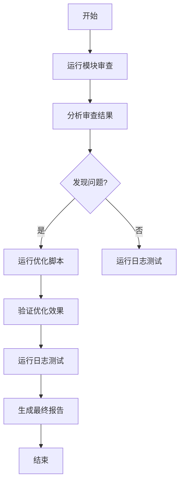
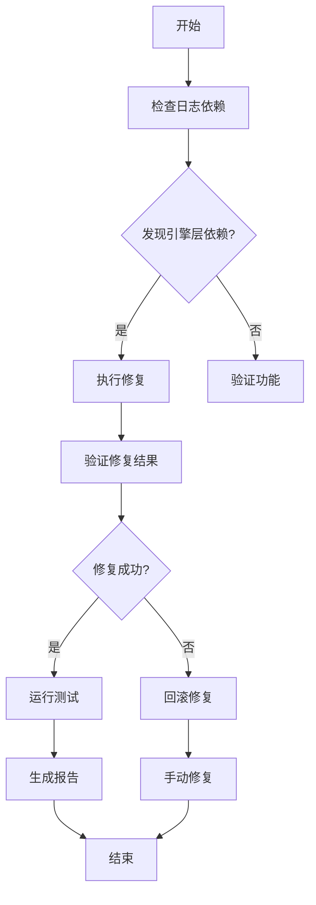

# 基础设施层脚本索引

## 概述

本文档索引了基础设施层相关的所有脚本，包括日志依赖修复、模块审查、优化和测试等功能。

## 脚本列表

### 1. 日志依赖修复脚本

**文件**: `fix_logging_dependencies.py`
**功能**: 批量修复基础设施层对引擎层日志的依赖，替换为基础设施层专用日志
**主要特性**:
- 自动检测和替换引擎层日志导入
- 支持多种修复模式
- 提供验证和回滚功能
- 生成详细的修复报告

**使用方法**:
```bash
# 检查模式
python scripts/infrastructure/fix_logging_dependencies.py --dry-run

# 验证模式
python scripts/infrastructure/fix_logging_dependencies.py --validate

# 执行修复
python scripts/infrastructure/fix_logging_dependencies.py

# 回滚修复
python scripts/infrastructure/fix_logging_dependencies.py --rollback

# 生成报告
python scripts/infrastructure/fix_logging_dependencies.py --report report.md
```

### 2. 基础设施层日志测试脚本

**文件**: `test_infrastructure_logging.py`
**功能**: 验证基础设施层日志功能完整性和依赖修复效果
**主要特性**:
- 测试导入功能
- 验证日志功能
- 检查依赖关系
- 性能测试
- 生成测试报告

**使用方法**:
```bash
# 运行所有测试
python scripts/infrastructure/test_infrastructure_logging.py

# 生成测试报告
python scripts/infrastructure/test_infrastructure_logging.py --report test_report.md
```

### 3. 基础设施层模块审查脚本

**文件**: `audit_infrastructure_modules.py`
**功能**: 全面审查基础设施层的架构、依赖关系和代码质量
**主要特性**:
- 模块结构分析
- 依赖关系分析
- 代码质量检查
- 架构合规性验证
- 安全风险分析

**使用方法**:
```bash
# 运行完整审查
python scripts/infrastructure/audit_infrastructure_modules.py

# 生成审查报告
python scripts/infrastructure/audit_infrastructure_modules.py --report audit_report.md
```

### 4. 基础设施层优化脚本

**文件**: `optimize_infrastructure.py`
**功能**: 自动修复审查中发现的问题，提升代码质量和架构合规性
**主要特性**:
- 自动修复代码风格问题
- 修复依赖关系
- 添加文档字符串
- 创建缺失的标准模块
- 支持回滚功能

**使用方法**:
```bash
# 检查模式
python scripts/infrastructure/optimize_infrastructure.py --dry-run

# 执行优化
python scripts/infrastructure/optimize_infrastructure.py

# 回滚优化
python scripts/infrastructure/optimize_infrastructure.py --rollback

# 生成优化报告
python scripts/infrastructure/optimize_infrastructure.py --report optimize_report.md
```

## 工作流程

### 1. 基础设施层审查和优化流程



### 2. 日志依赖修复流程



## 标准模块结构

基础设施层应包含以下标准模块：

### 1. 日志管理模块 (`logging`)
- `infrastructure_logger.py` - 基础设施层日志器
- `__init__.py` - 模块初始化

### 2. 配置管理模块 (`config`)
- `infrastructure_config.py` - 基础设施层配置
- `__init__.py` - 模块初始化

### 3. 数据库管理模块 (`database`)
- `infrastructure_database.py` - 基础设施层数据库
- `__init__.py` - 模块初始化

### 4. 缓存管理模块 (`cache`)
- `infrastructure_cache.py` - 基础设施层缓存
- `__init__.py` - 模块初始化

### 5. 消息队列模块 (`messaging`)
- `infrastructure_messaging.py` - 基础设施层消息队列
- `__init__.py` - 模块初始化

### 6. 监控管理模块 (`monitoring`)
- `infrastructure_monitoring.py` - 基础设施层监控
- `__init__.py` - 模块初始化

### 7. 安全管理模块 (`security`)
- `infrastructure_security.py` - 基础设施层安全
- `__init__.py` - 模块初始化

### 8. 工具函数模块 (`utils`)
- `infrastructure_utils.py` - 基础设施层工具函数
- `__init__.py` - 模块初始化

## 架构规范

### 1. 层隔离原则
- 基础设施层不能依赖上层模块（引擎层、交易层、风控层）
- 只能依赖外部库和基础设施层内部模块

### 2. 依赖方向
- 依赖方向应该是单向的：上层 → 下层
- 禁止循环依赖

### 3. 命名规范
- 模块名使用小写字母和下划线
- 文件名使用小写字母和下划线
- 类名使用大驼峰命名法
- 函数名使用小写字母和下划线

### 4. 代码质量要求
- 所有文件必须有编码声明
- 所有模块必须有文档字符串
- 行长度不超过120字符
- 空行比例不超过30%

## 常见问题

### 1. 如何处理引擎层依赖？
使用 `fix_logging_dependencies.py` 脚本自动修复，将引擎层日志依赖替换为基础设施层日志依赖。

### 2. 如何验证修复效果？
运行 `test_infrastructure_logging.py` 脚本进行功能测试和依赖检查。

### 3. 如何审查模块质量？
运行 `audit_infrastructure_modules.py` 脚本进行全面的模块审查。

### 4. 如何自动优化代码？
运行 `optimize_infrastructure.py` 脚本自动修复代码风格和架构问题。

### 5. 如何回滚修改？
所有脚本都支持回滚功能，使用 `--rollback` 参数即可。

## 维护建议

### 1. 定期审查
- 每周运行一次模块审查
- 每月运行一次完整优化

### 2. 持续集成
- 在CI/CD流程中集成这些脚本
- 自动生成审查和测试报告

### 3. 文档更新
- 及时更新脚本索引文档
- 记录新发现的问题和解决方案

### 4. 脚本维护
- 定期更新脚本以适应新的架构要求
- 添加新的检查规则和优化模式

## 联系信息

如有问题或建议，请联系基础设施层维护团队。
