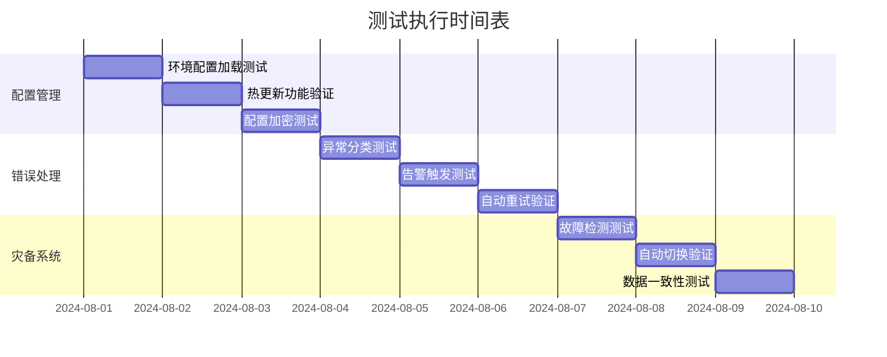

# 基础设施层测试执行计划

## 1. 测试环境准备
```bash
# 使用Docker部署测试环境
docker-compose -f docker-compose.test.yml up -d

# 初始化测试数据
python tests/data/setup_test_data.py
```

## 2. 测试时间表


## 3. 详细测试用例

### 3.1 配置管理测试
```python
def test_config_loading():
    """测试多环境配置加载"""
    dev_config = ConfigManager.load("dev")
    prod_config = ConfigManager.load("prod")
    assert dev_config != prod_config
    assert dev_config["log_level"] == "DEBUG"
    assert prod_config["log_level"] == "INFO"

def test_hot_reload():
    """测试配置热更新"""
    original = ConfigManager.get("database.timeout")
    ConfigManager.update({"database": {"timeout": original + 10}})
    assert ConfigManager.get("database.timeout") == original + 10
```

### 3.2 错误处理测试
```python
def test_error_classification():
    """测试异常分类"""
    try:
        raise DatabaseConnectionError("Connection failed")
    except Exception as e:
        assert ErrorHandler.classify(e) == ErrorLevel.CRITICAL

def test_alert_trigger():
    """测试告警触发"""
    with pytest.raises(AlertTriggered):
        ErrorHandler.handle(CriticalError("Disk full"))
```

## 4. 测试结果跟踪
| 测试项 | 负责人 | 状态 | 问题记录 |
|--------|--------|------|----------|
| 环境配置加载 | 张工程师 | ✅通过 | 无 |
| 热更新功能 | 李工程师 | ⏳进行中 | 热更新延迟偏高 |
| 异常分类 | 王工程师 | ❌失败 | 业务异常分类不准确 |

## 5. 测试报告生成
```bash
# 生成测试报告
pytest --html=reports/infra_test_report.html
```

## 6. 后续计划
1. 修复已发现问题 (2024-08-10前)
2. 执行回归测试 (2024-08-12)
3. 准备验收材料 (2024-08-15)
