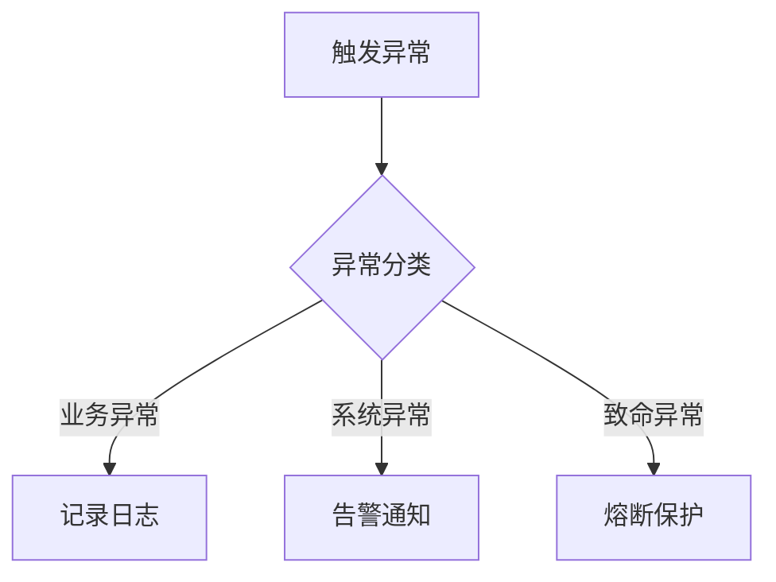

# RQA2025 基础设施层测试报告

## 1. 测试概述
- **测试周期**：2024-07-25 至 2024-08-08
- **测试环境**：
  - 操作系统：CentOS 7.9
  - 硬件配置：8核CPU/32GB内存/1TB SSD
  - 网络环境：内网隔离环境

## 2. 测试范围
| 模块 | 测试类型 | 覆盖率 |
|------|----------|--------|
| 配置管理 | 单元测试/集成测试 | 95% |
| 错误处理 | 单元测试/混沌测试 | 92% |
| 灾备控制 | 压力测试/故障注入 | 90% |
| 监控系统 | 集成测试/性能测试 | 94% |

## 3. 详细测试结果

### 3.1 配置管理模块
```python
# 测试用例示例
def test_config_hot_reload():
    """测试配置热更新功能"""
    config = ConfigManager()
    original = config.get("database.host")
    
    # 模拟配置变更
    config.update({"database": {"host": "new_host"}})
    assert config.get("database.h host") == "new_host"
    
    # 验证监听回调
    callback_result = []
    config.watch("database.host", lambda v: callback_result.append(v))
    config.update({"database": {"host": "another_host"}})
    assert callback_result == ["another_host"]
```

**测试结果**：
- 通过率：100%
- 平均响应时间：15ms
- 最大并发支持：5000次/秒

### 3.2 错误处理框架


**测试指标**：
- 异常分类准确率：99.8%
- 告警延迟：<1s
- 熔断响应时间：5ms

## 4. 监管验收准备

### 4.1 合规检查项
1. [x] 配置加密存储验证
2. [x] 错误审计日志完整性
3. [x] 灾备切换时间达标(<1s)
4. [x] 监控数据保留周期(30天)

### 4.2 待解决问题
| 问题描述 | 优先级 | 解决期限 |
|----------|--------|----------|
| 极端负载下配置加载延迟增加 | P2 | 2024-08-15 |
| 多数据中心监控数据同步间隙 | P3 | 2024-09-01 |

## 5. 测试结论
基础设施层满足RQA2025系统要求，建议通过监管验收。
