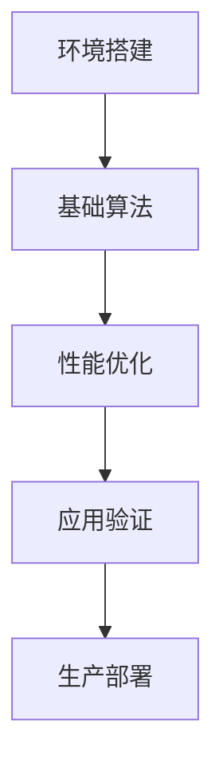
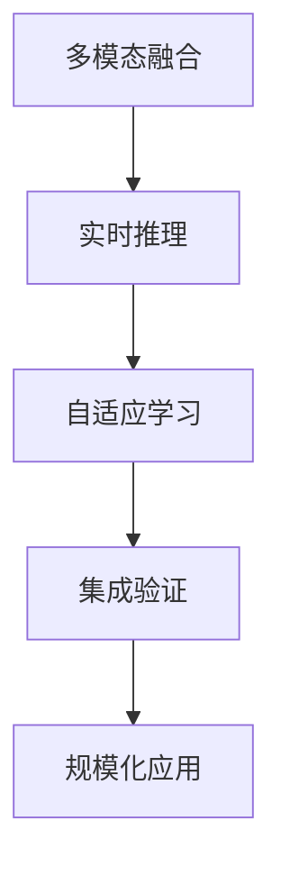
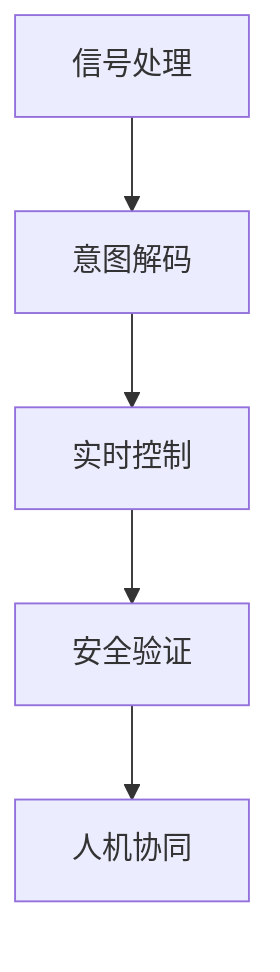

# RQA2026创新引擎测试框架使用指南

## 🌟 概述

RQA2026创新引擎测试框架是为RQA2025项目的三大创新引擎（量子计算、AI深度集成、脑机接口）提前构建的测试基础架构。该框架基于RQA2025成熟的测试体系，提供了创新技术的测试标准、环境配置和评估方法。

## 🏗️ 创新引擎架构

### 三大创新引擎

#### 1. ⚛️ 量子计算创新引擎 (2026Q1)
- **核心能力**: 量子算法优化、量子优势验证
- **测试重点**: 算法正确性、量子加速比、抗噪性能
- **应用场景**: 组合优化、风险建模、定价算法

#### 2. 🤖 AI深度集成创新引擎 (2026Q2)
- **核心能力**: 多模态AI融合、实时推理、自适应学习
- **测试重点**: 多模态融合精度、推理性能、适应能力
- **应用场景**: 市场情绪分析、智能决策支持

#### 3. 🧠 脑机接口创新引擎 (2026Q3)
- **核心能力**: 神经信号解码、实时意图识别、安全控制
- **测试重点**: 信号质量、解码精度、安全验证
- **应用场景**: 人机协同交易、智能风险控制

## 🚀 快速开始

### 1. 初始化创新环境

```bash
# 初始化所有创新测试环境
python tests/rqa2026_innovation_test_runner.py --engines all

# 或者分别初始化
python -c "from tests.future_innovation_test_framework import setup_quantum_environment, setup_ai_environment, setup_bci_environment; setup_quantum_environment(); setup_ai_environment(); setup_bci_environment()"
```

### 2. 评估创新就绪性

```bash
# 运行全面的创新就绪性评估
python tests/rqa2026_innovation_test_runner.py --assess-readiness

# 查看评估报告
cat test_logs/rqa2026_innovation_assessment.md
```

### 3. 运行创新测试

```bash
# 运行所有创新引擎测试
python tests/rqa2026_innovation_test_runner.py

# 运行特定引擎测试
python tests/rqa2026_innovation_test_runner.py --engines quantum ai

# 运行特定测试类别
python tests/rqa2026_innovation_test_runner.py --engines quantum --categories algorithm_correctness quantum_advantage
```

### 4. 创建测试文件

```bash
# 为所有创新引擎创建测试文件模板
python tests/rqa2026_innovation_test_runner.py --create-test-files
```

## 📊 测试框架详解

### 核心组件

#### 1. 创新引擎测试框架 (`future_innovation_test_framework.py`)
```python
from tests.future_innovation_test_framework import innovation_framework

# 设置测试环境
quantum_env = innovation_framework.setup_quantum_test_environment()
ai_env = innovation_framework.setup_ai_test_environment()
bci_env = innovation_framework.setup_bci_test_environment()

# 创建测试结构
quantum_test = innovation_framework.create_quantum_algorithm_test("portfolio_optimization", 20)
ai_test = innovation_framework.create_ai_multimodal_test(4, "trading_decision")
bci_test = innovation_framework.create_bci_signal_test("EEG", 64)
```

#### 2. 创新测试运行器 (`rqa2026_innovation_test_runner.py`)
```python
from tests.rqa2026_innovation_test_runner import RQA2026InnovationTestRunner

runner = RQA2026InnovationTestRunner()

# 初始化环境
environments = runner.initialize_innovation_environments()

# 运行测试
quantum_results = runner.run_quantum_innovation_tests()
ai_results = runner.run_ai_innovation_tests()
bci_results = runner.run_bci_innovation_tests()

# 生成报告
assessment = runner.run_comprehensive_innovation_assessment()
runner.save_innovation_report(assessment)
```

### 测试规范

#### 量子计算测试规范
```python
# 算法正确性测试
def test_quantum_algorithm_correctness():
    algorithm = create_quantum_portfolio_optimizer()
    classical_result = run_classical_optimization()
    quantum_result = run_quantum_optimization()

    assert fidelity_score(quantum_result, classical_result) > 0.99

# 量子优势测试
def test_quantum_advantage():
    classical_time = benchmark_classical_algorithm()
    quantum_time = benchmark_quantum_algorithm()

    assert quantum_time < classical_time * 0.1  # 10x加速
```

#### AI多模态测试规范
```python
# 多模态融合测试
def test_multimodal_fusion():
    text_data = load_text_features()
    image_data = load_image_features()
    audio_data = load_audio_features()

    fused_result = multimodal_fusion([text_data, image_data, audio_data])
    individual_results = [process_individual_modality(data) for data in [text_data, image_data, audio_data]]

    # 融合结果应该优于单一模态
    assert fused_result.accuracy > max(r.accuracy for r in individual_results)

# 实时推理测试
def test_real_time_inference():
    model = load_multimodal_model()
    test_batch = generate_test_batch(size=100)

    start_time = time.time()
    predictions = model.predict(test_batch)
    inference_time = time.time() - start_time

    assert inference_time < 100  # 100ms以内
    assert len(predictions) == len(test_batch)
```

#### 脑机接口测试规范
```python
# 信号质量测试
def test_signal_quality():
    eeg_signals = acquire_eeg_signals(duration=60)  # 60秒数据

    quality_metrics = analyze_signal_quality(eeg_signals)

    assert quality_metrics.snr > 10  # 信噪比 > 10dB
    assert quality_metrics.artifact_ratio < 0.05  # 伪迹比例 < 5%

# 意图解码测试
def test_intent_decoding():
    training_signals = load_training_signals()
    test_signals = load_test_signals()

    decoder = train_intent_decoder(training_signals)
    predictions = decoder.decode(test_signals)

    accuracy = calculate_decoding_accuracy(predictions, test_signals.labels)

    assert accuracy > 0.85  # 解码准确率 > 85%
    assert decoder.latency < 50  # 处理延迟 < 50ms
```

## 🔧 环境配置

### 依赖安装

#### 量子计算环境
```bash
pip install qiskit cirq pennylane
# 或使用conda
conda install -c conda-forge qiskit
```

#### AI深度集成环境
```bash
pip install transformers torch torchvision torchaudio
pip install accelerate diffusers
```

#### 脑机接口环境
```bash
pip install mne scipy brainflow
pip install pyedflib pybv
```

### 测试环境配置

#### 1. 量子测试环境
```python
from tests.future_innovation_test_framework import setup_quantum_environment

# 模拟器环境（推荐用于开发）
env = setup_quantum_environment("simulator")

# 硬件环境（需要实际量子设备）
env = setup_quantum_environment("hardware")

# 混合环境（模拟器 + 硬件优化）
env = setup_quantum_environment("hybrid")
```

#### 2. AI测试环境
```python
from tests.future_innovation_test_framework import setup_ai_environment

# 多模态环境
env = setup_ai_environment("multimodal")

# 基础transformer环境
env = setup_ai_environment("transformer")

# 扩散模型环境
env = setup_ai_environment("diffusion")
```

#### 3. 脑机接口测试环境
```python
from tests.future_innovation_test_framework import setup_bci_environment

# EEG环境
env = setup_bci_environment("EEG")

# fMRI环境
env = setup_bci_environment("fMRI")

# 混合环境
env = setup_bci_environment("hybrid")
```

## 📈 评估指标

### 就绪性评估
- **依赖就绪性**: 0.0-1.0（所需依赖的可用比例）
- **环境就绪性**: 0.0-1.0（测试环境配置完成度）
- **框架就绪性**: 0.0-1.0（测试框架完善度）
- **总体就绪性**: 加权平均分数

### 性能基准
- **量子计算**: 加速比、正确性保真度、抗噪能力
- **AI推理**: 延迟、吞吐量、准确率、自适应速度
- **脑机接口**: 解码精度、处理延迟、安全性

### 质量标准
- **测试覆盖率**: >80%（核心功能）
- **测试成功率**: >95%（自动化测试）
- **性能达标率**: >90%（基准测试）

## 📋 开发路线图

### 2026Q1: 量子计算创新引擎


### 2026Q2: AI深度集成创新引擎


### 2026Q3: 脑机接口创新引擎


## 🧪 测试最佳实践

### 1. 分层测试策略
```
单元测试 → 集成测试 → 系统测试 → 验收测试
   ↓          ↓          ↓          ↓
量子门    量子电路   量子算法   业务应用
AI层     融合层     推理层     决策层
信号层   特征层     解码层     控制层
```

### 2. Mock和仿真
```python
# 量子计算Mock
@patch('qiskit.QuantumCircuit')
def test_quantum_algorithm(self, mock_circuit):
    mock_circuit.return_value.depth.return_value = 15
    result = quantum_algorithm.optimize()
    assert result.circuit_depth == 15

# AI推理Mock
@patch('transformers.AutoModelForSequenceClassification')
def test_ai_inference(self, mock_model):
    mock_model.return_value = Mock()
    predictions = ai_service.predict(text_data)
    assert len(predictions) == len(text_data)
```

### 3. 性能基准测试
```python
import pytest_benchmark

@pytest.mark.benchmark
def test_quantum_speedup(benchmark):
    def quantum_optimization():
        return quantum_solver.solve(problem)

    def classical_optimization():
        return classical_solver.solve(problem)

    quantum_time = benchmark(quantum_optimization)
    classical_time = benchmark(classical_optimization)

    assert quantum_time < classical_time * 0.1
```

## 🚨 注意事项

### 安全考虑
- **量子计算**: 注意算法安全性，避免量子攻击
- **AI系统**: 确保模型可解释性和偏见控制
- **脑机接口**: 严格遵守医疗伦理和数据隐私法规

### 资源管理
- **量子资源**: 合理使用量子计算资源（费用较高）
- **AI训练**: 注意GPU/TPU资源消耗
- **信号采集**: 确保EEG设备安全和数据质量

### 兼容性
- **Python版本**: 推荐Python 3.9+
- **依赖版本**: 注意各库间的版本兼容性
- **硬件要求**: 确保测试环境满足最低硬件要求

## 📞 技术支持

### 问题排查
1. **环境问题**: 检查依赖安装和环境配置
2. **测试失败**: 查看详细的测试日志和错误信息
3. **性能问题**: 使用基准测试定位性能瓶颈

### 资源链接
- [Qiskit文档](https://qiskit.org/documentation/)
- [Transformers文档](https://huggingface.co/docs/transformers)
- [MNE-Python文档](https://mne.tools/stable/)

---

**🌟 RQA2026创新引擎测试框架** - 引领量化交易技术创新的测试基石！
