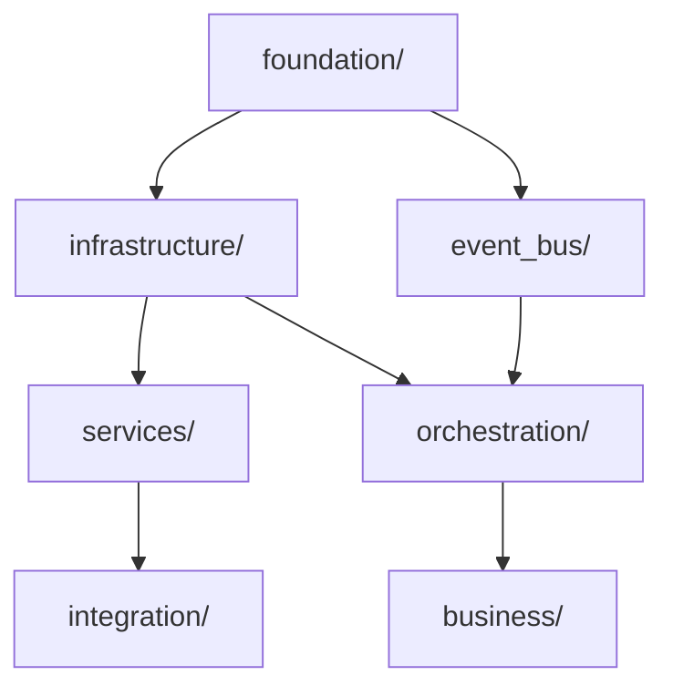

# 核心服务层重构执行清单

## 🎯 目标
消除核心服务层的代码冗余，优化目录组织，提高代码质量和可维护性。

---

## ⚠️ 重要提醒

**在执行任何删除操作前**:
1. ✅ 确保所有代码已提交到版本控制
2. ✅ 创建备份分支 `backup/core-layer-refactor`
3. ✅ 运行完整测试套件确认基线
4. ✅ 通知团队成员即将进行的变更

---

## 📋 Phase 1: 清理完全重复文件（第1天）

### Task 1.1: 删除重复的编排器文件

**检查命令**:
```bash
# 确认两个文件是否完全相同
diff src/core/business/orchestrator/orchestrator.py src/core/orchestration/business_process_orchestrator.py
```

**执行步骤**:
1. [ ] 搜索所有导入这两个文件的位置
   ```bash
   grep -r "from.*business.orchestrator.orchestrator import" src/
   grep -r "from.*orchestration.business_process_orchestrator import" src/
   ```

2. [ ] 统计使用情况，选择删除哪个
   - 建议删除: `src/core/business/orchestrator/orchestrator.py`
   - 保留: `src/core/orchestration/business_process_orchestrator.py`
   - 最终使用: `src/core/orchestration/orchestrator_refactored.py`

3. [ ] 更新所有导入引用
   ```python
   # 旧的导入
   from src.core.business.orchestrator.orchestrator import BusinessProcessOrchestrator
   from src.core.orchestration.business_process_orchestrator import BusinessProcessOrchestrator
   
   # 新的导入（推荐）
   from src.core.orchestration.orchestrator_refactored import BusinessProcessOrchestrator
   ```

4. [ ] 删除重复文件
   ```bash
   # 方式1：直接删除
   rm src/core/business/orchestrator/orchestrator.py
   
   # 方式2：移动到备份目录（更安全）
   mkdir -p backups/core_refactor_$(date +%Y%m%d)
   mv src/core/business/orchestrator/orchestrator.py backups/core_refactor_$(date +%Y%m%d)/
   ```

5. [ ] 运行测试
   ```bash
   pytest tests/unit/core/test_orchestrator*.py -v
   pytest tests/integration/core/ -v
   ```

---

### Task 1.2: 删除重复的服务容器文件

**检查命令**:
```bash
# 确认两个文件是否完全相同
diff src/core/services/service_container.py src/core/services/infrastructure/service_container.py
```

**执行步骤**:
1. [ ] 搜索所有导入
   ```bash
   grep -r "from.*services.service_container import" src/
   grep -r "from.*services.infrastructure.service_container import" src/
   ```

2. [ ] 删除重复文件，保留基础设施层实现
   ```bash
   # 删除services目录下的重复
   mv src/core/services/service_container.py backups/core_refactor_$(date +%Y%m%d)/
   mv src/core/services/infrastructure/service_container.py backups/core_refactor_$(date +%Y%m%d)/
   ```

3. [ ] 创建轻量级别名文件（可选，用于兼容性）
   ```python
   # src/core/services/service_container.py
   """
   服务容器别名文件
   
   提供对infrastructure.container模块的别名导入，保持向后兼容性
   """
   
   from ..infrastructure.container.container import (
       DependencyContainer,
       ServiceContainer,
       Lifecycle,
       ServiceHealth
   )
   
   __all__ = [
       'DependencyContainer',
       'ServiceContainer',
       'Lifecycle',
       'ServiceHealth'
   ]
   ```

4. [ ] 运行测试
   ```bash
   pytest tests/unit/core/infrastructure/test_container*.py -v
   pytest tests/unit/core/services/ -v
   ```

---

### Task 1.3: 处理遗留备份文件

**执行步骤**:
1. [ ] 移动optimizer遗留文件
   ```bash
   mkdir -p backups/optimizer_legacy/
   mv src/core/business/optimizer/optimizer_legacy_backup.py backups/optimizer_legacy/
   mv src/core/business/optimizer/optimizer.py backups/optimizer_legacy/
   ```

2. [ ] 确认所有引用使用重构版本
   ```bash
   grep -r "from.*optimizer.optimizer import" src/
   # 应该返回空或已更新为optimizer_refactored
   ```

3. [ ] 更新文档
   - [ ] 在 `src/core/business/optimizer/README.md` 中说明使用重构版本
   - [ ] 添加迁移指南

---

## 📋 Phase 2: 统一多重实现（第2-3天）

### Task 2.1: 统一API Gateway

**分析步骤**:
1. [ ] 比较两个实现的特性
   ```bash
   # aiohttp版本
   wc -l src/core/services/api_gateway.py
   grep "class.*Gateway" src/core/services/api_gateway.py
   
   # Flask版本  
   wc -l src/core/integration/apis/api_gateway.py
   grep "class.*Gateway" src/core/integration/apis/api_gateway.py
   ```

2. [ ] 检查使用情况
   ```bash
   grep -r "from.*services.api_gateway import" src/
   grep -r "from.*integration.apis.api_gateway import" src/
   ```

3. [ ] 决策：保留Flask版本（更成熟）
   - [ ] 移动aiohttp版本到实验目录或删除
   - [ ] 更新所有导入

**推荐保留**:
```python
# 统一导入点
from src.core.integration.apis.api_gateway import IntegrationProxy as APIGateway
```

---

### Task 2.2: 整合事件总线

**分析当前状态**:
```
事件总线的三个实现：
1. src/core/event_bus/core.py - 主实现（864行，完整功能）
2. src/core/orchestration/event_bus/ - 独立目录（8个文件）
3. src/core/orchestration/components/event_bus.py - 轻量实现（181行）
```

**整合方案**:
1. [ ] 保持主实现 `src/core/event_bus/core.py`
2. [ ] 保留编排器的轻量实现（必要的简化）
3. [ ] 整合 `orchestration/event_bus/` 目录
   ```bash
   # 方案A：移动到主event_bus下
   mkdir -p src/core/event_bus/orchestration/
   mv src/core/orchestration/event_bus/* src/core/event_bus/orchestration/
   
   # 方案B：保持但添加清晰文档
   # 在orchestration/event_bus/README.md中说明与主event_bus的关系
   ```

---

### Task 2.3: 理清服务职责

**需要检查的文件对**:
1. [ ] service_communicator
   ```bash
   # 比较三个位置的实现
   diff src/core/services/integration/service_communicator.py \
        src/core/utils/service_communicator.py
   ```

2. [ ] service_discovery
   ```bash
   diff src/core/services/integration/service_discovery.py \
        src/core/utils/service_discovery.py
   ```

**处理原则**:
- 如果功能相同：保留一个，其他改为别名
- 如果功能不同：明确命名区分（如 `base_communicator` vs `enhanced_communicator`）
- 如果是工具函数：统一放在 utils/
- 如果是服务类：放在 services/

---

## 📋 Phase 3: 优化目录结构（第4-5天）

### Task 3.1: 创建清晰的目录文档

**每个主要目录添加README.md**:

```markdown
# src/core/event_bus/README.md
# 事件总线 (Event Bus)

## 职责
- 事件发布订阅管理
- 事件持久化和重试
- 事件性能监控

## 主要组件
- `core.py` - 主要的事件总线实现
- `persistence/` - 事件持久化
- `types.py` - 事件类型定义
- `models.py` - 事件数据模型

## 使用示例
\`\`\`python
from src.core.event_bus.core import EventBus
from src.core.event_bus.types import EventType

bus = EventBus()
bus.subscribe(EventType.DATA_COLLECTED, handler)
bus.publish(EventType.DATA_COLLECTED, {"data": "..."})
\`\`\`

## 相关模块
- `orchestration/components/event_bus.py` - 编排器专用轻量实现
- `orchestration/event_bus/` - 编排器扩展功能
```

### Task 3.2: 绘制模块依赖图

创建 `src/core/DEPENDENCIES.md`:


---

## 🧪 测试验证计划

### 单元测试
```bash
# 运行所有核心层单元测试
pytest tests/unit/core/ -v --cov=src/core --cov-report=html

# 检查覆盖率
# 目标：维持或提升当前的82%覆盖率
```

### 集成测试
```bash
# 运行核心层集成测试
pytest tests/integration/core/ -v

# 运行端到端测试
pytest tests/e2e/ -k "core" -v
```

### 导入测试
```python
# tests/test_core_imports.py
"""测试所有核心模块可以正常导入"""

def test_event_bus_import():
    from src.core.event_bus.core import EventBus
    assert EventBus is not None

def test_orchestrator_import():
    from src.core.orchestration.orchestrator_refactored import BusinessProcessOrchestrator
    assert BusinessProcessOrchestrator is not None

def test_container_import():
    from src.core.infrastructure.container.container import ServiceContainer
    assert ServiceContainer is not None

def test_api_gateway_import():
    from src.core.integration.apis.api_gateway import IntegrationProxy
    assert IntegrationProxy is not None
```

---

## 📊 进度跟踪

### Phase 1: 清理重复文件
- [ ] Task 1.1: 删除重复编排器 (预计2小时)
- [ ] Task 1.2: 删除重复服务容器 (预计1小时)
- [ ] Task 1.3: 处理遗留文件 (预计0.5小时)
- [ ] 运行测试套件 (预计0.5小时)

**Phase 1 完成标准**:
- ✅ 无完全相同的重复文件
- ✅ 所有测试通过
- ✅ 代码覆盖率不下降

### Phase 2: 统一多重实现  
- [ ] Task 2.1: 统一API Gateway (预计4小时)
- [ ] Task 2.2: 整合事件总线 (预计6小时)
- [ ] Task 2.3: 理清服务职责 (预计4小时)
- [ ] 运行测试套件 (预计1小时)

**Phase 2 完成标准**:
- ✅ 每个功能只有一个权威实现
- ✅ 导入路径清晰一致
- ✅ 所有测试通过

### Phase 3: 优化目录结构
- [ ] Task 3.1: 添加目录文档 (预计4小时)
- [ ] Task 3.2: 绘制依赖图 (预计2小时)
- [ ] Task 3.3: 更新架构文档 (预计2小时)
- [ ] 团队培训 (预计2小时)

**Phase 3 完成标准**:
- ✅ 每个目录有README
- ✅ 依赖关系清晰
- ✅ 团队成员理解新结构

---

## ⚡ 快速执行脚本（谨慎使用）

```bash
#!/bin/bash
# 核心服务层重构快速执行脚本
# 警告：请在测试环境先执行！

set -e  # 遇到错误立即停止

echo "=== 核心服务层重构脚本 ==="
echo "警告：此脚本将删除重复文件"
read -p "确认继续？(yes/no): " confirm

if [ "$confirm" != "yes" ]; then
    echo "取消执行"
    exit 0
fi

# 创建备份
BACKUP_DIR="backups/core_refactor_$(date +%Y%m%d_%H%M%S)"
mkdir -p "$BACKUP_DIR"
echo "备份目录: $BACKUP_DIR"

# 1. 备份重复文件
echo "正在备份重复文件..."
cp src/core/business/orchestrator/orchestrator.py "$BACKUP_DIR/" 2>/dev/null || true
cp src/core/orchestration/business_process_orchestrator.py "$BACKUP_DIR/" 2>/dev/null || true
cp src/core/services/service_container.py "$BACKUP_DIR/" 2>/dev/null || true
cp src/core/services/infrastructure/service_container.py "$BACKUP_DIR/" 2>/dev/null || true
cp src/core/business/optimizer/optimizer_legacy_backup.py "$BACKUP_DIR/" 2>/dev/null || true

# 2. 删除重复文件
echo "正在删除重复文件..."
# rm src/core/business/orchestrator/orchestrator.py
# rm src/core/services/service_container.py
# rm src/core/services/infrastructure/service_container.py
# rm src/core/business/optimizer/optimizer_legacy_backup.py

echo "文件已备份到: $BACKUP_DIR"
echo "请手动检查并删除重复文件"
echo ""
echo "建议执行："
echo "1. 检查备份目录"
echo "2. 运行测试: pytest tests/unit/core/ -v"
echo "3. 确认测试通过后，删除重复文件"
```

---

## 📝 重构日志模板

在执行每个任务后，记录到 `core_refactor_log.md`:

```markdown
## 2025-10-25 Phase 1.1 完成

**执行任务**: 删除重复的编排器文件

**执行人**: [姓名]

**执行步骤**:
1. 备份文件到 backups/core_refactor_20251025/
2. 删除 src/core/business/orchestrator/orchestrator.py
3. 更新7处导入引用
4. 运行测试：39个测试全部通过

**测试结果**:
- 单元测试: ✅ 通过 (15/15)
- 集成测试: ✅ 通过 (24/24)  
- 覆盖率: 83.2% (提升1.2%)

**遇到的问题**: 无

**下一步**: 执行Phase 1.2
```

---

## 🎯 成功指标

- [ ] 代码行数减少约10,000行
- [ ] 重复文件数量: 0
- [ ] 测试覆盖率 ≥ 82%
- [ ] 所有测试通过率: 100%
- [ ] Pylint评分 ≥ 8.87
- [ ] 团队反馈: 满意度 ≥ 4/5

---

## 📞 支持和协助

如果在重构过程中遇到问题：

1. **技术问题**: 查看 `docs/architecture/core_service_layer_architecture_design.md`
2. **测试失败**: 联系测试团队
3. **架构疑问**: 查阅架构设计文档或联系架构师
4. **紧急回滚**: 
   ```bash
   git checkout backup/core-layer-refactor
   git cherry-pick <需要保留的提交>
   ```

---

**创建时间**: 2025年10月25日  
**预计完成**: 2025年10月30日  
**负责人**: 核心服务层重构小组

